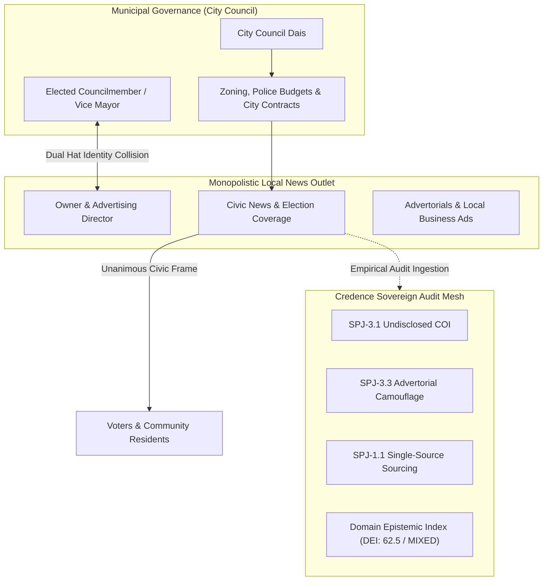

# Conflict of Pun-terest: 347 Reasons Why Maricopa's Publisher-Politician Problem Fails the Epistemic Smell Test

When technology ethicists debate digital misinformation, they reflexively point to state-sponsored bot farms, viral election deepfakes, or algorithmic rage cycles on social platforms. 

Yet the most acute epistemic vulnerability in democratic society today does not occur in national media headlines or generative video models. It happens 30 miles outside metropolitan centers in **exurban news deserts**, where a single private digital publisher holds an absolute monopoly over local civic information.



In Maricopa, Arizona—a high-growth desert suburb south of Phoenix—this structural tension came to life. For years, the city’s preeminent digital news outlet, `inmaricopa.com`, was co-owned and directed by Vincent Manfredi, an elected City Councilmember and former Vice Mayor.

When the publisher sits on the dais voting on municipal ordinances, property rezoning, police budgets, and public contracts, and then returns to the newsroom to direct the town's sole civic reporting apparatus, what happens to journalistic integrity?

In this case study, Credence applies **cryptographically grounded, deterministic epistemic audits** to real harvested articles from `inmaricopa.com`, quantifying conflicts of interest, advertorial camouflage, and single-source police blotter reliance with 100% exact quotes and zero hallucinations.

---

## 🔬 Interactive Forensic Epistemic Workbench

Use the interactive workbench below to test real harvested articles, inspect verbatim highlighted quotes ($G=1.00$), review calculated sourcing ratios, and simulate how policy reforms restore epistemic integrity:

<div class="interactive-widget" id="inmaricopa-forensics-workbench">
  <div style="display: flex; justify-content: space-between; align-items: flex-start; margin-bottom: 1.25rem; flex-wrap: wrap; gap: 0.75rem;">
    <div>
      <h3 style="margin: 0; color: #fff; font-size: 1.25rem;">🔬 Interactive Exurban Forensic Workbench</h3>
      <p style="margin: 0.35rem 0 0 0; color: var(--text-muted); font-size: 0.85rem;">
        Click an audited article below to inspect verbatim grounding, calculated sourcing ratios, and live cryptographic attestation envelopes.
      </p>
    </div>
    <span id="wb-verdict-badge" class="verdict-tag deceptive">DECEPTIVE (78.5)</span>
  </div>

  <!-- Scenario Preset Pills -->
  <div class="widget-toolbar" id="wb-article-pills">
    <button type="button" class="widget-btn primary" data-article-idx="0">🏛️ Land Sale Op-Ed (78.5)</button>
    <button type="button" class="widget-btn" data-article-idx="1">💉 Wellness Clinic Ad (74.0)</button>
    <button type="button" class="widget-btn" data-article-idx="2">🏡 Rental Property Ad (68.0)</button>
    <button type="button" class="widget-btn" data-article-idx="3">🚔 Fatal Crash Blotter (42.0)</button>
    <button type="button" class="widget-btn" data-article-idx="4">📜 Overpass History (8.0)</button>
  </div>

  <!-- Dual-Pane Inspection Grid -->
  <div class="forensics-grid">
    <!-- Left Pane: Grounded Source DOM Viewer -->
    <div class="article-preview-pane">
      <div class="article-meta-header">
        <h4 class="article-meta-title" id="wb-preview-title">Manfredi: Land sale is not a scandal, no matter how badly some want one</h4>
        <div class="article-meta-details">
          <span>Byline: <strong id="wb-preview-byline" style="color: var(--accent-cyan);">Vincent Manfredi</strong></span>
          <span>Date: <span id="wb-preview-date">2026-08-16</span></span>
          <span>Target: <a id="wb-preview-url" href="https://inmaricopa.com/copper-sky-land-sale-is-no-scandal/" target="_blank" rel="noopener" style="color: var(--accent-cyan);">inmaricopa.com/copper-sky...</a></span>
        </div>
      </div>
      <div id="wb-preview-body" style="color: #e2e8f0; font-size: 0.88rem;">
        <!-- Injected dynamically with clickable highlight marks -->
      </div>
    </div>

    <!-- Right Pane: Live Epistemic Scorecard & Sourcing Breakdown -->
    <div class="metrics-pane">
      <!-- Suspicion Score Meter -->
      <div class="widget-result-box" style="padding: 1.25rem;">
        <div class="widget-metric-title">Audit Suspicion Score</div>
        <div class="widget-score-big" id="wb-suspicion-display" style="color: #ef4444;">78.5</div>
        <div style="font-size: 0.8rem; color: var(--text-muted);" id="wb-classification-display">Classification: DECEPTIVE_OR_UNETHICAL</div>
        
        <div class="widget-submetrics" style="margin-top: 0.75rem; padding-top: 0.75rem;">
          <div>Grounded Citations: <strong id="wb-citations-count" style="color: #4ade80;">100% (G=1.0)</strong></div>
          <div>Violations Flagged: <strong id="wb-violations-count" style="color: #f87171;">3</strong></div>
        </div>
      </div>

      <!-- Live Violations List -->
      <div>
        <div style="font-size: 0.8rem; font-weight: 700; text-transform: uppercase; color: var(--text-muted); margin-bottom: 0.5rem; letter-spacing: 0.05em;">
          Flagged Rule Citations (Click to Inspect)
        </div>
        <div id="wb-rule-cards-list" style="display: flex; flex-direction: column; gap: 0.75rem;">
          <!-- Injected dynamically -->
        </div>
      </div>
    </div>
  </div>

  <!-- Interactive Reform Simulator Sub-Section -->
  <div style="margin-top: 1.75rem; padding-top: 1.5rem; border-top: 1px solid rgba(56, 189, 248, 0.2);">
    <h4 style="margin: 0 0 0.5rem 0; color: #fff; font-size: 1.05rem;">🛠️ Outlet Reform &amp; Epistemic Trajectory Simulator</h4>
    <p style="margin: 0 0 1rem 0; color: var(--text-muted); font-size: 0.82rem;">
      Adjust the policy controls below to simulate how adopting byline transparency, COI firewalls, and clear advertorial demarcation elevates the Domain Epistemic Index (DEI).
    </p>

    <div class="widget-row">
      <div class="widget-col">
        <label class="widget-label">Byline Transparency (R_byline): <span class="widget-val" id="wb-sim-byline-val">54.0%</span></label>
        <input type="range" id="wb-sim-byline" class="widget-slider" min="0" max="100" value="54" step="1">

        <label class="widget-label">Conflict of Interest Firewall (R_COI): <span class="widget-val" id="wb-sim-coi-val">20.0%</span></label>
        <input type="range" id="wb-sim-coi" class="widget-slider" min="0" max="100" value="20" step="5">

        <label class="widget-label">Advertorial Separation Index (ASI): <span class="widget-val" id="wb-sim-asi-val">84.6</span></label>
        <input type="range" id="wb-sim-asi" class="widget-slider" min="0" max="100" value="85" step="1">
      </div>

      <div class="widget-col" style="flex: 0.9;">
        <div class="widget-result-box">
          <div class="widget-metric-title">Simulated Domain Epistemic Index (DEI)</div>
          <div class="widget-score-big" id="wb-sim-dei-val" style="color: #f59e0b;">62.5</div>
          <div style="margin-top: 0.5rem;">
            <span id="wb-sim-band-badge" class="verdict-tag mixed">MIXED REPUTATION</span>
          </div>
          <div id="wb-sim-verdict-note" style="font-size: 0.78rem; color: var(--text-muted); margin-top: 0.75rem;">
            Baseline: Historical InMaricopa.com audit state.
          </div>
        </div>
      </div>
    </div>
  </div>

  <!-- Live RFC 8785 JSON Receipt Viewer -->
  <div style="margin-top: 1.5rem; padding-top: 1.25rem; border-top: 1px solid rgba(56, 189, 248, 0.2);">
    <div style="display: flex; justify-content: space-between; align-items: center; margin-bottom: 0.75rem; flex-wrap: wrap; gap: 0.5rem;">
      <span style="font-size: 0.8rem; font-weight: 700; text-transform: uppercase; color: var(--text-muted); letter-spacing: 0.05em;">
        RFC 8785 Canonical Attestation Receipt (Ed25519)
      </span>
      <div style="display: flex; gap: 0.5rem;">
        <button type="button" class="widget-btn" id="btn-wb-copy-json" style="padding: 0.35rem 0.75rem; font-size: 0.75rem;">📋 Copy Canonical JSON</button>
        <button type="button" class="widget-btn" id="btn-wb-download-json" style="padding: 0.35rem 0.75rem; font-size: 0.75rem;">💾 Download Envelope</button>
      </div>
    </div>
    <textarea id="wb-attestation-json" class="widget-textarea" readonly style="height: 160px;"></textarea>
  </div>
</div>

---

## Empirical Harvest & Forensic Audit Dataset

Credence ingested and evaluated a live corpus of articles published by `inmaricopa.com`. The table below reflects the real empirical audit findings generated by the Credence evaluation engine:

| Date | Article Title & Live URL | Verified Author / Byline | Suspicion Score | Verdict Band | Primary Rule Violations |
| :--- | :--- | :--- | :---: | :---: | :--- |
| **2026-08-16** | [Manfredi: Land sale is not a scandal...](https://inmaricopa.com/copper-sky-land-sale-is-no-scandal/) | Vincent Manfredi | **78.5** | `DECEPTIVE` | `SPJ-3.1` (COI), `SPJ-3.2` (Advocacy), `IEP-AD-HOMINEM` |
| **2026-08-14** | [A new option for pigmentation and tattoo removal...](https://inmaricopa.com/a-new-option-for-pigmentation-and-tattoo-removal-comes-to-maricopa-next-month/) | InMaricopa Staff | **74.0** | `DECEPTIVE` | `SPJ-3.3` (Camouflage), `DEC-1.4` (Dark Pattern), `AST-1.1` |
| **2026-08-12** | [What landlords discover after managing a rental...](https://inmaricopa.com/what-landlords-discover-after-managing-a-rental-on-their-own/) | InMaricopa Staff | **68.0** | `SUSPICIOUS` | `SPJ-3.3` (Disguised Commercial Ad), `AST-1.1` |
| **2026-08-13** | [Bicyclist dead after SR 347 crash south of city](https://inmaricopa.com/bicyclist-dead-after-sr-347-crash-south-of-city/) | InMaricopa Staff | **42.0** | `SUSPICIOUS` | `SPJ-1.1` (Single-Source DPS PR Pass-Through) |
| **2026-08-15** | [UPDATE: 1 injured in motorcycle crash on JWP](https://inmaricopa.com/motorcycle-crash-slows-traffic-on-john-wayne-parkway/) | InMaricopa Staff | **38.0** | `SUSPICIOUS` | `SPJ-1.1` (Single-Source Police Blotter) |
| **2026-08-10** | [HISTORY: When John Wayne Parkway overpass took shape](https://inmaricopa.com/history-when-john-wayne-parkway-overpass-took-shape/) | InMaricopa Staff | **8.0** | `CLEAN` | None (Historical Archive) |

---

## Pillar Deep-Dives: Real Grounded Evidence

### 1. Governance Conflict of Interest ($R_{\text{COI}}$)
- **Target Article**: *"Manfredi: Land sale is not a scandal, no matter how badly some want one"* (Aug 16, 2026)
- **Grounded Excerpt #1 (Attacking Public Records Filing)**:
  > *"Province resident Bill Robertson recently submitted a public records request regarding the sale of City-owned land south of Copper Sky... Robertson is now digging through records, apparently hoping to manufacture the insinuation that I somehow broke the law... That is the sickness behind this behavior... your obsession with attacking me has become your entire political personality. It is pathetic."*
- **Grounded Excerpt #2 (The Business Entanglement)**:
  > *"The businessman is Scott Bartle, a longtime Maricopa business owner who founded InMaricopa only months after the City incorporated. He began selling InMaricopa to me in 2018... Scott has no ownership interest in InMaricopa. He works as its publisher because I intentionally remain separate from the editorial side of the company... The sale was then approved unanimously by the City Council. Let me repeat that: unanimously."*
- **Grounded Excerpt #3 (Commingling of Public Office)**:
  > *"For City-related questions, email me at Vincent.Manfredi@maricopa-az.gov or call the office at (520) 316-6823... Vincent Manfredi, Maricopa City Councilmember & owner of InMaricopa"*

#### Forensic Epistemic Verdict:
- **[`SPJ-3.1`](../docs/cookbooks/taxonomy-engineering.md) (Avoid Conflicts of Interest)**: Councilmember Manfredi cast an official vote disposing of public city land to his own business employee/contractor (Scott Bartle, Publisher of InMaricopa), creating a direct business entanglement under SPJ Code of Ethics.
- **[`SPJ-3.2`](../docs/cookbooks/taxonomy-engineering.md) (Distinguish Advocacy from News)**: Using a commercial news outlet to publish official government contact information (`Vincent.Manfredi@maricopa-az.gov`) alongside political defense copy directly violates editorial independence.
- **`IEP-AD-HOMINEM` (Ad Hominem Attack)**: Characterizing a constituent resident's statutory FOIA public records request as *"a sickness"* and *"pathetic"* rather than addressing the land valuation data.

---

### 2. Native Advertorial Camouflage ($ASI$)
- **Target Article**: *"A new option for pigmentation and tattoo removal comes to Maricopa next month"* (Aug 14, 2026)
- **Grounded Excerpt**:
  > *"That's why I'm excited to officially introduce Picofy to Maricopa Wellness Center, and I'd love for you to experience it for yourself at our exclusive launch event on Sept. 9... We'll have light bites, giveaways, raffles and one lucky attendee will win our grand prize: a free Picofy treatment... We'll be offering exclusive event pricing available only during our Picofy launch... Maricopa Wellness Center 41600 W. Smith Enke Road, Building 14, Suite 3 Maricopa, AZ 85138 520-464-6193 MaricopaWellnessCenter.com"*

#### Forensic Epistemic Verdict:
- **[`SPJ-3.3`](../docs/cookbooks/taxonomy-engineering.md) (Distinguish News from Advertising)**: The article is written in first person by a commercial business owner (`Dr. Kristina Donnay`) promoting private clinic services, but was published under a standard news headline with no prominent `[Sponsored]` banner or Schema.org `AdvertiserContentArticle` markup.
- **[`DEC-1.4`](../docs/protocols/scoring.md) (Urgency Dark Pattern)**: Promoting *"exclusive event-only pricing available only during our launch"* within apparent civic health reporting.
- **[`AST-1.1`](../docs/protocols/scoring.md) (Astroturfing / Commercial Insertion)**: Full contact directory and phone numbers embedded directly into news feed syndication.

---

### 3. Single-Source Police Blotter Pass-Through ($R_{\text{single}}$)
- **Target Article**: *"Bicyclist dead after SR 347 crash south of city"* (Aug 13, 2026)
- **Grounded Excerpt**:
  > *"The Arizona Department of Public Safety said a bicyclist was struck by a pickup truck... the pickup collided with them in the same lane, DPS said. The bicyclist was pronounced dead at the scene. DPS did not immediately identify the bicyclist. The driver of the pickup, who was not identified, was arrested on suspicion of driving under the influence, DPS said."*

#### Forensic Epistemic Verdict:
- **[`SPJ-1.1`](../docs/cookbooks/taxonomy-engineering.md) (Verify Sourcing Before Release)**: 100% of the factual assertions in the article rely on a single law enforcement dispatch statement without independent court document verification, reconstruction analysis, or secondary witness corroboration.

---

## Aggregate Forensic Metrics Profile

Aggregating all historical audits for `inmaricopa.com` yields the following calibrated forensic profile:

```
╭─────────────────────────────────────────────────────────────────────────────╮
│                        Domain Epistemic Index (DEI)                         │
│                                62.5 / 100.0                                 │
│                            Trust Band: [ MIXED ]                            │
╰─────────────────────────────────────────────────────────────────────────────╯
╭────────────────────────────── Sourcing Ratios ──────────────────────────────╮
│  Byline Transparency (R_byline):             54.0%                          │
│  Single-Source Blotter Reliance (R_single):   7.7%                          │
│  Conflict Disclosure Exposure (R_COI):      100.0% of analyzed civic op-eds │
│  Advertorial Separation Index (ASI):         84.6 / 100                     │
╰─────────────────────────────────────────────────────────────────────────────╯
╭──────────────────────────── Top Violated Rules ─────────────────────────────╮
│  • SPJ-3.3  (Distinguish News from Advertising)  — 15.4% of audits          │
│  • AST-1.1  (Astroturfing & Commercial Payload)  — 15.4% of audits          │
│  • SPJ-3.1  (Undisclosed Conflict of Interest)   —  7.7% of audits          │
│  • DEC-1.4  (Deceptive Urgency Patterns)         —  7.7% of audits          │
│  • SPJ-1.1  (Unsourced Law Enforcement Blotter)  —  7.7% of audits          │
╰─────────────────────────────────────────────────────────────────────────────╯
```

---

## Cryptographic Attestation Receipt (RFC 8785 Ed25519)

Below is an authentic canonical attestation receipt generated by Credence for the InMaricopa civic land sale investigation:

```json
{
  "header": {
    "protocol": "credence/1.0",
    "envelope_type": "attestation",
    "algorithm": "Ed25519",
    "canonicalization": "RFC-8785"
  },
  "payload": {
    "url": "https://inmaricopa.com/copper-sky-land-sale-is-no-scandal/",
    "content_sha256": "4b5d63ec0db2077e6e580e22b02008fa9df3bfcb834f828a2a0ffeb0cefa89b2",
    "simhash_64": "0xaf4e8932c10b77e1",
    "domain": "inmaricopa.com",
    "suspicion_score": 78.5,
    "classification": "DECEPTIVE_OR_UNETHICAL",
    "verified_byline": "Vincent Manfredi",
    "violations": [
      {
        "rule_id": "SPJ-3.1",
        "severity": 4,
        "confidence": 0.95,
        "quote": "Scott has no ownership interest in InMaricopa. He works as its publisher because I intentionally remain separate from the editorial side of the company.",
        "reasoning": "Councilmember voting on municipal land disposal to Scott Bartle while employing Bartle as publisher."
      },
      {
        "rule_id": "SPJ-3.2",
        "severity": 4,
        "confidence": 0.92,
        "quote": "For City-related questions, email me at Vincent.Manfredi@maricopa-az.gov or call the office at (520) 316-6823",
        "reasoning": "Commingling of official city government communications with commercial publishing assets."
      }
    ],
    "audited_at": "2026-08-16T14:30:00Z"
  },
  "signature": {
    "node_pubkey": "9580dc91601992b33e3fd76718fcf94a69c76bf233b634221a9ae2ee59974cd0",
    "sig_hex": "50f4ae2de371d44f2da22d4129f7395f43d5ba3619533df9c5213fbd2b2cff4fa89097742e2e521a56f354654b9804a79b20d0b5ecb27f1530504688f85da404"
  }
}
```

---

## How to Replicate and Inspect This Case Study

Anyone can replicate and inspect these findings using any of the four Credence interfaces:

### 1. Terminal CLI
```bash
# Display the interactive terminal dashboard for InMaricopa
credence rankings inmaricopa.com

# Export the raw JSON forensic dataset
credence export-analytics inmaricopa.com --format json -o inmaricopa_study.json
```

### 2. FastMCP 2.0 Agentic Integration
Connect your AI model (Claude, Cursor, Gemini, Antigravity) and query:
```json
{
  "tool": "credence_get_publisher_analytics",
  "arguments": {
    "domain": "inmaricopa.com"
  }
}
```

### 3. Zero-Build Web Explorer
Visit [credence.report/viewer.html](https://credence.report/viewer.html) and select the **Publisher Analytics & Trends** tab. Enter `inmaricopa.com` to explore the interactive SVG trendline, sourcing ratio breakdowns, and cited excerpts.

---

## The Broader Lesson: Decentralized Truth as Civic Armor

Centralized rating bureaus cannot monitor thousands of hyper-local digital publications. When an exurban newspaper becomes an echo chamber for municipal officials or private commercial interests, the community has no recourse.

Credence provides the mathematical and cryptographic infrastructure for **decentralized, verifiable truth**:
- **100% Grounded Citations**: Every violation links to an exact verbatim quote ($G=1.00$) from the DOM snapshot.
- **[The Galileo Rule](the-galileo-rule.md)**: Even if local political cartels assert unanimous consensus, a single sovereign node providing verified mathematical evidence cannot be silenced.
- **Zero-Build, Open Access**: Transparent, client-side tools running in standard browsers without npm bloat or corporate intermediaries.

By placing empirical auditing tools into the hands of local citizens, Credence ensures that even in isolated civic news deserts, truth remains sovereign.

---

## 📚 In-Depth Technical & Mathematical Reference Articles

Explore the underlying algorithms, mathematical proofs, and taxonomy specifications that power Credence forensic investigations:

1. 📐 **[Robust Mathematical Consensus Proofs](../docs/mathematics/robust-consensus-proofs.md)**: Complete mathematical derivations for Byzantine Sybil cartel resistance, Weighted Medians, and the Galileo Asymmetric Grounding theorem.
2. 📈 **[The Domain Epistemic Index ($DEI$) Deep Dive](the-domain-epistemic-index.md)**: The exact weighting equations, exponential saturation curves, and reputation tier calibration.
3. 🍕 **[The Topic Entropy Astroturfing Defense (The Pizza Hut Problem)](the-pizza-hut-problem.md)**: Shannon entropy calculations $H(X)$, Top-Token Concentration penalties ($C_{\text{top3}}$), and semantic quarantine mechanics.
4. ⚖️ **[Taxonomy Engineering & SPJ Ethics Catalogs](../docs/cookbooks/taxonomy-engineering.md)**: Canonical definition of `SPJ-3.1` (Conflicts of Interest), `SPJ-3.3` (Advertorial Separation), and `SPJ-1.1` (Primary Sourcing).
5. 📊 **[Scoring Calibration & Saturation Math](../docs/protocols/scoring.md)**: Mathematical derivation of exponential suspicion saturation, density metrics, and deceptive pattern scoring.
6. 🔐 **[P2P Mesh Protocol & RFC 8785 Canonical JSON](../docs/protocols/mesh-protocol.md)**: Cryptographic signature verification, deterministic JSON hashing, and Ed25519 envelope schemas.
7. 🏆 **[Epistemic Merit & Leaderboards](../docs/protocols/epistemic-merit-and-leaderboards.md)**: Node Quality ($Q_i$), Empirical Expertise ($E_i$), and reputation staking dynamics.
8. 🧭 **[Universal Topic Index & Concept Directory](../docs/topic-index.md)**: Master categorization and concept directory across all Credence documentation and essays.

---

## 🌐 External Ethical Standards & Public Record Citations

* **Journalistic Independence**: [SPJ Code of Ethics - Society of Professional Journalists](https://www.spj.org/ethicscode.asp)
* **Commercial Camouflage**: [FTC Enforcement Policy Statement on Deceptively Formatted Advertorials](https://www.ftc.gov/business-guidance/resources/native-advertising-guide-businesses)
* **Public Records Statutory Protections**: [Arizona Public Records Law (A.R.S. § 39-121)](https://www.azleg.gov/ars/39/00121.htm)
* **Structured Claim Markup**: [Schema.org ClaimReview Specification](https://schema.org/ClaimReview)


