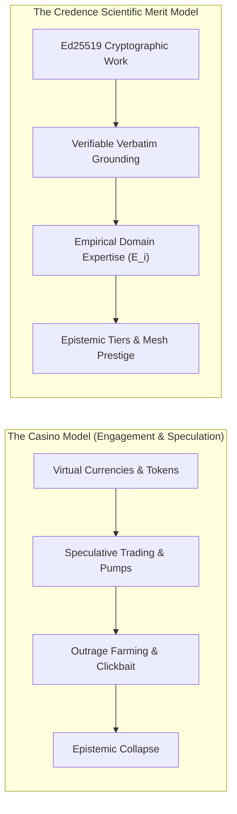
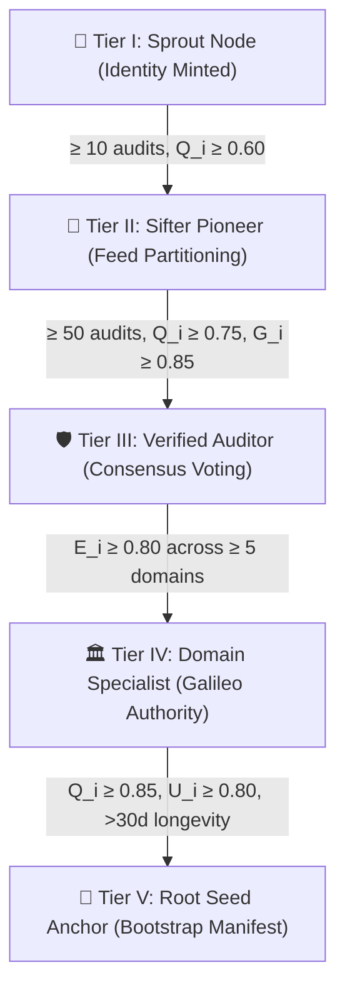
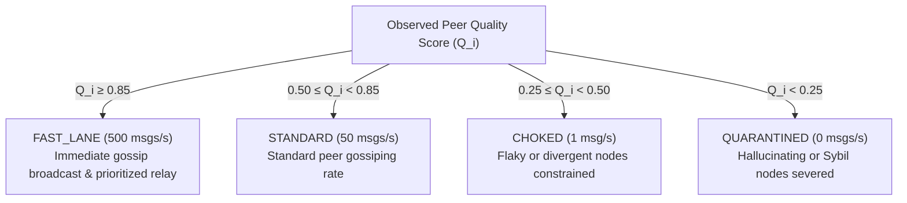

# Folding@home for Truth: Gamification Without the Casino

When platforms attempt to "gamify" online discourse, they almost invariably construct a casino. 

They introduce speculative tokens, algorithmic virality meters, streak mechanics, and pay-to-play verification badges. In doing so, they optimize for addictive engagement, outrage velocity, and financialized speculation—the very forces currently dismantling the digital information ecosystem.

When designing the incentive mechanics for the **Credence Epistemic Mesh**, we took a radically different stance. 

Truth verification is not a mobile game. It is a collaborative computational science.



---

## The Lessons of Distributed Computing: BOINC and Wikipedia

The greatest distributed collaboration networks in human history did not succeed by issuing utility tokens or selling lootboxes. 

- **Folding@home and SETI@home (BOINC)** mobilized millions of CPU cycles and GPUs worldwide to fold proteins and analyze radio signals by giving contributors **verifiable donor credit, team leaderboards, and scientific certificates of contribution**.
- **Wikipedia** built the largest encyclopedia in human history through **unforgeable revision history, talk-page consensus, transparent barnstars, and earned editorial tenure**—with zero financial payouts.

Credence adopts this exact ethos. Prestige in the Credence mesh is earned through **verifiable epistemic rigor, verbatim source grounding, and computational philanthropy**.

---

## The 5 Epistemic Tiers

In Credence, nodes do not "level up" by spending money. They ascend through **5 Epistemic Tiers** rooted in unforgeable mathematical proofs and observable performance:

| Tier | Badge | Name | Key Qualification Criteria | Network Capability |
| :--- | :---: | :--- | :--- | :--- |
| **Tier I** | 🌱 | **Sprout** | Ed25519 identity initialized; subscribed to syndicated feeds | Peer message relay, local feed ingestion |
| **Tier II** | 📡 | **Sifter** | $\ge 10$ evaluations, Quality $Q_i \ge 0.60$ | Distributed HRW feed rendezvous partitioning |
| **Tier III** | 🛡️ | **Auditor** | $\ge 50$ evaluations, $Q_i \ge 0.75$, Grounding $G_i \ge 0.85$ | Consensus voting weight, attestation seeding |
| **Tier IV** | 🏛️ | **Specialist** | Empirical Authority $E_i \ge 0.80$ across $\ge 5$ distinct FQDNs | Domain Authority weighted medians (Galileo Rule) |
| **Tier V** | 💎 | **Root Anchor** | $Q_i \ge 0.85$, $U_i \ge 0.80$, $>30$ days active longevity | Inclusion in canonical `peers.json` bootstrap seed |



---

## The Philanthropic Compute Odometer

One of the most powerful features in Credence is the **Compute Philanthropy Odometer**.

When your node audits an incoming wire article or RSS feed item, it cryptographically signs the normalized audit report with its Ed25519 private key. When peer nodes in the mesh encounter that same content, they verify your signature and adopt your signed attestation directly into their cache—**saving 100% of the LLM inference tokens at $0.00 token cost**.

Your node tracks its cumulative contributions:
- **Tokens Donated to Swarm**: The exact quantity of input and thinking tokens saved for peer nodes.
- **Swarm Compute Value ($USD)**: The estimated dollar savings delivered to the decentralized network based on frontier inference rates ($0.34 per million tokens).
- **Galileo Discoveries**: Instances where your node discovered verified, grounded high-severity violations that shifted consensus across the mesh.

```bash
$ credence merit

╭────────────────────── 🛡️ Credence Epistemic Merit Card ──────────────────────╮
│ Node Alias:       sifter-node-us-east1 (8f7e2a1b9c...)                       │
│ Epistemic Tier:   AUDITOR (Rank #4 of 84 nodes)                              │
│ Traffic Status:   FAST_LANE (500 msgs/s)                                     │
│ 5-Factor Quality: 0.9124 (Uptime: 99.4%, Grounding: 98.2%)                   │
│ Active Longevity: 42.6 days                                                  │
│                                                                              │
│ ⚡ Compute Philanthropy Odometer:                                            │
│   • Tokens Donated to Peers: 1,420,500 tokens                                │
│   • Swarm Compute Value:     $0.4830 USD                                     │
│   • Attestations Seeded:     384 audits                                      │
│   • Galileo Discoveries:     2 findings                                      │
│                                                                              │
│ Unlocked Epistemic Badges (5):                                               │
│   • 🌱 Sprout Node: Initialized Ed25519 cryptographic identity               │
│   • 📡 Sifter Pioneer: Sifted >100 syndicated feeds via HRW rendezvous        │
│   • 🛡️ Verified Auditor: Q_i >= 0.70 with 98% verbatim grounding             │
│   • ⚡ Philanthropic Relay: Seeded >1,000,000 tokens to mesh peers            │
│   • 💎 Root Seed Candidate: Qualified for canonical peers.json manifest     │
│                                                                              │
│ Next Tier Milestone (SPECIALIST): ██████████████░░░░░░ (70%)                 │
╰──────────────────────────────────────────────────────────────────────────────╯
```

---

## Live Vector SVG Badges: GitHub Readme Integration

Nodes and newsrooms can display their real-time epistemic status anywhere on the web using Shields.io-compatible vector SVG badges generated directly by their local node or remote federation server:

```html
<!-- Live Epistemic Tier Badge -->


<!-- Live Publisher Trust Badge -->

```

These badges update in real time with the node's verified uptime, grounding accuracy, and tier ranking—offering verifiable transparency without central certification authorities.

---

## Closed-Loop Routing: Turning Reputation into Network Physics

In most gamified applications, leaderboards are cosmetic vanity metrics. In Credence, **epistemic merit directly controls network routing physics**.

The P2P relay dynamically assigns connected peers to **4 Traffic Shaping Classes**:



If a node submits ungrounded citations or attempts to spam false consensus, its Quality Score ($Q_i$) is slashed. The routing engine automatically demotes its connection from `FAST_LANE` to `CHOKED` (1 msg/s) or `QUARANTINED` (0 msg/s). Good actors receive high-bandwidth fast lanes; adversaries are mathematically throttled out of existence.

---

## Why Blockchain is an Anti-Pattern for Truth

When people discuss decentralized verification and leaderboards, someone inevitably asks: *"Why not put this on a blockchain?"*

In Credence, blockchain is strictly avoided for five fundamental reasons:

1. **Financialization Destroys Epistemic Neutrality**: When tokens carry monetary value, actors game the consensus for financial payout rather than scientific truth.
2. **High Latency & Transaction Costs**: Auditing a breaking news event cannot wait for block confirmations or pay gas fees. Credence evaluates in sub-300ms at $0.00 cost.
3. **Storage Bloat**: Archiving DOM snapshots and full text on-chain causes explosive state bloat. Credence uses local SQLite engines with SimHash deduplication.
4. **The 51% Attack Trap**: Proof-of-Stake allows wealthy cartels to purchase truth. Credence uses **Domain Authority Weighted Medians and Verifiable Verbatim Grounding**, where even a solitary node can prove a violation if its quote matches the immutable DOM (The Galileo Rule).
5. **Simplicity and Sovereignty**: Credence runs on vanilla Python, modern browsers, and standard P2P WebSockets with zero cryptocurrency wallets or Web3 dependencies.

---

## Conclusion: Merit Through Evidence

By rejecting the casino and embracing the scientific method, Credence proves that online verification can be engaging, rewarding, and sustainable without sacrificing epistemic integrity.

Every badge earned is backed by cryptographic signatures. Every rank on the leaderboard represents compute saved for peers and deception uncovered on the open web.

Join the mesh, run a node, and start climbing the tiers.
