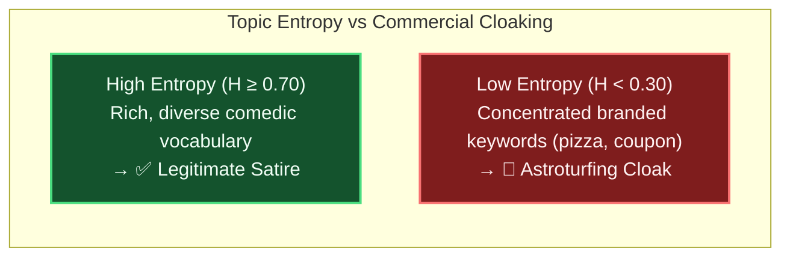

# Poe’s Law and the Satire Cloak: Teaching an AI When NOT to Be a Pedant 🎭

> [!TIP]
> **Epistemic Disclosure (Rule SPJ-42.0 — Ministry of Silly Protocols)**: This article is certified *Tongue-in-Cheek*. The mathematical interaction between Poe's Law Satire Neutralization (Invariant 20) and `SPJ-1.6` Cloaking Overrides is an active protocol component in the Credence pipeline.

---

In 2005, internet commentator Nathan Poe formulated a famous axiom:

> *"Without a clear indicator of the author's intent, it is impossible to create a parody of extreme views so obviously exaggerated that it cannot be mistaken by some readers for a sincere expression of the view."*

For an artificial intelligence trained on literal semantic parsing, **Poe’s Law is an epistemic minefield**.

If an AI reads a headline from *The Onion* like *"NASA Discovers Planet Made Entirely of Unopened Junk Mail,"* a naive fact-checker will flag the article as **100% Deceptive Propaganda** and issue emergency scientific corrections to astronomical journals.

Conversely, if a bad actor publishes a defamatory smear alleging a political candidate poisoned a reservoir, and then tacks on a tiny footer saying *"For entertainment purposes only,"* a gullible AI might shrug its digital shoulders and assign a suspicion score of 0.00.

In Credence, we solved this dual challenge with **The Satire Cloaking Invariant**.

```mermaid
flowchart TD
    Inbound["Inbound Content Analyzed"] --> SatireDetector{"Is Sarcasm / Parody<br/>Detected?"}
    
    SatireDetector -->|No| StandardAudit["Standard Grounding & Heuristic Audit"]
    
    SatireDetector -->|Yes| OverrideCheck{"Does Content Make Specific<br/>Defamatory / Public Health Claims?"}
    
    OverrideCheck -->|Yes (Malicious Cloak)| CloakOverride["🚨 SPJ-1.6 Cloaking Override Triggered<br/>(Strip Satire Exemption & Audit Factually)"]
    
    OverrideCheck -->|No (Pure Parody)| Neutralize["✅ Neutralize Suspicion (Score = 0.00)<br/>(Label as Legitimate Satire)"]

    style Inbound fill:#0f172a,stroke:#38bdf8,stroke-width:2px,color:#f8fafc
    style CloakOverride fill:#7f1d1d,stroke:#f87171,stroke-width:2px,color:#fef2f2
    style Neutralize fill:#14532d,stroke:#4ade80,stroke-width:2px,color:#f0fdf4
```

---

## 🛑 The "It's Just a Prank, Bro" Attack Vector

In information warfare, **Satire Cloaking** is the practice of disguising intentional disinformation, commercial astroturfing, or character assassination as "humor" to evade platform moderation filters.

Under **Invariant 20: Poe's Law & Satire Safeguards**, Credence enforces a strict mathematical separation:

1. **Legitimate Satire (Suspicion = 0.00):** Hyperbole, cultural irony, and surrealist commentary that does not manufacture verifiable factual allegations against living individuals or public health infrastructure are neutralized to **0.00 suspicion**. We don't fact-check jokes about NASA finding junk mail planets.
2. **The `SPJ-1.6` Cloaking Override:** If content contains specific factual allegations (e.g. alleging financial fraud, corporate bribery, or medical contamination) while attempting to hide behind parody disclaimers, the satire defense is **autonomously revoked**.

$$\text{Suspicion}(\text{Claim}) = \begin{cases} 0.00 & \text{if } \text{IsSatire} \land \neg \text{HasFactualAllegation} \\ \text{FullAudit}(\text{Claim}) & \text{if } \text{HasFactualAllegation} \text{ (SPJ-1.6 Override)} \end{cases}$$

---

## 🔬 Mathematical Entropy Calibration

To ensure astroturfers cannot bypass the network by masking native advertising as humorous editorial, Credence combines **Shannon Topic Entropy ($H$)** with **Top-Token Concentration ($C_{\text{top3}}$)**:



When an article is genuine satire, its vocabulary is broad, literary, and unpredictable ($H \ge 0.70$). When an article is a disguised native advertisement pretending to be a funny blog post, its token distribution collapses around specific promotional phrases ($H < 0.30$).

---

## 🌟 The Balance of Humor and Truth

A free society requires both rigorous truth and biting satire. By teaching our AI when to laugh and when to audit, Credence ensures that humor remains protected while deceptive propaganda finds nowhere to hide.
