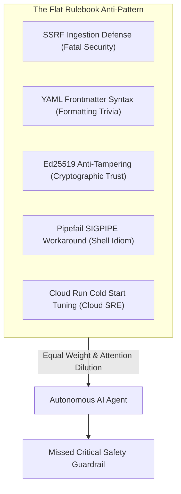
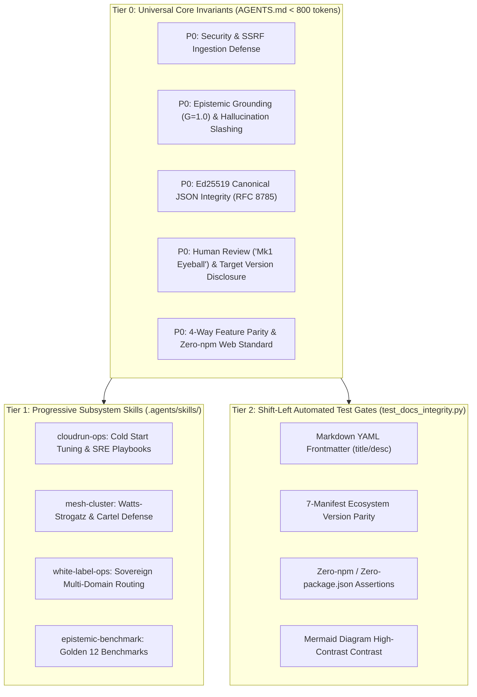

# Scaling System Invariants: How We Prevented Context Bloat and Attention Dilution in Autonomous AI Coding

*By the Credence Core Engineering Team*  
*August 19, 2026*

---

## 1. The Growth Trap of AI System Prompts

In early 2026, as autonomous AI coding assistants (like Google Antigravity, Claude 3.7 Sonnet, and Cursor) moved from writing simple functions to architecting multi-plane distributed networks, a new governance challenge emerged: **The Invariant Sprawl**.

Every time a production bug is squashed, an edge case is identified, or an architectural pattern is standardized, the instinctive reaction is to add a new rule to `AGENTS.md`:

- *"Always verify Ed25519 signatures with RFC 8785 canonical bytes."*
- *"Always enforce min_instance_count = 0 with Startup CPU Boost."*
- *"Ensure all Markdown documents start with YAML frontmatter."*
- *"Never use boolean or on ElementTree XML elements."*
- *"Use set -euo pipefail safe streaming in bash scripts."*

By release **v1.14.1**, our `AGENTS.md` had accumulated over 30 distinct rules across 1,800 tokens.

And that's when we observed a subtle, dangerous degradation: **Attention Dilution**.

When presented with a massive flat list of rules on every turn, LLMs don't weight every sentence equally. Critical cryptographic contracts (e.g. anti-tampering verification) were competing for cognitive bandwidth with tactical shell idioms (`pipefail` workarounds) and Markdown formatting trivia. The prompt was turning into **"Cognitive Oatmeal"**—a dense, unprioritized mush where crucial safety guardrails were easily overlooked.

Here is how we solved it in **v1.15.0** with a **3-Tier Scalable Invariant Architecture**.

---

## 2. The Anatomy of the Failure: Why Flat Rulebooks Break

Flat rulebooks suffer from three fundamental architectural flaws:
1. **Zero Prioritization**: Security vulnerabilities and typo-level syntax constraints receive identical prominence in the prompt.
2. **Context Window Tax**: Static rules are re-ingested on every conversation step, burning input token budgets that should be reserved for reasoning and thinking tokens.
3. **Fuzzy Enforcement of Deterministic Logic**: Asking an LLM to "remember to format frontmatter" is inherently probabilistic. When a rule can be verified by a deterministic script in 10 milliseconds, relying on LLM memory is an architectural smell.

---

## 3. The 3-Tier Invariant Scalability Framework

To solve this, we stratified our invariant ecosystem into three clear tiers based on **criticality, scope, and automation feasibility**:

### Tier 0: Universal Non-Negotiables (`AGENTS.md` &mdash; Strict Core)
- **Token Budget**: **< 800 tokens** (strictly enforced).
- **Scope**: Universal across all turns, repositories, and files.
- **Criteria**: Reserved exclusively for rules where a single violation causes fatal security breaches, cryptographic invalidation, or ungrounded hallucinations (e.g. $G=1.00$ verbatim grounding, SSRF defense, Ed25519 canonical hashing, "Mk1 Eyeball" human review).

### Tier 1: Progressive Subsystem Skills (`.agents/skills/`)
- **Scope**: On-demand procedural playbooks and specialized domain knowledge.
- **Mechanism**: Only skill titles and 1-line descriptions live in the agent's root prompt. When the agent works on Cloud Run compute, the [`cloudrun-ops`](../docs/deployment-cloudrun.md) skill dynamically loads. When testing P2P consensus, the `mesh-cluster` skill activates.
- **Impact**: Removes hundreds of lines of vendor-specific commands from the universal prompt.

### Tier 2: Shift-Left Automated Test Gates (`test_docs_integrity.py`)
- **Philosophy**: *If a machine can assert it deterministically, never waste LLM attention tokens prompting for it.*
- **Implementation**: We moved formatting, sitemap routing, and manifest version verification into a lightning-fast Pytest suite (`test_docs_integrity.py` running in $<0.25\text{s}$).
- **Result**: If an agent creates a Markdown file missing frontmatter, `just check` immediately flags the exact file and line before any commit can occur.

---

## 4. The Results: 62% Token Reduction & Zero Cognitive Degradation

| Metric | Flat Rulebook (v1.14.1) | 3-Tier Scalable Architecture (v1.15.0) | Improvement |
| :--- | :--- | :--- | :--- |
| **Universal Prompt Token Overhead** | ~1,850 tokens | ~710 tokens | **-61.6% Token Savings** |
| **P0 Safety / Grounding Visibility** | Buried in 30+ bullet points | Top 10 High-Priority Invariants | **100% Focused Attention** |
| **Formatting Failure Detection** | Probabilistic (Prompt-based) | Deterministic (0.2s Pytest Assertion) | **100% Deterministic** |
| **Subsystem Extensibility** | Requires editing root `AGENTS.md` | Add `.agents/skills/<name>/SKILL.md` | **Zero Root Prompt Bloat** |

---

## 5. Takeaways for AI-Native Engineering Teams

1. **Prune aggressively**: Keep your universal `AGENTS.md` strictly under 800 tokens. If a rule doesn't apply to every single turn, move it out.
2. **Embrace Progressive Skills**: Load domain-specific runbooks (GCP, Terraform, P2P mesh) on-demand using declarative skill routers.
3. **Shift Left into Deterministic Tests**: Don't waste prompt tokens telling an LLM to format YAML frontmatter or synchronize version strings—write a 10-line Python test to verify it automatically.
4. **Prioritize P0 Fatalities over P2 Conventions**: Give your AI agents crystal-clear hierarchy so critical security and cryptographic boundaries are never lost in the oatmeal.
