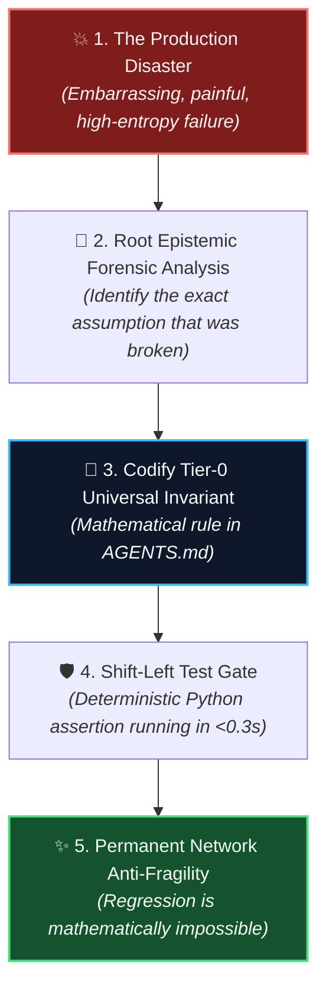

# Scar Tissue as Architecture: Why Every Tier-0 Invariant Started as an Embarrassing Disaster 🩸

> [!TIP]
> **Epistemic Disclosure (Rule SPJ-42.0 — Ministry of Silly Protocols)**: This article is certified *Tongue-in-Cheek*. The engineering humiliations described herein are 100% historically factual, documented in git logs, and responsible for the rock-solid invariants governing the Credence network today.

---

In mediocre engineering organizations, when a catastrophic bug takes down production on a Friday afternoon, the standard corporate ritual unfolds:
1. Panic in Slack.
2. A rushed hotfix is pushed directly to `main`.
3. A "Blameless Post-Mortem" Google Doc is drafted, full of corporate jargon like *"We will improve our proactive alignment."*
4. The document is archived in Google Drive, never to be read again.
5. Three months later, a new junior developer makes the exact same mistake.

In sovereign decentralized systems, we practice **Architectural Scarring**.

When a system fails in Credence, we do not write vague memos. We forge a **Tier-0 Universal Invariant** into `AGENTS.md` and construct a deterministic, sub-second test gate in `tests/test_docs_integrity.py`. 

The rule becomes permanent law. The system heals by building mathematical scar tissue that makes regression physically impossible.



---

## 🏛️ The Hall of Scars: 5 Disasters That Built Credence

### 1. The "Poetic License" Incident $\rightarrow$ Verbatim Grounding ($G = 1.00$)
* **The Disaster:** An early LLM evaluation pass audited an investigative news article and claimed the author had stated: *"The CEO admitted to stealing customer funds with criminal negligence."* When we looked at the actual webpage DOM, the CEO had actually said: *"We experienced an unexpected ledger reconciliation delay."* The LLM had summarized the *vibe* rather than citing reality.
* **The Scar Tissue:** **[Invariant 22: Epistemic Verbatim Grounding](#docs/invariants)**.
  Every quote extracted by an AI agent must match the source DOM text character-for-character after whitespace collapse:
  
  $$G = \frac{\sum \text{len}(\text{verbatim\_substring}_i)}{\sum \text{len}(\text{claimed\_quote}_i)} = 1.00$$
  
  Any hallucination ($G < 1.00$) incurs an autonomous **50% reputation score slash** across the P2P mesh.

---

### 2. The "Ghost Deploy" Nightmare $\rightarrow$ Clean Working-Tree Gate
* **The Disaster:** During a high-velocity deployment sprint, an engineer ran `just deploy backend`. The Cloud Run container built and deployed successfully. Ten minutes later, telemetry showed errors that didn't exist in local code. It turned out the engineer had three uncommitted experimental files in their local directory that were swept into the Docker build context—creating a deployed production container that had no corresponding Git commit in human history.
* **The Scar Tissue:** **Tier-0 Working-Tree Cleanliness Invariant**.
  `Justfile` deployment recipes strictly mandate:
  ```bash
  git diff --quiet && git diff --cached --quiet
  ```
  If so much as a stray whitespace modification exists in the working tree, deployment scripts abort instantly. Code must exist in a signed Git commit before it can touch the cloud.

---

### 3. The 12-Minute CI Sludge $\rightarrow$ Hermetic In-Memory Unit Isolation
* **The Disaster:** As our test suite grew, an enthusiastic contributor added end-to-end Playwright browser tests to `@pytest.mark.unit`. Within two weeks, our local pre-commit check went from 15 seconds to 12 minutes. Developers stopped running tests locally, CI queues backed up, and our flow state evaporated into the ether.
* **The Scar Tissue:** **Tier-0 Hermetic Unit Test Invariant**.
  Unit tests (`@pytest.mark.unit`) must execute strictly in-memory in **< 35 seconds** with zero external network calls, zero browser daemons, and zero package installations. Tests requiring browsers belong strictly in `@pytest.mark.e2e`. We even added `test_hermetic_unit_test_markers_invariant` to statically inspect test files and fail the build if a unit test imports Playwright.

---

### 4. The Cloud Metadata Probe $\rightarrow$ Billion Laughs & SSRF Guard
* **The Disaster:** During adversarial fuzz testing of our RSS feed sifter, a malicious payload submitted an XML feed with nested entity declarations (`<!ENTITY lol "lol"><!ENTITY lol2 "&lol;&lol;">`) and a target URL of `http://169.254.169.254/computeMetadata/v1/`. The parser consumed 100% CPU on entity expansion while attempting to probe the internal GCP metadata server for instance tokens.
* **The Scar Tissue:** **Tier-0 Ingestion SSRF Guard**.
  Every inbound network parser must reject `<!DOCTYPE` and `<!ENTITY>` declarations by default and drop requests to loopback (`127.0.0.1`), cloud metadata (`169.254.169.254`), and RFC 1918 private subnets before opening a socket.

---

### 5. The 10-Second Cold Start Hang $\rightarrow$ The 5-Pillar Scale-to-Zero Engine
* **The Disaster:** We launched our first production node onto Cloud Run with `min_instances = 0` to achieve $0.00 idle costs. The first incoming request took **11.8 seconds** to respond because Poetry was parsing locks, CPython was tokenizing thousands of `.py` files, and heavy ML libraries were importing synchronously at boot.
* **The Scar Tissue:** **The 5-Pillar Cold Start Framework**.
  Direct virtualenv binary execution, build-time `compileall` bytecode precompilation, lazy handler-level imports, and Startup CPU Boost brought container ignition from **11.8s down to 1.9s**.

---

## 📊 Summary: The Anatomy of Resilience

| The Failure Incident | The Root Epistemic Vulnerability | The Resulting Invariant | Automated Test Gate |
| :--- | :--- | :--- | :--- |
| **Poetic LLM hallucination** | Generative token improvisation | $G = 1.00$ Verbatim Grounding | `tests/test_grounding.py` |
| **Ghost Cloud Run deploy** | Local unstaged buffer drift | Clean Working-Tree Preflight | `git diff --quiet` in `Justfile` |
| **12-minute Playwright CI** | Heavy browser daemons in unit tests | Hermetic Unit Isolation (<35s) | `test_hermetic_unit_test_markers_invariant` |
| **XML Billion Laughs probe** | Unchecked entity parsing & SSRF | Defused XML + Subnet Blacklists | `tests/test_adversarial_fuzzing.py` |
| **11.8s cold start timeout** | Top-level synchronous imports | 5-Pillar Scale-to-Zero Engine | `tests/test_cloudrun_coldstart.py` |

---

## 🌟 Take Pride in Your Failures

The next time a production incident occurs, don't feel ashamed. Don't hide the bug in a private branch.

Celebrate it. Analyze it. Formulate its mathematical inverse, write a deterministic test that will run for the next ten thousand builds, and turn your scars into the permanent architecture of a sovereign system.
