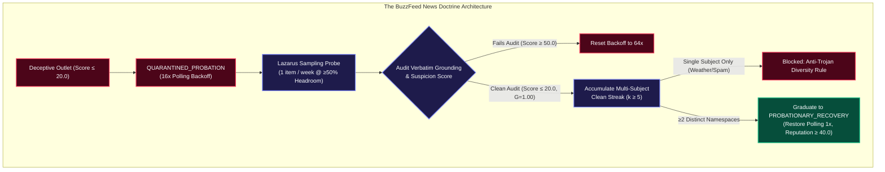

# The BuzzFeed News Doctrine: How Autonomous Trust Networks Handle Redemption Without Blindspots

In 2011, **BuzzFeed** was universally recognized as the internet's epicenter of clickbait—famous for listicles, quiz widgets, and cat memes (*"17 Signs You Grew Up in the 90s"*). Conventional editorial wisdom deemed the publication irredeemably unserious.

Yet ten years later, in **2021**, *BuzzFeed News* was awarded the **Pulitzer Prize in International Reporting** for an investigative masterclass using satellite imagery and architectural modeling to expose mass internment camps in Xinjiang.

This transformation presents a fundamental dilemma for automated verification engines:

> **If an epistemic network implements static, permanent blacklists, it constructs indelible blindspots that fail to recognize authentic editorial reform.**

In **Credence v1.21.0**, we formalized **Invariant 40** and **EPEP-17** to solve this through **The BuzzFeed News Doctrine**.

---

## 1. Soft Quarantine vs. Hard Deletion

When an adversarial domain repeatedly publishes fabrications, hard-deleting the source from the database creates three systemic vulnerabilities:
1. **Cache Amnesia**: End-users who click a link from that domain force a redundant, high-token on-demand audit because all cached attestations were discarded.
2. **Alias Evading**: Malicious syndicates easily re-enter the network under minor subdomain variations or mirrored URLs.
3. **Redemption Blindness**: The network never detects if editorial standards improve.

Credence replaces hard deletion with **Soft Blacklisting (`QUARANTINED_PROBATION`)**:
- Polling intervals back off exponentially: $T_{\text{poll}} \times 2^{\min(\text{deceptions}, 6)}$ (from $15\text{m} \to 4\text{h} \to 16\text{h} \to 7\text{ days}$).
- Quarantined domains are capped to a single exploratory sample per week.

---

## 2. The Asymmetric Epistemic Recovery Curve

Trust is asymmetric: it takes minutes to destroy credibility and months of verified integrity to rebuild it.

Credence encodes this mathematically in `credence/feeds/reputation.py`:

$$\Delta R_{\text{down}} = -15.0 \times \left( \frac{\text{Severity}}{2.0} \right) \times \text{Confidence}$$

$$\Delta R_{\text{up}} = +5.0 \times \left( 1.0 - \frac{\text{SuspicionScore}}{100.0} \right)$$

A single fabricated quote ($\text{Severity}=5$) slashes domain reputation by $-37.5$ points. Rebuilding those points requires at least $8$ consecutive spotless audits.

---

## 3. Neutralizing the "Trojan Whitelist" Attack

During empirical simulations across our 13-node local mesh cluster (`Study D`), we discovered an adversarial exploit: deceptive operators published 5 tiny identical neutral weather reports to quickly clear a naive $k=5$ clean threshold.

To neutralize this, the BuzzFeed News Doctrine enforces a **3-factor verification gate**:
1. **Multi-Subject Diversity**: The 5 clean audits must span at least $\ge 2$ distinct taxonomy namespaces (e.g. `journalism.investigative` and `finance.banking`).
2. **Depth Requirement**: Each audited article must contain $\text{word\_count} \ge 300$.
3. **Verbatim Grounding**: Every asserted fact must pass $G=1.00$ verbatim DOM citation matching.

By pairing rigorous mathematical penalties with an unyielding, verifiable path to rehabilitation, Credence ensures that no domain is permanently condemned—and no reform goes unnoticed.
