# The Domain Credence Index (DCI): The Web's Honor Roll & Wall of Shame

The modern open web suffers from an asymmetrical incentive structure.

Creating sensationalized clickbait, partisan outrage bait, and unverified allegations takes seconds and yields millions of algorithmic impressions. Conversely, rigorous journalistic fact-checking, primary source citation, and byline attribution require immense editorial discipline with virtually zero distribution advantage.

To restore epistemic balance, the Credence network introduces the **Domain Credence Index ($DCI$)**: a decentralized, unforgeable reputation metric computed through mutual peer observation across thousands of independent verification audits.

```mermaid
flowchart LR
    subgraph Web["The Open Web"]
        P1["Publishers &amp; Wire Services"]
        P2["Content Mills &amp; Clickbait"]
        P3["Astroturf PR Campaigns"]
    end

    subgraph Engine["Credence Analytics Engine"]
        E1["Verbatim Quoted Evidence"]
        E2["SimHash Deduplication"]
        E3["Topic Entropy H(X)"]
        E4["Byline Ratio"]
    end

    subgraph Output["Epistemic Intelligence"]
        O1["🛡️ Honor Roll (DCI &ge; 85%)"]
        O2["🛑 Wall of Shame (DCI &lt; 40%)"]
        O3["📢 Astroturf Alerts (H &lt; 0.30)"]
    end

    Web --> Engine --> Output
```



---

## What is the Domain Credence Index ($DCI$)?

The **Domain Credence Index ($DCI$)** is a 0.0 to 100.0% composite score reflecting a publisher's historical fidelity to verifiable fact, transparent attribution, and logical consistency.

Unlike proprietary ratings provided by opaque centralized rating agencies, the $DCI$ is calculated deterministically from publicly verifiable, signed audit records:

$$\text{DCI} = 100 - \left( 0.50 \cdot \overline{S} + 0.30 \cdot \min(50, \overline{D}) + 0.20 \cdot (1 - R_{\text{byline}}) \cdot 100 \right)$$

Where:
- $\overline{S} \in [0, 100]$: Mean calibrated **Suspicion Score** across all audited snapshots for the domain.
- $\overline{D} \ge 0$: Mean **Suspicion Density** (verified rule violations per 1,000 words).
- $R_{\text{byline}} \in [0, 1]$: **Byline Transparency Ratio** (proportion of articles featuring verified author attributions).

---

## The 5 Trust Bands

A domain's $DCI$ maps directly into five standardized **Trust Bands**:

| Trust Band | $DCI$ Range | Characteristic Behavior | Public Verification Badge |
| :--- | :---: | :--- | :---: |
| **High Integrity** | $85.0 - 100.0\%$ | Verbatim sourcing, low suspicion, named bylines, clean corrections | `🛡️ 98% HIGH_INTEGRITY` |
| **Reliable** | $65.0 - 84.9\%$ | Minor formal fallacies or unlinked quotes; general journalistic rigor | `✅ 74% RELIABLE` |
| **Mixed** | $45.0 - 64.9\%$ | Frequent emotional framing, unsourced claims, opinion cloaked as news | `⚠️ 52% MIXED` |
| **Low Integrity** | $25.0 - 44.9\%$ | Pervasive deceptive patterns, fabricated urgency, missing author attribution | `🛑 34% LOW_INTEGRITY` |
| **Deceptive** | $0.0 - 24.9\%$ | Coordinated inauthentic behavior, health scams, cloaked propaganda | `🚨 12% DECEPTIVE` |

---

## The Epistemic Honor Roll vs. The Wall of Shame

Credence publishes real-time domain rankings across two primary views:

### 1. Epistemic Honor Roll (Most Trusted Publishers)
Domains that consistently deliver grounded, transparent, and verified journalism ascend to the top of the Honor Roll:

```bash
$ credence rankings --type domains --category best

                 🛡️ Epistemic Honor Roll (Most Trusted Domains)                  
╭─┬───────────────────────┬──────┬───────────┬─────────┬───────┬───────────────────╮
│ │ Domain FQDN           │  DCI │ Trust     │ Avg     │ Total │                   │
│ │                       │ Score│ Band      │ Suspic. │ Audits│ Earned Badges     │
├─┼───────────────────────┼──────┼───────────┼─────────┼───────┼───────────────────┤
│1│ reuters.com           │ 98.5%│ HIGH_INT. │     3.2 │   142 │ ✍️ Byline, 🛡️ Clean │
│2│ apnews.com            │ 97.8%│ HIGH_INT. │     4.1 │   118 │ ✍️ Byline, 🛡️ Clean │
│3│ nature.com            │ 96.4%│ HIGH_INT. │     5.0 │    89 │ ✍️ Byline, 🛡️ Clean │
│4│ propublica.org        │ 95.2%│ HIGH_INT. │     6.8 │    64 │ ✍️ Byline, 🛡️ Clean │
│5│ arstechnica.com       │ 92.1%│ HIGH_INT. │     8.4 │    52 │ ✍️ Byline         │
╰─┴───────────────────────┴──────┴───────────┴─────────┴───────┴───────────────────╯
```

### 2. Deception Hotlist (Wall of Shame)
Domains with pervasive fabricated claims, deceptive advertising, or high violation densities appear on the public Wall of Shame:

```bash
$ credence rankings --type domains --category worst

                 🛑 Deception Hotlist (Wall of Shame)                            
╭─┬───────────────────────┬──────┬───────────┬─────────┬───────┬───────────────────╮
│ │ Domain FQDN           │  DCI │ Trust     │ Avg     │ Total │ Primary Flag      │
│ │                       │ Score│ Band      │ Suspic. │ Audits│                   │
├─┼───────────────────────┼──────┼───────────┼─────────┼───────┼───────────────────┤
│1│ miracle-cure-daily.biz│ 14.2%│ DECEPTIVE │    88.5 │    28 │ SPJ-1.1 Defamation│
│2│ breaking-us-patriot.co│ 22.8%│ DECEPTIVE │    81.0 │    45 │ DP-1.1 Fake Alert │
│3│ viral-gossip-vault.net│ 31.4%│ LOW_INT.  │    72.4 │    19 │ IEP-2.3 Ad Hominem│
╰─┴───────────────────────┴──────┴───────────┴─────────┴───────┴───────────────────╯
```

---

## Defeating Astroturfing: The Pizza Hut Problem & Topic Entropy

A classic attack against reputation systems is **Astroturfing**: a coordinated network of fake sites publishing benign fluff articles about weather or sports to build up a high trust score, before suddenly pivoting to blast a high-stakes corporate smear or political disinformation campaign.

Credence neutralizes this attack vector using **Topic Diversity Entropy ($H$) and Top-Token Concentration ($C_{\text{top3}}$)**:

$$H(X) = - \sum_{i=1}^{k} P(w_i) \log_2 P(w_i)$$

When a publisher publishes 50 articles that all obsessively repeat the same commercial brand or political candidate ($C_{\text{top3}} > 0.40$), its entropy collapses ($H < 0.30$). Credence flags the domain with an immediate **📢 Astroturf Alert badge**, capping its maximum $DCI$ score regardless of its surface-level grammar.

---

## Top 10 Violated Rules: Real-Time Diagnostic Telemetry

Beyond domain rankings, Credence aggregates the most prevalent epistemic violations across the entire web:

```bash
$ credence rankings --type rules

                 📊 Top Violated Rules Across the Open Web                      
╭─┬──────────┬──────────────────────┬────────────────────────────┬──────┬──────╮
│ │ Rule ID  │ Domain               │ Name                       │ Viol.│ Freq%│
├─┼──────────┼──────────────────────┼────────────────────────────┼──────┼──────┤
│1│ SPJ-1.1  │ JOURNALISTIC_ETHICS  │ Accuracy & Verification    │ 1,420│ 38.4%│
│2│ FALLACY-2│ LOGICAL_FALLACY      │ Straw Man Argument         │   890│ 24.1%│
│3│ DP-1.2   │ DECEPTIVE_PATTERNS   │ False Urgency Countdown    │   650│ 17.6%│
│4│ SPJ-2.4  │ JOURNALISTIC_ETHICS  │ Cloaked Sponsored Content  │   412│ 11.1%│
│5│ FALLACY-1│ LOGICAL_FALLACY      │ Ad Hominem Attack          │   320│  8.7%│
╰─┴──────────┴──────────────────────┴────────────────────────────┴──────┴──────╯
```

---

## Conclusion: Restoring Epistemic Hygiene

The Domain Credence Index turns truth verification from an invisible internal process into a public, measurable asset. 

Publishers that maintain high journalistic integrity gain verifiable prestige that protects their reputation against malicious smears. Conversely, bad actors and clickbait mills can no longer hide behind anonymous bylines and recycled domains.

Explore live domain rankings today on [credence.report](https://credence.report) or directly inside your terminal with `credence rankings`.
