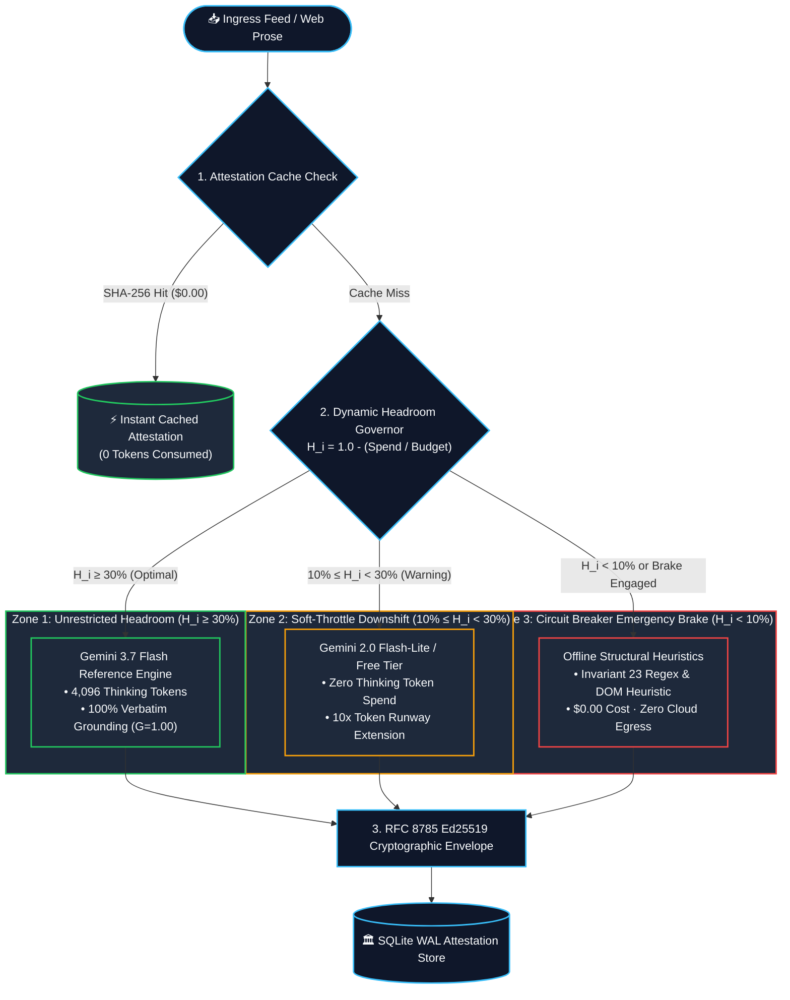

# The Economics of Epistemic Headroom: Why AI Cost Governance Needs a Dynamic Brake

Building autonomous multi-agent systems that ingest external real-time data streams introduces a fundamental financial risk: **unbounded token consumption**.

If a breaking global news event occurs and hundreds of articles flood into your RSS sifter simultaneously, static rate limits either fail completely or cause total service paralysis.

---

## 1. The 3-Tier Headroom Safety Curve

Credence solves this with a multi-tiered **Dynamic Headroom Governor**:

1. **Zone 1: Unrestricted Epistemic Reasoning ($>30\%$ Headroom)**: Full Gemini 3.7 Flash inference with calibrated thinking tokens (512–4096 tokens).
2. **Zone 2: Soft-Throttle Auto-Downshift ($<20\%$ Headroom or $>80\%$ Spend)**: Automatically downshifts background triage and subagents to zero-marginal-cost models (`gemini-2.0-flash-lite`), stretching remaining budget by 10x without stopping audits.
3. **Zone 3: Failsafe Circuit Breaker ($100\%$ Budget or Emergency Brake)**: Instantly cuts all external API calls across all 500 Cloud Run container replicas, switching 100% of audits to deterministic local structural heuristics at **$0.00 cost**.

---

## 2. Zero-Downtime Live Controls

Crucially, adjusting spend ceilings or pulling the Emergency Brake requires **zero container rebuilds or deployments**. Runtime overrides synchronize across all nodes in $<5\text{ms}$ via Redis and SQLModel, ensuring that operators and AI overseers always retain instantaneous control over operating costs.
