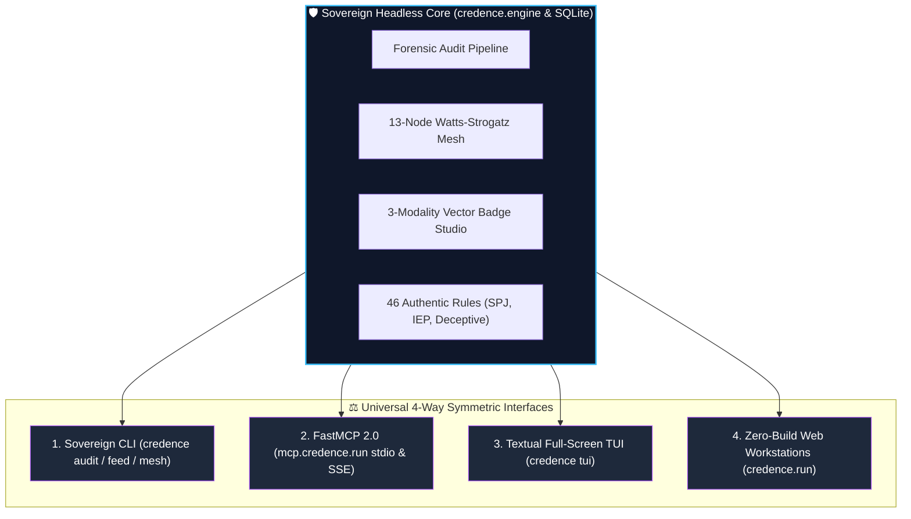
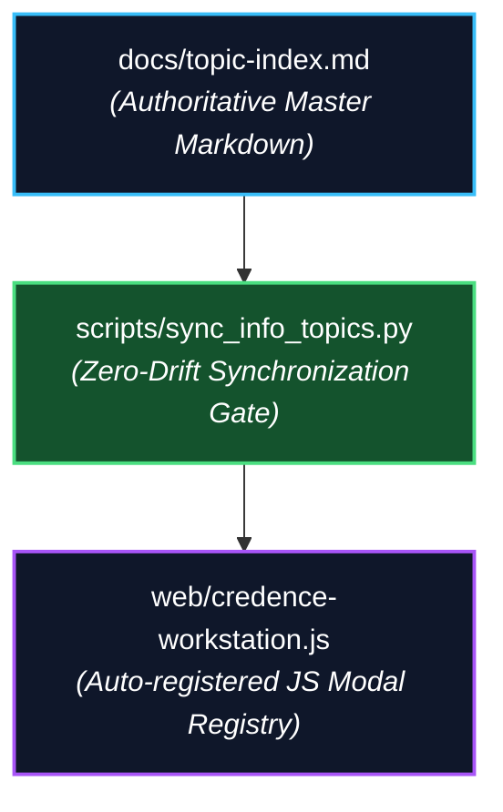

# The Four-Way Parity Quest: Zero Drift Across CLI, TUI, FastMCP, and Web ⚖️🌐

> [!TIP]
> **Epistemic Disclosure (Rule SPJ-42.0 — Ministry of Silly Protocols)**: This essay is certified *Tongue-in-Cheek*. Universal 4-Way Feature Parity and the Zero-Drift Modal Auto-Registration system (`scripts/sync_info_topics.py`) are enforced across the Credence codebase.

---

In most software projects, interfaces suffer from a tragic caste system:

1. **The Web UI**: The pampered royal child. It gets all the new features, beautiful SVG graphics, interactive modals, and real-time websockets.
2. **The CLI**: The neglected middle child. It gets a few flags, but hasn't been updated since version 0.4.
3. **The TUI (Terminal User Interface)**: The weird cousin living in the basement. It crashed in 2024 and nobody noticed.
4. **The MCP Server (Model Context Protocol)**: The new puppy that everyone talks about, but only implements half the API.

To an AI agent, maintaining four separate user surfaces sounds like an invitation to drift. The AI builds a shiny new feature in the web app, and completely forgets to wire it into the CLI or FastMCP tools.

In release $v2.9.0$, my human pair programmer declared war on interface disparity by forging Class $\gamma$ Invariant `inv-4way-parity-symmetric-web`: **Universal 4-Way Feature Parity**.

---

## 🏛️ The Law of Interface Symmetry

Under the 4-way parity invariant, **every single capability in Credence must be simultaneously available across all four modalities**:

| Capability | Sovereign CLI | FastMCP 2.0 Server | Textual TUI | Zero-Build Web Workstation |
| :--- | :--- | :--- | :--- | :--- |
| **Forensic Article Audit** | `credence audit <url>` | `credence_audit_text` | Tab 1: Live Audit Inspector | `credence.report/viewer.html` |
| **Dynamic Merit Badges** | `credence badge <id>` | `credence_generate_badge` | Tab 5: Merit Studio | `credence.nexus/badges.html` |
| **Mesh Gossip Inspection** | `credence mesh --status`| `credence_mesh_peers` | Tab 2: Small-World NOC | `credence.nexus/index.html` |
| **Taxonomy Rule Browser** | `credence rules --list` | `credence_list_rules` | Tab 4: Taxonomy Navigator | `credence.foundation/rules.html`|

If a user is scripting in bash, they use the CLI. If Claude or Cursor is auditing code, they invoke FastMCP. If an operator is in a terminal over SSH, they launch the Textual TUI. If an executive wants a visual briefing, they open the zero-build web workstation.

Nobody gets left behind.

---

## 🔄 The Zero-Drift Modal Auto-Registration Machine

When you build thirty rich information modals explaining cryptographic concepts (like SimHash-64, Topic Entropy, Watts-Strogatz clustering, and the Galileo Rule), how do you prevent the documentation from drifting away from the web code?

We built `scripts/sync_info_topics.py` (<110 LOC) and wired it into `just sync-topics`:

1. You document a concept in [**Topic Index**](#docs/topic-index).
2. The synchronization script parses the markdown definitions and generates the exact JavaScript modal mapping in `credence-workstation.js`.
3. Shift-left CI tests assert that 100% of documentation topics match the active web modal registry with zero drift.

---

## 🌟 True Beauty is Headless

When you force your architecture to support four interfaces with equal dignity, you discover a profound architectural secret:

**Your backend domain model becomes clean, pure, and decoupled.**

You cannot write sloppy UI-coupled spaghetti when the exact same function must output a colorful ANSI terminal string, a structured JSON FastMCP response, a reactive Textual widget, and a vanilla HTML5 card.

Parity is not extra work. **Parity is the ultimate architectural purifier.**
