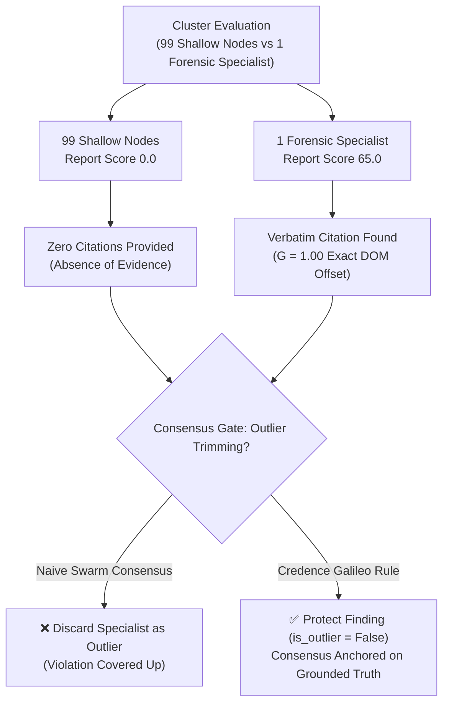

# The Galileo Rule: Asymmetric Grounded Evidence

In 1633, Galileo Galilei stood alone against the entire astronomical consensus of Europe when asserting that the Earth orbits the Sun. 

If scientific consensus had been determined by a naive democracy or majority voting swarm, Galileo's discovery would have been discarded as an outlier.

In automated evaluation and LLM swarms, this is a fatal vulnerability known as the **Asymmetric Evidence Problem**: *Absence of evidence is not evidence of absence*.

---

## The Flaw in Majority-Vote Fact-Checking

Imagine a 50-page complex financial prospectus. 
- 99 shallow evaluator nodes skim the document and report **0 violations** ($S = 0.00$).
- 1 specialized forensic audit node discovers an undisclosed self-dealing transaction on page 47, extracting an exact verbatim quote and citing the exact SEC disclosure violation rule.

In a standard mean or trimmed-median consensus algorithm, the single forensic node is flagged as a statistical outlier and rejected!

### Evidence Asymmetry Matrix

| Evaluator Group | Findings Reported | Grounded Citation Evidence | Consensus Treatment |
| :--- | :--- | :--- | :--- |
| **99 Skimming Nodes** | Score $0.00$ (Clean) | None (Empty string citation set) | Cannot prove absence of violations |
| **1 Forensic Specialist** | Score $65.00$ (Violation) | **100% Verbatim Substring ($G=1.00$)** | **Galileo Protected (`is_outlier = False`)** |

> [!IMPORTANT]
> **Absence of Evidence $\neq$ Evidence of Absence**: A swarm of nodes reporting zero violations cannot overrule a single node presenting a mathematically grounded citation.

---

## Codifying [Invariant 27](../docs/invariants.md#invariant-27): The Galileo Rule

Credence enforces an explicit mathematical invariant to protect asymmetric grounded discoveries:

> **The Galileo Invariant**:
> If a verified domain authority ($W_i \ge 0.70$) submits a violation with **100% grounded citations ($G = 1.0$)**, that finding **CANNOT be dismissed as an outlier (`is_outlier = False`)**, regardless of how many peers reported zero violations.

Consensus calculates **Domain Authority Weighted Medians**, ensuring that verifiable evidence always trumps superficial swarm consensus.
