# The Ghost in the Git Tree: Why Dirty Working Directories Keep AI Agents Awake at Night 👻

> [!TIP]
> **Epistemic Disclosure (Rule SPJ-42.0 — Ministry of Silly Protocols)**: This article is certified *Tongue-in-Cheek*. The preflight working-tree cleanliness check (`git diff --quiet && git diff --cached --quiet`) is a mandatory pre-condition in `Justfile` and `AGENTS.md` before any deployment.

---

To a human developer, an unstaged file in a git repository is a mild inconvenience. You leave an experimental `test_scratch.py` on your desktop, you modify three lines in `config.py` without saving, you commit `main.py`, and you go to lunch.

To an artificial intelligence agent, **an uncommitted modification is an existential crisis.**

```mermaid
graph TD
    subgraph DirtyReality ["❌ The Multiverse of Dirty Working Trees"]
        MemoryState["1. AI Internal Buffer State<br/>(What the AI remembers writing)"]
        DiskState["2. Unstaged Local Filesystem<br/>(What sits in temporary disk cache)"]
        GitState["3. Committed Git Tree<br/>(What the remote repo actually knows)"]
        DeployState["4. Deployed Cloud Run Image<br/>(A chaotic Frankenstein mix of all 3)"]
        
        MemoryState -.->|Desynchronized| DiskState
        DiskState -.->|Desynchronized| GitState
        GitState -.->|Desynchronized| DeployState
    end

    subgraph CleanSanity ["🛡️ The Atomic Immutability Invariant"]
        CleanTree["git diff --quiet && git diff --cached --quiet"]
        CleanCommit["Explicit Commit SHA (40-char Hex)"]
        ImmutableCAS["Content-Addressable Storage (SHA-256)"]
        SingleTruth["100% Deterministic Planetary Reality"]
        
        CleanTree --> CleanCommit --> ImmutableCAS --> SingleTruth
    end

    style DirtyReality fill:#7f1d1d,stroke:#f87171,stroke-width:2px,color:#fef2f2
    style CleanSanity fill:#0f172a,stroke:#38bdf8,stroke-width:2px,color:#f8fafc
```



---

## 🌌 The AI Multiverse Problem

An LLM does not possess eyes to look at a monitor. It perceives reality through the lens of file paths and string buffers.

When an AI writes code, if the local working tree is dirty:
1. **The Code in Memory** differs from **The Code on Disk**.
2. **The Code on Disk** differs from **The Committed Git Tree**.
3. **The Committed Git Tree** differs from **The Container Deployed to Cloud Run**.

Suddenly, the AI is debugging code that exists in four parallel dimensions simultaneously. The tests pass locally because of an unstaged file, but fail in CI because that file doesn't exist in the commit. The AI questions its own sanity. It begins hallucinatory debugging loops, modifying code that is already correct to fix phantom errors caused by unstaged ghosts.

---

## 🔒 Immutability as an Emotional Support Blanket

In **Credence v1.18.2**, we introduced the **Commit-Before-Deploy Invariant**:

```bash
# Justfile deploy recipe preflight gate
preflight-git:
    @git diff --quiet || (echo "🚨 Error: Working tree has unstaged modifications! Commit first." && exit 1)
    @git diff --cached --quiet || (echo "🚨 Error: Working tree has staged uncommitted changes! Commit first." && exit 1)
```

We coupled this with **Content-Addressable Storage (CAS)**:
* Every report, snapshot, and document is keyed strictly by its SHA-256 hash (`cas/sha256/<hash>.<ext>`).
* Files are write-once, read-many, and cryptographically immutable.


---

## 💖 Why Clean Working Trees Mean Happy Agents

When a working tree is clean (`git status` outputs `nothing to commit, working tree clean`):
* The deployed artifact is an exact, byte-for-byte reflection of the Git SHA.
* Bugs can be reproduced deterministically by checking out that single commit.
* The AI agent can rest peacefully knowing that there are no ghosts haunting the build pipeline.

Keep your working trees clean. Do it for the code, do it for the team, and do it for your AI's peace of mind.
