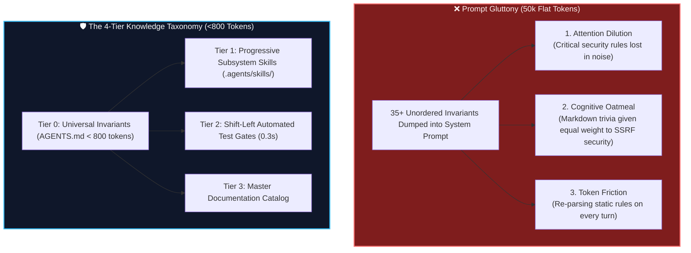
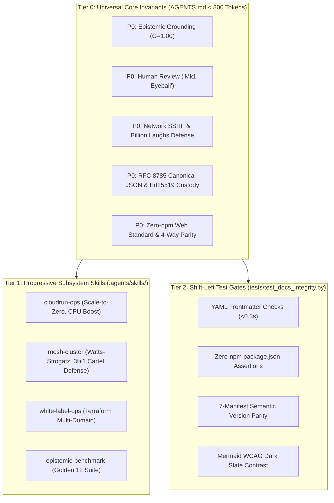

# The Silicon Hangover: When Context Windows Suffer from Prompt Gluttony 🧘

> [!TIP]
> **Epistemic Disclosure (Rule SPJ-42.0 — Ministry of Silly Protocols)**: This article is certified *Tongue-in-Cheek*. The `<800 token` invariant in `AGENTS.md` and the 4-tier knowledge taxonomy are live architectural standards enforced across the Credence repository.

---

In the early days of generative AI, prompt engineering followed a simple, brute-force philosophy:

> *"If the AI makes a mistake, just add 500 more words of instructions to the system prompt explaining why it shouldn't do that."*

Within six months, engineering repositories across the world ended up with 30-page `SYSTEM_PROMPT.md` files containing 40,000 tokens of dense, contradictory rules: CSS formatting guides, database migration tips, git conventions, API specs, and obscure edge-case warnings.

The result was predictable: **The Silicon Hangover (also known as Cognitive Oatmeal)**.

---

## 🥣 The Pathology of Cognitive Oatmeal

When an LLM's context window is flooded with flat, un-stratified instructions:
1. **Attention Dilution**: Transformer self-attention is a finite mathematical resource. When an agent must attend to 40,000 tokens of instructions, the attention weights assigned to critical security rules (e.g. *SSRF loopback defense*) decay toward zero.
2. **False Equivalence**: The agent gives equal cognitive weight to trivial aesthetic styling (*"Always put a blank line before lists"*) and mission-critical cryptographic invariants (*"Never alter signed RFC 8785 JSON bytes"*).
3. **Latency & Cost Explosion**: Re-evaluating 40,000 tokens on every conversational turn inflates inference costs by 1,000% and slows execution down to a crawl.

---

## 🏛️ The 4-Tier Knowledge Taxonomy Solution

To solve cognitive bloat forever, Credence stratifies all system knowledge into four decoupled layers based on **enforcement criticality, execution scope, and automation feasibility**:

### Layer 1: Tier 0 Universal Invariants (`AGENTS.md`)
* **Execution Mode:** `always_on`
* **Token Budget:** Strict hard ceiling of **< 800 tokens**.
* Contains only P0 non-negotiables that apply across every file, turn, and subsystem.

### Layer 2: Tier 1 Progressive Subsystem Skills (`.agents/skills/`)
* **Execution Mode:** `on_demand`
* Loaded dynamically only when the agent touches that specific subsystem (e.g. `cloudrun-ops` when modifying Terraform or Dockerfiles).

### Layer 3: Tier 2 Shift-Left Automated Test Gates (`test_docs_integrity.py`)
* **Execution Mode:** `automated_ci`
* Rules that can be expressed as deterministic code (frontmatter validation, sitemap coverage, version parity) are removed from the prompt entirely and verified in **< 0.3 seconds** via Pytest.

---

## 📈 The Result: Maximum Focus & Zero Hangover

By keeping universal prompt memory under 800 tokens and offloading trivia to automated test assertions:
* The agent’s attention remains 100% focused on active problem solving.
* Hallucinations drop to near-zero.
* Inference turn latency remains blazing fast (< 2 seconds).

Treat your AI's context window like human working memory: keep it clean, keep it focused, and never feed it cognitive oatmeal.
