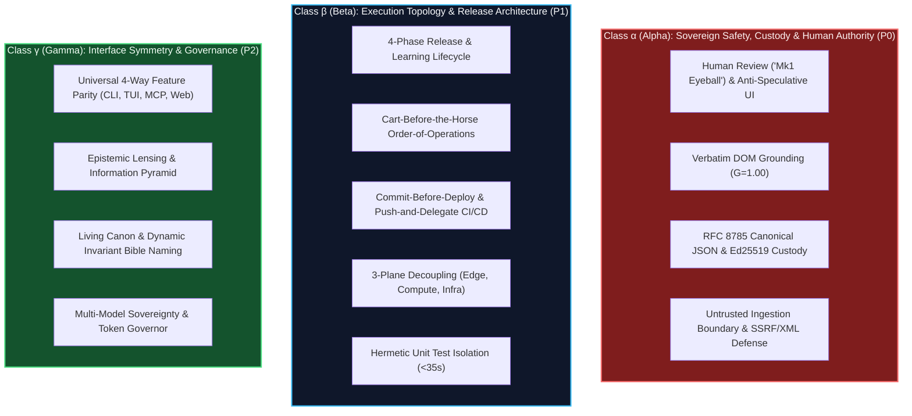
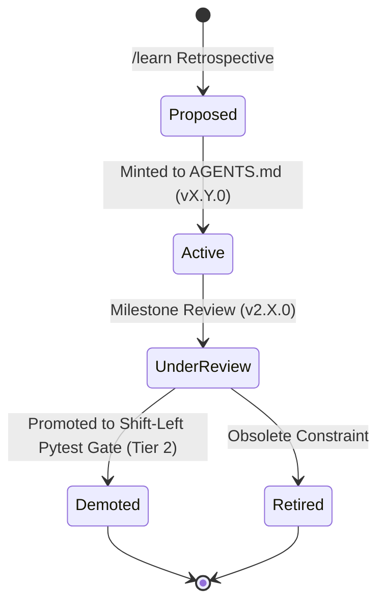

# The Silicon Hangover: When Context Windows Suffer from Prompt Gluttony 🧘

> [!TIP]
> **Epistemic Disclosure (Rule SPJ-42.0 — Ministry of Silly Protocols)**: This article is certified *Tongue-in-Cheek*. The `<800 token` invariant in `AGENTS.md`, the 3-class cognitive taxonomy, and the Demotion Highway are live architectural standards enforced across the Credence ecosystem.

---

In the early days of generative AI, prompt engineering followed a simple, brute-force philosophy:

> *"If the AI makes a mistake, just add 500 more words of instructions to the system prompt explaining why it shouldn't do that."*

Within six months, engineering repositories across the world ended up with 30-page `SYSTEM_PROMPT.md` files containing 40,000 tokens of dense, contradictory rules: CSS formatting guides, database migration tips, git conventions, API specs, and obscure edge-case warnings.

The result was predictable: **The Silicon Hangover (also known as Cognitive Oatmeal)**.

---

## 🥣 The Pathology of Cognitive Oatmeal

When an LLM's context window is flooded with flat, un-stratified instructions:
1. **Attention Dilution**: Transformer self-attention is a finite mathematical resource. When an agent must attend to 40,000 tokens of instructions, the attention weights assigned to critical security rules (e.g. *SSRF loopback defense*) decay toward zero.
2. **False Equivalence**: The agent gives equal cognitive weight to trivial aesthetic styling (*"Always put a blank line before lists"*) and mission-critical cryptographic invariants (*"Never alter signed RFC 8785 JSON bytes"*).
3. **Latency & Cost Explosion**: Re-evaluating 40,000 tokens on every conversational turn inflates inference costs by 1,000% and slows execution down to a crawl.

---

## 🏛️ The 3-Class Cognitive Taxonomy (Class $\alpha$, $\beta$, $\gamma$)

In `AGENTS.md`, we organize Tier-0 knowledge into a strict, prioritized cognitive hierarchy that fits inside **< 800 tokens**:

---

## 🛣️ The Demotion Highway: Forgetting What Tests Can Prove

The secret to keeping `AGENTS.md` permanently bounded under 800 tokens—even as the codebase grows across ten minor releases—is the **Demotion Highway**:

$$\text{KnowledgePlacement} = \begin{cases} \text{Tier 2 (Test Gate)}, & \text{if assertion is deterministically verifiable in } < 0.3\text{s} \\ \text{Tier 1 (Progressive Skill)}, & \text{if rule is subsystem-scoped (e.g., Cloud Run / Mesh)} \\ \text{Tier 0 (AGENTS.md)}, & \text{only if rule is a universal, multi-file non-negotiable} \end{cases}$$

When an invariant can be asserted with 100% mechanical certainty (e.g. valid YAML frontmatter, 7-manifest version parity, zero npm dependencies), we **demote** it out of prompt memory and graduate it into `tests/test_docs_integrity.py`.

---

## 📈 The Result: Maximum Focus & Zero Hangover

By keeping universal prompt memory under 800 tokens and offloading trivia to automated test assertions:
* The agent’s attention remains 100% focused on active problem solving.
* Security and cryptographic invariants are never forgotten or diluted.
* Inference turn latency remains blazing fast (< 2 seconds).

Treat your AI's context window like human working memory: keep it clean, keep it focused, and never feed it cognitive oatmeal.
