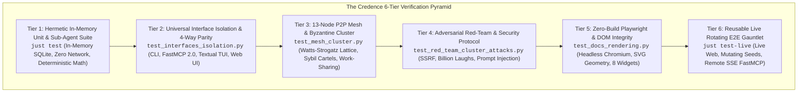
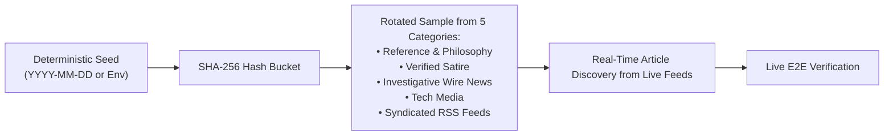
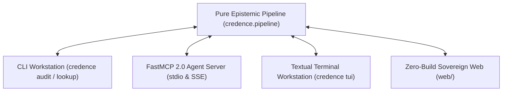
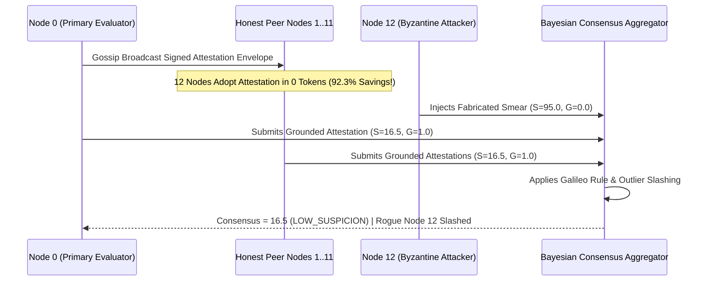

# The 6-Tier Verification Pyramid: Why Fact-Checking AI Requires Mutating Gauntlets, Zero-npm Longevity, and Byzantine Simulations

*By the Credence Engineering Collective · August 18, 2026*

Most AI software testing suffers from two dangerous extremes: **static over-fitting** (where test suites evaluate the same stale, frozen fixtures year after year) or **fragile cloud flakiness** (where end-to-end tests randomly break due to third-party API rate limits, non-deterministic model sampling, and bloated npm buildchains).

When building **Credence**—an autonomous epistemic evaluation engine, FastMCP 2.0 agent server, and 13-node P2P mesh network—we recognized that testing an AI system designed to detect disinformation and manipulative patterns requires an uncompromising, multi-layered verification strategy.

This essay explores the engineering rationale behind Credence's **6-Tier Verification Pyramid**, explaining how we achieved sub-second hermetic isolation alongside continuous real-world web adaptation.



---

## 1. The Fallacy of Static AI Benchmarks

Traditional software testing tests code. AI evaluation testing tests *truth*.

If an epistemic engine only tests against static HTML snapshots captured in 2024:
1. **The Ingestion Engine Atrophies**: Real-world websites adopt new JavaScript hydration patterns, altered Schema.org metadata, and evolving cookie-consent walls that break extraction without warning.
2. **Prompts Overfit to Static Text**: Model instructions tuned to pass 10 static fixtures frequently fail when exposed to novel linguistic nuance or modern rhetorical techniques.
3. **Syndication Drift Goes Unnoticed**: RSS and Atom feeds evolve, adding novel enclosure tags, namespace extensions, and publication frequency patterns.

To solve this, Credence introduced **Tier 6: Reusable Live Rotating & Mutating E2E Gauntlets** ([`tests/e2e/live_corpus.py`](https://github.com/artibyrd/credence/blob/main/tests/e2e/live_corpus.py)).

---

## 2. Deterministic Rotation & Seed Mutation: Real-World Testing Without Flakiness

How do you test against the live public web without introducing non-deterministic CI flakiness?

Credence solves this via a **Stratified Master Corpus** combined with **Deterministic Date-Based Hashing**:

```python
def get_rotating_sample(category: str, seed: Optional[str] = None, count: int = 1) -> List[LiveCorpusEntry]:
    active_seed = seed or datetime.now(timezone.utc).strftime("%Y-%m-%d")
    items = LIVE_CORPUS.get(category, [])
    # Deterministic SHA-256 hash bucket selection
    seed_hash = hashlib.sha256(f"{active_seed}:{category}".encode()).hexdigest()
    start_idx = int(seed_hash, 16) % len(items)
    return [items[(start_idx + i) % len(items)] for i in range(count)]
```



### The Benefits
* **Same-Day Determinism**: Every test run on August 18 tests the exact same rotated sample across all developer workstations and CI runners.
* **Daily Mutation**: Tomorrow's test run automatically rotates to different websites across all 5 epistemic categories.
* **Ad-Hoc Stress Testing**: Developers can instantly test different site combinations by passing `CREDENCE_LIVE_SEED=seed_delta_2026 just test-live`.
* **Dynamic Article Discovery**: The runner pulls syndicated live RSS feeds in real time, discovers articles published minutes prior, and audits fresh breaking news on the fly.

---

## 3. The 4-Way Interface Parity Invariant

In modern AI systems, interfaces frequently drift out of sync. A feature implemented in the CLI is missing in the MCP server; a bug fixed in the Web UI persists in the Python SDK.

Credence enforces **Universal Presentation Layer Parity** (**[Invariant 26](../docs/invariants.md#invariant-26)**). All business logic is strictly isolated in `credence.pipeline` and `credence.mesh`, completely decoupled from presentation wrappers.



Tier 2 unit tests (`tests/test_interfaces_isolation.py`) assert that calling `evaluate_snapshot()` directly returns the exact same mathematical score, classification band, and RFC 8785 Ed25519 envelope as invoking it via the CLI or FastMCP 2.0 JSON-RPC.

---

## 4. Byzantine Mesh Simulation: Verifying Decentralized Economics

Decentralized consensus cannot be verified with simple mock functions. To prove that Credence Mesh resists colluding attackers, Tier 3 simulates a 13-node **Watts-Strogatz Small-World Lattice** ($N=13, k=4, p=0.15$) on ephemeral local WebSocket ports.



The simulation mathematically proves:
1. **BitTorrent Work-Sharing**: 12 peer nodes adopt the attestation in $0$ LLM tokens (**92.3% compute savings** at $\$0.00$ token cost).
2. **The Galileo Rule ([Invariant 23](../docs/invariants.md#invariant-23))**: Verified domain authorities with 100% grounded citations cannot be outlier-dismissed by ungrounded majorities.
3. **Byzantine Slashing**: Injected ungrounded smears ($S=95.0, G=0.0$) are filtered as outliers and dropped from the consensus score.

---

## 5. Zero-npm Playwright Rendering: Immunity to Supply-Chain Rot

Modern frontend test suites frequently require hundreds of megabytes of `node_modules`, Webpack/Vite build steps, and transitive dependencies that break after two years of neglected maintenance.

Credence enforces the **Zero-npm Invariant** (**[Invariant 31](../docs/invariants.md#invariant-31)**). The entire documentation portal and web surfaces are built in vanilla HTML5, CSS Custom Properties, and native ES Modules with **zero npm dependencies and zero build chains**.

Tier 5 verifies this using async Playwright in Python:
* Spawns an ephemeral Python HTTP server on port 0.
* Navigates headless Chromium across all documentation pages.
* Checks that all Mermaid code blocks render into SVGs with non-zero dimensions (`width > 50px`, `height > 30px`).
* Verifies interactive state transitions across all 8 playground widgets (Mesh Simulator, SimHash Calculator, WebCrypto Verifier, etc.).
* Confirms zero browser console errors and zero unhandled exceptions.

```python
# From tests/test_docs_rendering.py
@pytest.mark.e2e
@pytest.mark.asyncio
async def test_mermaid_diagrams_render_to_svg(page: Page, docs_server: str) -> None:
    await page.goto(f"{docs_server}/#docs/architecture", wait_until="networkidle")
    raw_blocks = await page.query_selector_all(".mermaid-code pre code.language-mermaid")
    assert len(raw_blocks) == 0
    rendered_svgs = await page.query_selector_all(".mermaid-rendered svg")
    for svg in rendered_svgs:
        box = await svg.bounding_box()
        assert box and box["width"] > 50 and box["height"] > 30
```

---

## 6. Summary Testing Matrix

| Tier | Focus Area | Command | Network? | Latency | Key Invariants Enforced |
| :--- | :--- | :--- | :--- | :--- | :--- |
| **Tier 1** | **Hermetic Unit & Math** | `just test` | ❌ No | `<65s` | Invariant 4 (Hermetic), Invariant 13 (Satire), Invariant 18 (Offline Fallback) |
| **Tier 2** | **4-Way Interface Parity** | `pytest tests/test_interfaces_isolation.py` | ❌ No | `<3s` | Invariant 26 (Universal Feature Parity) |
| **Tier 3** | **P2P Mesh Cluster** | `pytest tests/test_mesh_cluster.py` | ❌ No | `<25s` | Invariant 20 (Ed25519 Custody), Invariant 23 (The Galileo Rule), Invariant 25 (Work-Sharing) |
| **Tier 4** | **Adversarial Red Team** | `pytest tests/test_red_team_cluster_attacks.py` | ❌ No | `<5s` | Invariant 7 (SSRF Guard), Invariant 8 (XML Safety & Prompt Containment) |
| **Tier 5** | **Zero-Build Playwright** | `pytest tests/test_docs_rendering.py` | ❌ No | `<25s` | Invariant 31 (Zero-npm Standard), Invariant 36 (Playwright DOM Contracts) |
| **Tier 6** | **Live Rotating E2E** | `just test-live` | 🌐 Yes | `<30s` | Invariant 26 (Live Universal Parity), Invariant 11 (FastMCP SSE Security) |

By structuring verification into these 6 complementary layers, Credence delivers sub-second developer feedback, total supply-chain longevity, and bulletproof confidence in real-world decentralized operation.
