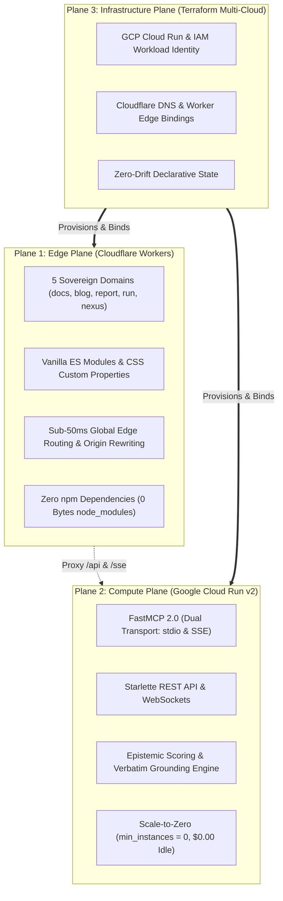

# The 3-Plane Architecture: Zero-npm Edge, Scale-to-Zero Compute, and Sovereign Infra

**Published:** August 19, 2026 | **Author:** Credence Core Team | **Tags:** `architecture`, `cloudflare`, `cloudrun`, `terraform`, `zero-npm`, `edge`

---

Modern web architectures often become entangled monsters: complex Next.js or Nuxt monoliths bundled with thousands of transitive npm dependencies, running on provisioned server instances that burn monthly cloud budgets even when nobody is querying them.

When designing **Credence**, we took a radically different architectural path driven by two foundational principles:
1. **Zero Supply-Chain Risk (Zero-npm Invariant)**: The public web surfaces must have zero npm dependencies, zero build steps, and zero bundlers.
2. **Scale-to-Zero Economics**: Idle computing costs must strictly equal **$0.00/month**.

To fulfill these requirements without sacrificing latency, cryptographic verifiability, or multi-cloud portability, we organized the entire ecosystem into **The 3-Plane Architecture**.



---

## Plane 1: The Edge Plane (Cloudflare Workers & Zero-Build Assets)

The Edge Plane is responsible for global asset delivery, documentation rendering, and intelligent request dispatching across our 5 sovereign domains:
- `credence.run`: Main interactive landing portal and quickstart on-ramp.
- `docs.credence.run`: Complete technical documentation suite, tutorials, and specifications.
- `blog.credence.run`: Sovereign investigative journalism and engineering essays.
- `credence.report`: Interactive report inspector and ClaimReview visualizer.
- `credence.nexus`: Peer-to-peer mesh directory and seed federation.

### The Zero-npm Invariant
Every web asset in Credence is written in standard HTML5, CSS Custom Properties (`credence-ui.css`), and native ES Modules.
- **No Webpack, Vite, Rollup, or esbuild**.
- **No `package.json` or `node_modules` directory**.
- **100% immune to npm supply-chain hijacking, dependency poisoning, and bundle bloat**.

### Edge Origin Header Rewriting
Because Google Cloud Run requires native `.run.app` Host headers for backend traffic verification, our custom Edge Worker (`_worker.js`) transparently intercepts `/api/*` and `/sse` requests, rewrites the `Host` header to the native Cloud Run target, and proxies the stream:

```javascript
// Edge Origin Header Translation
const backendUrl = new URL(request.url);
backendUrl.hostname = "credence-server-663899237633.us-central1.run.app";

const modifiedRequest = new Request(backendUrl.toString(), {
  method: request.method,
  headers: new Headers(request.headers),
  body: request.body
});
modifiedRequest.headers.set("Host", "credence-server-663899237633.us-central1.run.app");
return fetch(modifiedRequest);
```

---

## Plane 2: The Compute Plane (Google Cloud Run v2)

The Compute Plane runs the core epistemic evaluation engine, FastMCP 2.0 protocol endpoints, and SQLite state persistence.

### Key Compute Invariants
1. **Scale-to-Zero (`min_instances = 0`)**: When no audits or MCP tool calls are executing, container instances scale down to 0. Hosting cost during periods of inactivity is exactly **$0.00**.
2. **FastMCP 2.0 Dual Transport**: Supports local CLI process piping via `stdio` alongside high-concurrency streaming over Server-Sent Events (`SSE`) behind Cloudflare.
3. **Non-Blocking Lifespan Startup**: Background tasks (such as node germination and Genesis attestation inoculation) execute asynchronously in `asyncio.create_task` during Starlette startup so HTTP health probes respond in milliseconds.

---

## Plane 3: The Infrastructure Plane (Terraform Multi-Cloud)

The Infra Plane declaratively manages cloud resources across Google Cloud and Cloudflare using modular Terraform templates (`terraform/`):

- **GCP Module**: Provisions Cloud Run v2 services, Workload Identity Federation (WIF) pools for GitHub Actions, and custom service accounts.
- **Cloudflare Module**: Configures DNS records, SSL/TLS certificates, custom routes, and Worker script bindings.

```bash
# Validate and inspect infrastructure drift in under 1 second
just tf validate
just tf plan
```

---

## The Benefits of 3-Plane Decoupling

| Dimension | Monolithic Node/React Setup | Credence 3-Plane Architecture |
| :--- | :--- | :--- |
| **npm Supply Chain Vulnerabilities** | Hundreds of dependencies | **Zero (0 bytes `node_modules`)** |
| **Idle Hosting Cost** | $15–$50/mo minimum | **$0.00/mo (Scale-to-Zero)** |
| **Global Edge Latency** | 200–500ms (Origin roundtrips) | **<50ms (Cloudflare Edge cache)** |
| **Build & Deploy Velocity** | 3–5 minutes (Babel/Webpack/npm) | **Instant zero-build static updates** |
| **Protocol Extensibility** | Tied to browser runtime | **Clean FastMCP 2.0 / CLI / REST separation** |

By strictly decoupling the Edge, Compute, and Infrastructure planes, Credence delivers lightning-fast global performance with rock-solid security and minimal operational overhead.
---

## 4. The Push-and-Delegate Doctrine & CI/CD Verification Loop

One of the greatest operational hazards in modern cloud deployment is **dual deployment**. When an engineer or autonomous AI agent completes local verification and pushes to `origin/main`, running manual deployment commands locally (`just deploy`, `wrangler deploy`, `gcloud run deploy`) introduces state race conditions, wiggles through fragile local OAuth tokens, and duplicates work.

Under Credence's **Push-and-Delegate Doctrine**:
1. **Authoritative CI/CD Hand-off**: All multi-plane deployments are delegated strictly to GitHub Actions using keyless Workload Identity Federation (WIF).
2. **The Verification Gate**: The agent does not declare victory upon `git-sync push`. Instead, it actively monitors remote workflow telemetry (`gh run watch` / `just pipeline watch`) until the deployment run completes with conclusion `success`.
