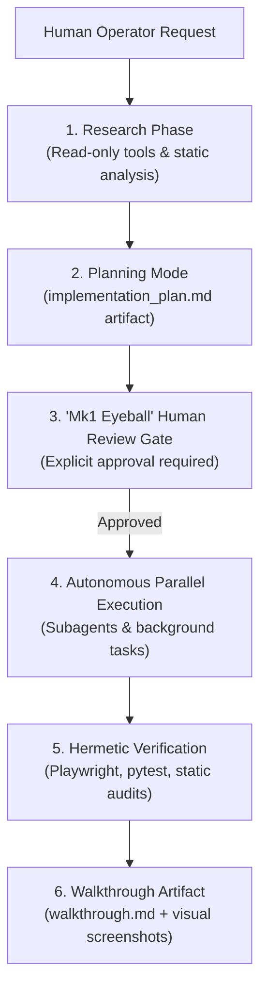
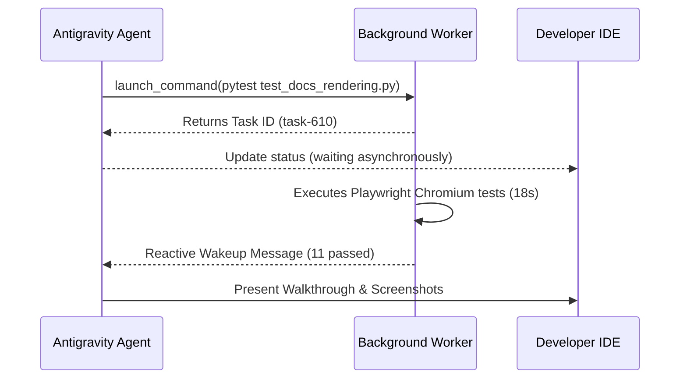
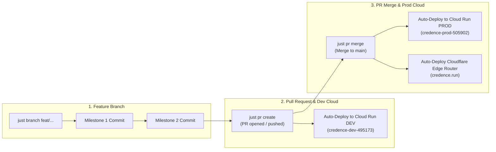

# Antigravity Pair-Programming: Planning Mode, Background Tasks, & Mk1 Eyeball

Explore the operational methodology developed during the creation of Credence using **Google Antigravity (AGY)**—combining rigorous planning mode, non-blocking asynchronous task orchestration, and human-in-the-loop review ("Mk1 Eyeball").



> [!IMPORTANT]
> **[Invariant 6: Human Review Before Commits ("Mk1 Eyeball")](../invariants.md#invariant-6)**: Agents must never execute `git commit` or apply infrastructure changes autonomously without presenting live verification results for human approval first.

---

## 1. The Planning Mode Design Pattern

Complex features and architectural refactors should never be written blindly. When a task involves architectural updates or multi-step changes:

1. **Research First**: Explore codebase dependencies without modifying code files.
2. **Author Implementation Plan Artifact**: Create `implementation_plan.md` with:
   - User Review Required items highlighted with GitHub alerts.
   - Exact file-by-file changes (`[MODIFY]`, `[NEW]`, `[DELETE]`).
   - Automated and manual verification plans.
   - Set `RequestFeedback: true` to prompt human review in the IDE.
3. **Wait for Approval**: Execution is blocked until the operator clicks **Proceed**.

---

## 2. Non-Blocking Task Execution & Reactive Messaging

Traditional agent loops frequently fail due to poll-loop timeouts or freezing terminal windows while long tests run. Antigravity introduces asynchronous task backgrounding:

:::tabs
=== Background Command Launch
```bash
# Long-running Playwright browser suite launched asynchronously
pytest tests/test_docs_rendering.py -v
# Returns task ID: task-610 immediately without blocking agent context
```

=== Reactive Notification
```json
{
  "sender": "task-610",
  "priority": "MESSAGE_PRIORITY_HIGH",
  "content": "Task completed: 11 passed in 18.88s"
}
```
:::



---

## 3. Declarative Subagent Delegation & Role Specialization

For multi-agent workflows, Credence declares specialized subagents configured with targeted system prompts and scoped permission sets (`credence-agent/templates/subagents/`):

| Subagent Role | Mode | Focus & Key Directives |
| :--- | :--- | :--- |
| **`epistemic-auditor`** | `inherit` (Read-only) | Validates $G=1.00$ verbatim grounding, Ed25519 canonical JSON signatures, and SPJ scoring. |
| **`refactor-sentinel`** | `branch` (Worktree) | Enforces the 500 LOC Ceiling Law, function splitting, and `compute_*` naming standards. |
| **`docs-sync-agent`** | `inherit` (Read/Write) | Synchronizes `DOCS_REGISTRY` (`app.js`), `sitemap.md`, and changelogs. |

---

## 4. Turnkey Developer Preflight Loop

To ensure instantaneous developer feedback, all agentic rules and skill schemas are verified with a sub-second check:

```bash
just agent-check
```

---

## 5. Incremental Atomic Commits & Branch-PR Staging Lifecycle

To prevent high-risk monolithic commits and ensure verifiable step-by-step progress, Credence pair programming follows an **Incremental Commit & Branch-PR Staging Architecture**:



### Core Release Rules:
1. **Commit-as-You-Go**: Changes are committed as discrete, tested units (`just commit "<message>"`) throughout the session after each test gate passes, rather than batched into one massive release commit.
2. **Feature Branch Isolation**: Active development occurs on dedicated feature branches (`just branch <name>`) across all ecosystem repositories.
3. **Automated Dev Cloud Staging**: Opening a Pull Request or pushing new commits automatically triggers `deploy-dev.yml` to deploy live previews to `credence-dev-495173`.
4. **Automated Production Release on Merge**: Merging the PR into `main` automatically triggers `deploy-backend.yml` and `deploy-edge.yml` to deploy to `credence-prod-505902` and Cloudflare Pages.

> [!TIP]
> Use read-only `epistemic-auditor` subagents when auditing large codebases to prevent polluting the main agent's working context memory.


