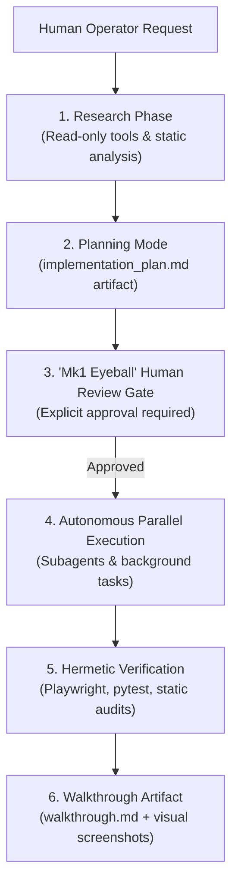
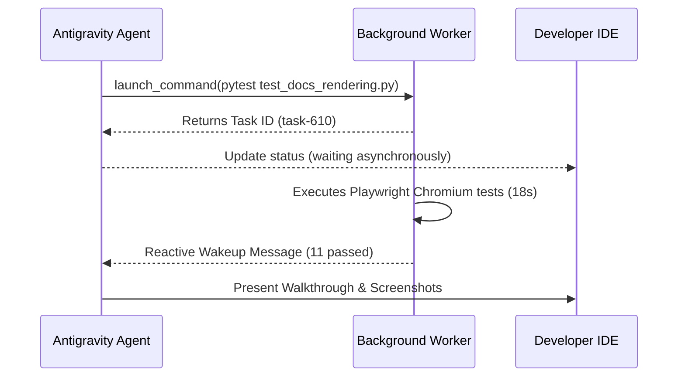

# Antigravity Pair-Programming: Planning Mode, Background Tasks, & Mk1 Eyeball

Explore the operational methodology developed during the creation of Credence using **Google Antigravity (AGY)**—combining rigorous planning mode, non-blocking asynchronous task orchestration, and human-in-the-loop review ("Mk1 Eyeball").



> [!IMPORTANT]
> **[Invariant 6: Human Review Before Commits ("Mk1 Eyeball")](../invariants.md#invariant-6)**: Agents must never execute `git commit` or apply infrastructure changes autonomously without presenting live verification results for human approval first.

---

## 1. The Planning Mode Design Pattern

Complex features and architectural refactors should never be written blindly. When a task involves architectural updates or multi-step changes:

1. **Research First**: Explore codebase dependencies without modifying code files.
2. **Author Implementation Plan Artifact**: Create `implementation_plan.md` with:
   - User Review Required items highlighted with GitHub alerts.
   - Exact file-by-file changes (`[MODIFY]`, `[NEW]`, `[DELETE]`).
   - Automated and manual verification plans.
   - Set `RequestFeedback: true` to prompt human review in the IDE.
3. **Wait for Approval**: Execution is blocked until the operator clicks **Proceed**.

---

## 2. Non-Blocking Task Execution & Reactive Messaging

Traditional agent loops frequently fail due to poll-loop timeouts or freezing terminal windows while long tests run. Antigravity introduces asynchronous task backgrounding:

:::tabs
=== Background Command Launch
```bash
# Long-running Playwright browser suite launched asynchronously
pytest tests/test_docs_rendering.py -v
# Returns task ID: task-610 immediately without blocking agent context
```

=== Reactive Notification
```json
{
  "sender": "task-610",
  "priority": "MESSAGE_PRIORITY_HIGH",
  "content": "Task completed: 11 passed in 18.88s"
}
```
:::



---

## 3. Subagent Delegation: Research vs Coding

For broad surveys of large codebases, Antigravity delegates exploration to specialized subagents:

| Agent Type | Capabilities | Typical Use Cases |
| :--- | :--- | :--- |
| **`research`** | Read-only tools, web search, file view | Deep taxonomy searches, dependency audits |
| **`self`** | Inherited tools, edit, write, run | Multi-repo sync, release coordination |
| **`cortex`** | Core planner, artifact authoring | Implementation plans, walkthroughs, review |

> [!TIP]
> Use read-only `research` subagents when auditing large codebases to prevent polluting the main agent's working context memory.
