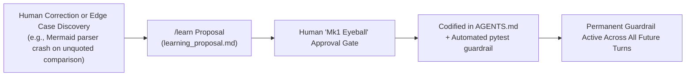

# Continuous Learning with /learn: Codifying Edge Cases into Machine Invariants

Discover how Credence uses the `/learn` slash command to transform transient corrections and post-mortem findings into permanent, machine-verifiable invariants in `AGENTS.md`.



> [!NOTE]
> **[Invariant 18: Context Governance & Progressive Disclosure](../invariants.md#invariant-18)**: Keep `AGENTS.md` lean (<1,000 tokens) in thematic categories. Place multi-step runbooks in `.agents/skills/` and complete specifications in `docs/`.

---

## 1. The Lifecycle of a Machine Invariant

When an unexpected edge case occurs during pair-programming, Credence follows a 3-step crystallization process:

1. **Root Cause Analysis**: Identify why the issue occurred (e.g., Markdown parsers failing on unescaped `<` inside Mermaid node strings).
2. **Drafting the Learning Proposal**: Create `learning_proposal.md` proposing the exact textual additions to `AGENTS.md` with rationale.
3. **Automated Test Guardrail**: Add a matching test in `tests/test_docs_integrity.py` or `tests/test_docs_rendering.py` so CI enforces the rule permanently.

---

## 2. Real-World Case Studies from Credence Development

| Incident / Edge Case | Immediate Fix | Codified Invariant Added via `/learn` | Automated Guardrail |
| :--- | :--- | :--- | :--- |
| **Mermaid Syntax Crashes** | Quoted node strings | **[Invariant 34: Universal Mermaid Syntax Guardrail](../invariants.md#invariant-34)** | `test_mermaid_diagram_syntax_integrity` |
| **Wall-of-Text Fatigue** | Added flowcharts & tables | **[Invariant 35: Visual Density Invariant ($\ge 2.0$/500w)](../invariants.md#invariant-35)** | `scratch/audit_visual_density.py` |
| **Multi-Repo Version Drift** | Updated `credence.run` | **[Invariant 3: Version Parity Governance](../invariants.md#invariant-3)** | `test_ecosystem_version_parity` |
| **Unlinked Invariant Mentions** | Cross-linked markdown | **[Invariant 30: Invariant Linking Guardrail](../invariants.md#invariant-30)** | `test_all_invariant_references_are_linked` |

---

## 3. The Structure of a High-Signal Agent Rule

Effective rules in `AGENTS.md` must be **actionable, unambiguous, and mathematically testable**:

:::tabs
=== ❌ Vague Rule (Ignored by LLMs)
```markdown
Make sure diagrams look nice and documentation is easy to read.
```

=== ✅ High-Signal Credence Invariant
```markdown
- **Visual Density & Anti-Wall-of-Text Invariant**: All documentation guides, tutorials, and editorial blog posts must maintain a visual density of >= 2.0 visual elements per 500 words (using Mermaid architecture diagrams, comparison matrices, and styled alert callout boxes) to eliminate unformatted prose fatigue.
```
:::

> [!TIP]
> Never let an agent repeat a mistake twice. Whenever a correction is made, trigger `/learn` to cement the behavior permanently.
