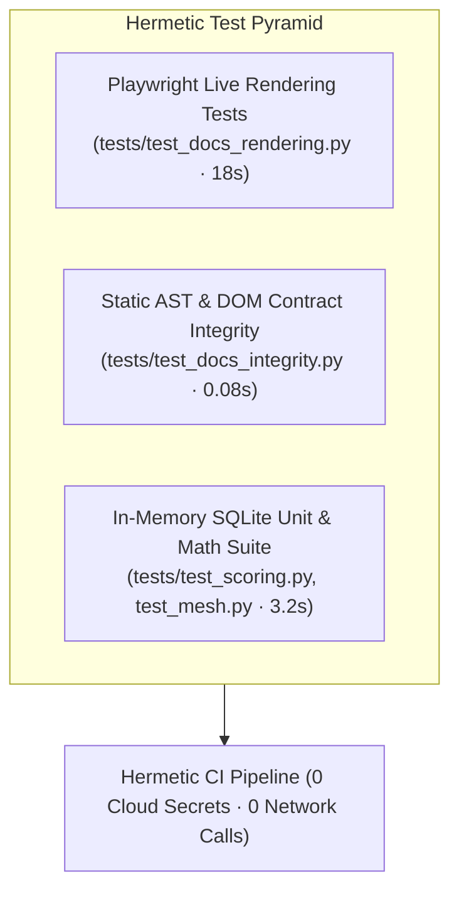

# Hermetic Testing & Zero-npm Guardrails: Engineering High-Longevity AI Systems

Learn the engineering principles behind Credence's 100% network-free hermetic testing architecture and **Zero-npm Invariant**, designed to ensure applications run reliably for decades without build toolchain rot.



> [!IMPORTANT]
> **[Invariant 31: Universal Zero-Build Standards (Zero-npm Invariant)](../invariants.md#invariant-31)**: All public web surfaces, documentation portals (`credence-docs`), and blogs strictly use vanilla HTML5, CSS Custom Properties, and native ES Modules with **zero npm dependencies, zero package.json, and zero build toolchains**.

---

## 1. The Zero-npm Philosophy: Immunity to Toolchain Churn

Web development frameworks (Webpack, Vite, Astro, Next.js) suffer from severe supply-chain churn, breaking changes across major versions, and vulnerability bloat.

By building the Credence documentation and blog engine purely in **vanilla modern ES Modules**:
- **0 build steps**: Edit HTML/CSS/JS and refresh the browser instantly.
- **0 node_modules**: Eliminates thousands of untrusted supply-chain packages.
- **Eternal portability**: Runs on Cloudflare Workers, GitHub Pages, Raspberry Pi, or local file systems identically.

---

## 2. Automated Live Rendering Verification with Playwright

Static HTML linters cannot detect whether client-side JavaScript actually rendered an SVG diagram or if a mathematical formula threw an exception. Credence uses headless Chromium to verify live DOM geometry:

```python
# From tests/test_docs_rendering.py
@pytest.mark.e2e
def test_mermaid_diagrams_render_to_svg(page: Page, docs_server: str) -> None:
    page.goto(f"{docs_server}/#docs/architecture", wait_until="networkidle")
    
    # 1. Ensure raw code blocks were converted
    raw_blocks = page.query_selector_all(".mermaid-code pre code.language-mermaid")
    assert len(raw_blocks) == 0

    # 2. Ensure rendered SVGs have non-zero geometry
    rendered_svgs = page.query_selector_all(".mermaid-rendered svg")
    for svg in rendered_svgs:
        box = svg.bounding_box()
        assert box["width"] > 50 and box["height"] > 30
```

---

## 3. Comparison: Traditional Web Stack vs. Credence Zero-Build

| Metric | Traditional Node.js Docs (Astro/Next) | Credence Zero-Build ES Module Stack |
| :--- | :--- | :--- |
| **npm Dependencies** | 800+ packages (`~350MB`) | **0 packages (`0 bytes`)** |
| **Build Time** | 45–90 seconds per deploy | **0.00 seconds (Instant)** |
| **Test Suite Latency** | 60+ seconds (Vite / Jest) | **<0.1s static / 18s Playwright** |
| **Supply Chain Risk** | High (transitive CVEs) | **Zero (100% auditable local assets)** |
| **Long-Term Longevity** | High break risk after 2 years | **Runs indefinitely on standard browsers** |

> [!TIP]
> Use ephemeral TCP ports (`ReusableTCPServer(("127.0.0.1", 0))`) in Python test runners to prevent port collisions during parallel test execution.
