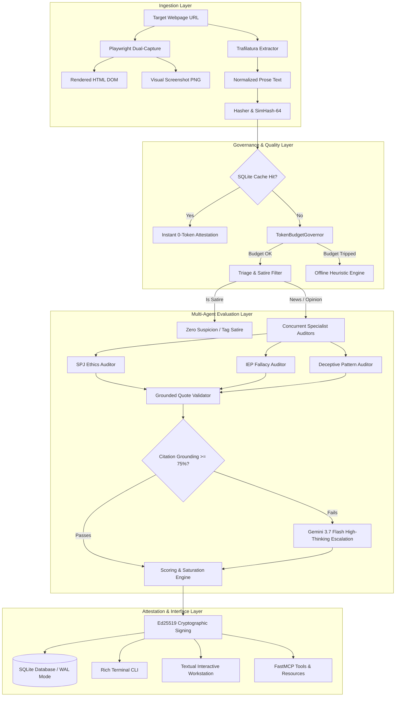

# Decentralized Architecture

**Credence** is an autonomous epistemic evaluation engine, FastMCP 2.0 server, and decentralized trust network designed to analyze digital media against formal journalistic ethics, logical fallacies, and deceptive UI patterns.

### Architectural Component Matrix

| Layer | Primary Responsibilities | Core Technologies | Key Invariants |
| :--- | :--- | :--- | :--- |
| **Ingestion** | Dual DOM/prose extraction, SimHash-64 deduplication | Trafilatura, Playwright, SQLite WAL | SSRF guard, semaphore concurrency |
| **Governance** | Token budget metering, offline heuristics | TokenBudgetGovernor, Rule Catalogs | Circuit breaker at 30% headroom |
| **Evaluation** | 4-specialist audit, verbatim substring grounding | Gemini 3.7 Flash, Namespaced Taxonomies | $G=1.00$ exact quote matching |
| **Cryptographic Mesh** | Ed25519 signing, epidemic gossip, consensus | RFC 8785 Canonical JSON, Ed25519 | $3f+1$ Sybil resistance, Galileo Rule |
| **Presentation** | CLI, Textual TUI, FastMCP 2.0, Zero-Build Web | Rich, Textual, FastMCP, WebCrypto | 4-interface synchronous feature parity |

> [!TIP]
> **Decoupled Architecture**: In accordance with the Pure Logic Decoupling Invariant, all business logic and scoring mathematics execute completely independent of UI rendering layers.

---

## 1. Dual-Capture Ingestion Engine

Credence captures both structural content and visual presentation:
- **Clean Prose Extraction**: Uses Trafilatura to extract primary article text, title, author bylines, and schema.org metadata while stripping tracking scripts and ad boilerplate.
- **Visual & DOM Snapshotting**: Runs headless Chromium via Playwright to generate full-page visual screenshots (`.png`) and rendered DOM dumps (`.html`).
- **Memory Protection Gate**: All Playwright browser instances are strictly serialized through an `asyncio.Semaphore(1)` gate (`MAX_CONCURRENT_SNAPSHOTS`), preventing OOM crashes.
- **Deterministic Content Hashes**:
  - Unicode NFKC normalization and whitespace collapsing.
  - Cryptographic `SHA-256` content hash.
  - 64-bit `SimHash` with Hamming distance comparison to identify mirror sites and near-duplicate publications.

---

## 2. Multi-Agent Evaluation Pipeline

The evaluation pipeline dispatches 4 specialist agents:
1. **SPJ Ethics Auditor**: Truth and verification, minimizing harm, editorial independence, and transparency.
2. **IEP Fallacy Auditor**: Informal and formal fallacies grouped into 6 cognitive families.
3. **Deceptive Patterns Auditor**: Visual dark patterns, fake countdown timers, and confirmshaming.
4. **Provenance & Satire Classifier**: Masthead badges, schema markup, and `SPJ-1.6` cloaking checks.

---

## 3. Cryptographic Mesh & Bayesian Consensus

Nodes sign audit reports using **Ed25519** over **RFC 8785 Canonical JSON**. Signed envelopes are gossiped across the 13-node Watts-Strogatz mesh, and consensus is aggregated using Domain Authority Weighted Medians with the Galileo Rule protection.
