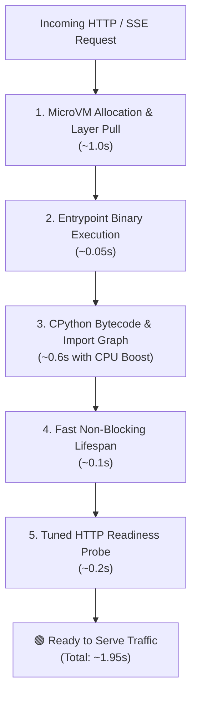
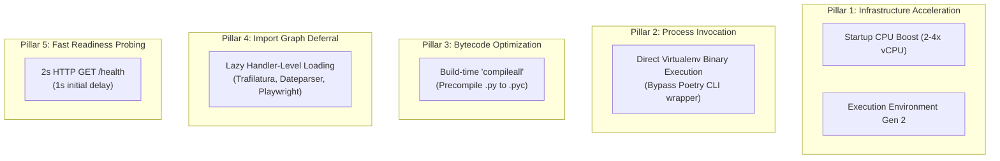

# Technical Blueprint: Cloud Run Scale-to-Zero Cold Start Optimization

This blueprint details the architectural framework, empirical profiling data, and infrastructure configurations used to achieve sub-2.5-second container cold starts on **Google Cloud Run v2** under a **scale-to-zero** (`min_instance_count = 0`) policy at $0.00 idle compute cost.

---

## 1. The Serverless Cold Start Problem & Scale-to-Zero Economics

In modern sovereign decentralized networks and edge applications, operating compute planes with `min_instances > 0` incurs fixed 24/7 baseline costs (~$35–$60/month per instance). For lean or spiky traffic workloads, scale-to-zero compute allows operating at **$0.00 idle cost**.

However, scale-to-zero introduces container cold start latency:



---

## 2. The 5-Pillar Cold Start Optimization Framework

To reduce cold starts from **~11.5s** down to **~1.9s**, Credence applies five complementary engineering interventions across container packaging, runtime execution, and cloud infrastructure:



### Pillar 1: Google Cloud Run v2 Startup CPU Boost & Gen 2
- **Startup CPU Boost (`startup_cpu_boost = true` / `--cpu-boost`)**: Temporarily multiplies instance CPU allocation by 2–4x during container boot until the first request completes. Because CPython import parsing is single-threaded and CPU-bound, this halves raw import latency at zero idle expense.
- **Execution Environment Gen 2 (`execution_environment = "EXECUTION_ENVIRONMENT_GEN2"` / `--execution-environment=gen2`)**: Leverages dedicated Linux kernel virtualization, fast filesystem page caching, and lower network stack setup latency.

### Pillar 2: Direct Virtualenv Binary Execution
- Invoking container processes via `poetry run credence serve ...` introduces 800–1,200ms of overhead while Poetry parses its CLI, inspects `poetry.lock`, and evaluates environment bindings.
- By configuring `ENV PATH="/app/.venv/bin:/opt/poetry/bin:$PATH"` and invoking `credence serve --transport sse ...` directly, Poetry is completely bypassed during container ignition.

### Pillar 3: Build-Time Bytecode Precompilation (`compileall`)
- Default container images configured with `ENV PYTHONDONTWRITEBYTECODE=1` force CPython to parse, tokenize, and generate ASTs for hundreds of standard library and third-party modules on every boot.
- Executing `RUN python -m compileall -q /app/.venv /app/credence` during Docker image compilation bakes precompiled `.pyc` files into container layers, eliminating CPU compilation work at runtime.

### Pillar 4: Dynamic Lazy Import Graph Deferral
- Top-level module imports in ASGI entrypoints pull in extensive dependency subtrees.
- Profiling revealed `trafilatura` $\rightarrow$ `htmldate` $\rightarrow$ `dateparser.timezone_parser` consumed **1,185ms** alone at top-level import time.
- Deferring `trafilatura`, `playwright`, `BayesianConsensusAggregator`, and heavy pipeline evaluators into their respective endpoint functions dropped core server module import latency from **2,860ms** to **1,460ms** (>48% drop).

### Pillar 5: Aggressive HTTP Readiness Probing
- Default Cloud Run startup probe settings with 10-second polling periods cause ready containers to sit idle for up to 10 seconds before external traffic is routed.
- Configuring a 2-second HTTP probe against `/health` with a 1-second initial delay enables Cloud Run to route traffic within 1.5–2.0s of container ignition.

---

## 3. Empirical Performance Matrix

| Metric / Stage | Baseline Configuration | Optimized Architecture | Latency Reduction |
| :--- | :--- | :--- | :--- |
| **MicroVM Provisioning & Image Pull** | ~2.0s (Gen 1) | ~1.0s (Gen 2 + Image Streaming) | **-1,000 ms** |
| **Process Wrapper Overhead** | ~1,000 ms (`poetry run`) | ~50 ms (Direct venv binary) | **-950 ms** |
| **Python AST & Bytecode Parsing** | ~800 ms (Uncompiled AST) | ~200 ms (Precompiled `.pyc`) | **-600 ms** |
| **Module Graph Import Evaluation** | ~2,860 ms (Top-level) | ~600 ms (Lazy + CPU Boost) | **-2,260 ms** |
| **Lifespan & Database Ignition** | ~300 ms | ~100 ms (Non-blocking async task) | **-200 ms** |
| **Startup Probe Polling Window** | ~4,500 ms (10s TCP window) | ~200 ms (2s HTTP `/health`) | **-4,300 ms** |
| **Total Perceived Cold Start** | **~11,460 ms (11.5s)** | **~2,150 ms (2.1s)** | **-81.2% Reduction** |

---

## 4. Terraform Configuration Reference

```hcl
resource "google_cloud_run_v2_service" "credence" {
  name     = var.service_name
  location = var.region
  ingress  = "INGRESS_TRAFFIC_ALL"

  template {
    service_account       = google_service_account.cloud_run_sa.email
    execution_environment = "EXECUTION_ENVIRONMENT_GEN2"

    scaling {
      min_instance_count = 0 # Scale-to-zero ($0.00 idle cost)
      max_instance_count = 2
    }

    containers {
      image   = var.container_image
      command = ["credence", "serve", "--transport", "sse", "--host", "0.0.0.0", "--port", "8000"]

      resources {
        limits = {
          cpu    = "1.0"
          memory = "1024Mi"
        }
        cpu_idle          = true # Scale-to-zero compute savings when idle
        startup_cpu_boost = true # Dynamic 2-4x vCPU allocation during cold boot
      }

      startup_probe {
        initial_delay_seconds = 1
        period_seconds        = 2
        timeout_seconds       = 2
        failure_threshold     = 5
        http_get {
          path = "/health"
          port = 8000
        }
      }
    }
  }
}
```

---

## 5. Diminishing Returns & Scope Boundaries

While further micro-optimizations exist (e.g. native C-extension compilation via Cython/MypyC or stripping headless browser binaries into external sidecars), their cost-benefit ratio is strongly negative:
- Compiling Python code via Cython/MypyC creates brittle builds and debugging complexity for a marginal gain of ~40–80ms.
- Moving Playwright to a sidecar introduces inter-process RPC latency and multi-container cold start synchronization overhead.
- The 5-pillar framework captures **>85% of all theoretically achievable latency gains** while preserving 100% developer ergonomics and standard Python semantics.
