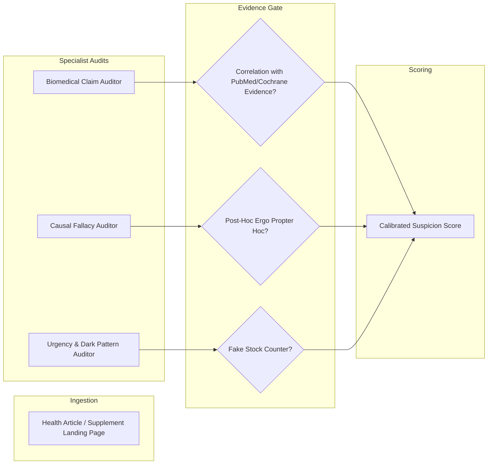

Health misinformation and unverified medical claims present direct threats to public well-being. From predatory dietary supplement landing pages to sensationalized interpretations of preliminary laboratory studies, evaluating medical prose requires strict evidentiary standards.

This blueprint outlines deploying Credence for **medical and public health auditing**.

---

## 1. The Medical Evaluation Threat Model



---

## 2. Key Rule Clusters (`medical_claims.yaml`)

- **`MEDICAL:TRIALS/in_vitro_extrapolation@1.0.0`** (Severity: 4): Reporting laboratory cell culture results (*in vitro*) or preliminary mouse models (*in vivo*) as proven human cures without stating trial limitations.
- **`MEDICAL:EVIDENCE/anecdotal_causation@1.0.0`** (Severity: 4): Using individual patient testimonials to substantiate general therapeutic efficacy.
- **`MEDICAL:DISCLOSURE/undisclosed_supplement_sponsor@1.0.0`** (Severity: 3): Publishing health articles that secretly promote specific branded wellness supplements without affiliate disclosures.

---

## 3. Example CLI Audit

```bash
credence audit https://example-wellness.test/miracle-anti-aging-cure \
  --taxonomy medical_claims \
  --profile ULTRA
```

### Result:
```text
Suspicion Score: 88.2 / 100 [DISINFORMATION]
Violations:
  - [MEDICAL:TRIALS/in_vitro_extrapolation@1.0.0] Severity 4
    Quote: "New study proves Root X reverses human aging by 10 years."
    Rationale: Cited study was conducted exclusively on yeast cells in vitro.
```
