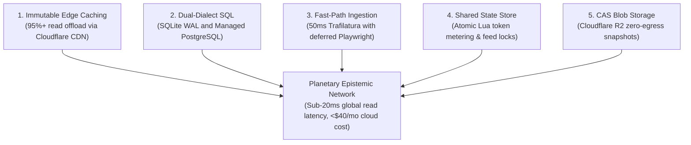

# Technical Blueprint: High-Efficiency Scaling & Resiliency Architecture

This blueprint documents the architectural patterns enabling Credence to scale horizontally to 100M+ monthly queries while maintaining strict cost bounds and $G=1.00$ verbatim epistemic grounding.

---

## 1. The 5 Value Pillars

---

## 2. Ingestion Decision Matrix

Trafilatura handles 95% of standard news articles in $<50\text{ms}$ consuming $<15\text{MB}$ RAM. Full Playwright Chromium capture is only invoked when:
1. Extracted text is $<50$ words (indicating client-side SPA rendering).
2. Deceptive pattern inspection (`DP-*`) is explicitly requested under `profile=ultra`.
