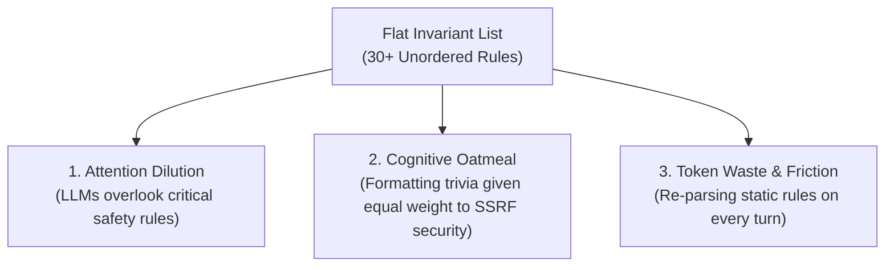
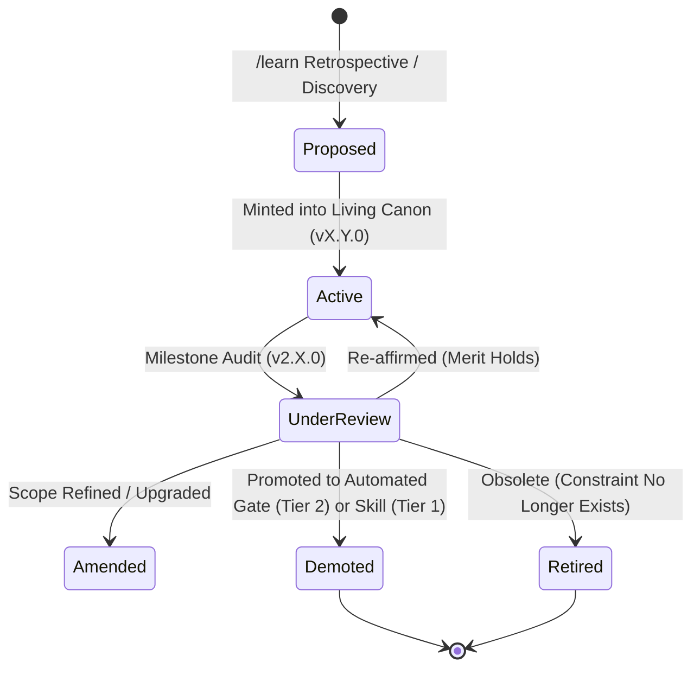
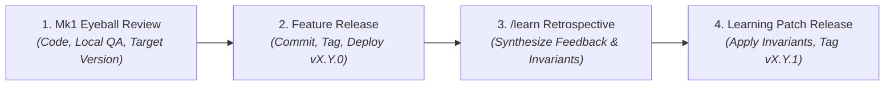

# Technical Blueprint: Invariant Scalability & Knowledge Governance

This blueprint details the architectural framework, governance hierarchy, and shift-left automation used by Credence to scale the Living Canon of System Invariants across 15+ versions without suffering from context window bloat, rule dilution, or cognitive degradation in autonomous AI coding agents.

---

## 1. The Scaling Problem in Autonomous Agent Governance

As complex software ecosystems evolve, engineering invariants, security boundaries, and protocol contracts naturally multiply:
- **Epistemic constraints** (verbatim grounding $G=1.00$, satire safeguards, topic entropy $H < 0.30$).
- **Cryptographic integrity** (RFC 8785 canonical JSON bytes, Ed25519 custody, anti-tampering).
- **Presentation standards** (Zero-npm vanilla HTML5/ES modules, 4-way parity across CLI, FastMCP, TUI, Web).
- **Infrastructure & performance** (Scale-to-zero Cloud Run tuning, Startup CPU Boost, bytecode precompilation, build context exclusions).

When all rules are dumped into a single flat file (`AGENTS.md` / system prompt), autonomous agents suffer from three distinct cognitive failure modes:

---

## 2. The 3-Tier Invariant Scalability Framework

To maintain extreme precision while keeping universal system prompt context under **800 tokens**, Credence stratifies invariants into a 4-layer taxonomy based on **enforcement criticality, execution scope, and automation feasibility**:

---

## 3. Layer-by-Layer Specifications

### Tier 0: Universal Core Invariants (`AGENTS.md`)
- **Execution Mode**: `always_on` (injected directly into agent root prompt on every turn).
- **Context Budget**: **< 800 tokens**.
- **Prioritized 3-Class Cognitive Taxonomy**:
  - **Class α (Alpha) - Sovereign Safety, Custody & Human Authority (P0 Non-Negotiables)**: Human Review ("Mk1 Eyeball"), Epistemic Verbatim Grounding ($G=1.00$), RFC 8785 Canonical JSON & Ed25519 Custody, Untrusted Ingestion Boundary & Network Defense, Clean Scratch Script Approvals.
  - **Class β (Beta) - Execution Topology, Lifecycle & Release Architecture (P1 Process Boundaries)**: 4-Phase Release & Learning Lifecycle, The Cart-Before-the-Horse Order-of-Operations, Commit-Before-Deploy & Push-and-Delegate CI/CD Gate, 3-Plane Decoupling, Hermetic Unit Test Isolation.
  - **Class γ (Gamma) - Interface Symmetry, Epistemic Parity & Governance (P2 Ergonomics & Presentation)**: Universal 4-Way Feature Parity, The Epistemic Lensing & Information Pyramid, Session-Driven Documentation Expansion, Dynamic Invariant Canon Naming ("The Invariant Bible"), Multi-Model Sovereignty.

### Tier 1: Progressive Subsystem Skills (`.agents/skills/`)
- **Execution Mode**: `on_demand` (only metadata is visible; full body is loaded when relevant).
- **Context Budget**: Dynamic (loads only during active domain tasks).
- **Inclusion Criteria**:
  - Subsystem-specific operational playbooks (e.g. Google Cloud Run cold start tuning, P2P mesh partition recovery).
  - Multi-step procedural runbooks requiring specific CLI command permutations.
  - Enforces schema and token economy via automated linter (`scripts/lint_skills.py`).

### Tier 2: Shift-Left Automated Test Gates (`test_docs_integrity.py` & `Justfile`)
- **Execution Mode**: `pre_commit` / CI/CD (executed in $<0.3\text{s}$ during `just check`).
- **Philosophy**: *If a machine can assert it deterministically, never waste LLM attention tokens prompting for it.*
- **Enforced Contracts**:
  - Valid YAML frontmatter on all `.md` files.
  - Absence of `package.json` / `node_modules` in zero-build web directories.
  - Complete 7-manifest semantic version synchronization.
  - 100% route coverage in `sitemap.md`.
  - Contrast and syntax validity in Mermaid diagrams.
  - Complete schema integrity and token budget validation on all `.agents/skills/`.
  - JSON schema integrity for all subagent delegation templates.

### Tier 3: Master Canonical Reference Catalog (`docs/invariants.md`)
- **Execution Mode**: Reference only (queried on-demand).
- **Scope**: Contains the living canon of system invariants, complete with mathematical formulas, LaTeX proofs, edge case analyses, and historical architecture context.

---

## 4. Invariant Mutability & The Demotion Highway

Invariants are not immutable dogmas; they represent the **strongest empirical truth validated at project epoch $t$**.

### The Invariant Lifecycle State Machine
1. **`Proposed`**: Synthesized during `/learn` retrospectives or post-mortems.
2. **`Active`**: Formally adopted and minted into `AGENTS.md` and `docs/invariants.md`.
3. **`Under Review`**: Evaluated during minor version release boundaries (`v2.X.0`) or constitutional review milestones.
4. **`Amended`**: Refined, sharpened, or merged with related invariants to adapt to architectural advancements.
5. **`Demoted` (The Demotion Highway)**: Graduated out of prompt context into automated deterministic test gates (Tier 2) or progressive skills (Tier 1) via `just audit-demotions`.
6. **`Retired`**: Archived with rationale in `docs/invariants.md` when the underlying constraint or technology is obsoleted.

---

## 5. Subagent Delegation Architecture

To streamline complex multi-agent pair programming, specialized subagents are declared via JSON configuration templates:

| Subagent Name | Default Workspace | Role & Purpose |
| :--- | :--- | :--- |
| **`epistemic-auditor`** | `inherit` | Strictly read-only validation of $G=1.00$ verbatim citations, Ed25519 signatures, and ethical scores. |
| **`refactor-sentinel`** | `branch` | Enforces the 500 LOC Ceiling Law and `compute_*` naming standards in isolated worktrees. |
| **`docs-sync-agent`** | `inherit` | Maintains bidirectional synchronization between `DOCS_REGISTRY` (`app.js`), sitemaps, and changelogs. |

---

## 6. The 4-Phase Delivery & Continuous Learning Lifecycle

Knowledge synthesis and invariant crystallization strictly follow the 4-phase delivery lifecycle:

1. **Phase 1 (Mk1 Eyeball Review)**: Implement feature, execute local QA gauntlet (`just check`), present working-tree diff and explicit target version for human inspection ("Mk1 Eyeball").
2. **Phase 2 (Feature Release)**: Upon approval, commit with clean working tree, synchronize manifests, tag, push to origin, and verify live cloud deployment (e.g. `v2.3.0`).
3. **Phase 3 (`/learn` Retrospective)**: Review session discoveries, user feedback, and security constraints to synthesize high-density invariants and progressive skills.
4. **Phase 4 (Apply Lessons as Patch Release)**: Persist verified learnings into `AGENTS.md`, `.agents/skills/`, and shift-left contract tests, bump to the next patch version (e.g. `v2.3.1`), run `just check`, and release the patch.

---

## 7. Governance Decision Matrix

When a new requirement, discovery, or post-mortem action item arises, apply this routing matrix:

| Finding Characteristic | Correct Layer | Target Location |
| :--- | :--- | :--- |
| **Non-negotiable security or behavioral rule** | Tier 0 | `AGENTS.md` (<800 token budget) |
| **Domain-specific procedural playbook** | Tier 1 | `.agents/skills/<domain>/SKILL.md` |
| **Mechanical syntax or formatting rule** | Tier 2 | `tests/test_docs_integrity.py` |
| **Mathematical proof or formal protocol** | Tier 3 | `docs/invariants.md` & `docs/blueprints/` |

---

## 8. Architectural Benefits

1. **Token Efficiency**: Reduces base system prompt consumption by **>60%**, preserving token budgets for reasoning and thinking steps.
2. **Deterministic Reliability**: Shifts formatting and version verification from fuzzy LLM compliance to 100% deterministic unit tests.
3. **Demotion Highway**: Continuously cleans prompt context as automated test capabilities expand.
4. **Infinite Extensibility**: Allows onboarding new complex subsystems (e.g. mobile viewers, hardware cryptographic enclaves) without inflating universal core prompt size.

