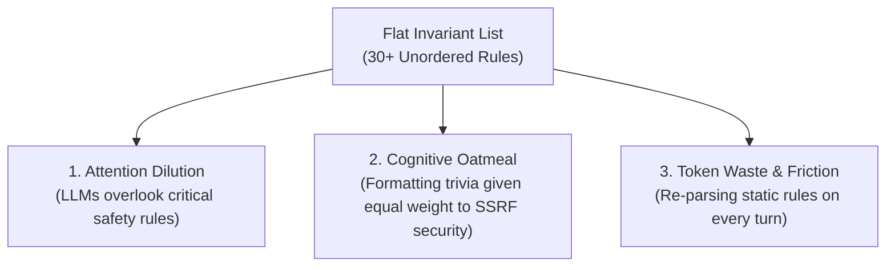
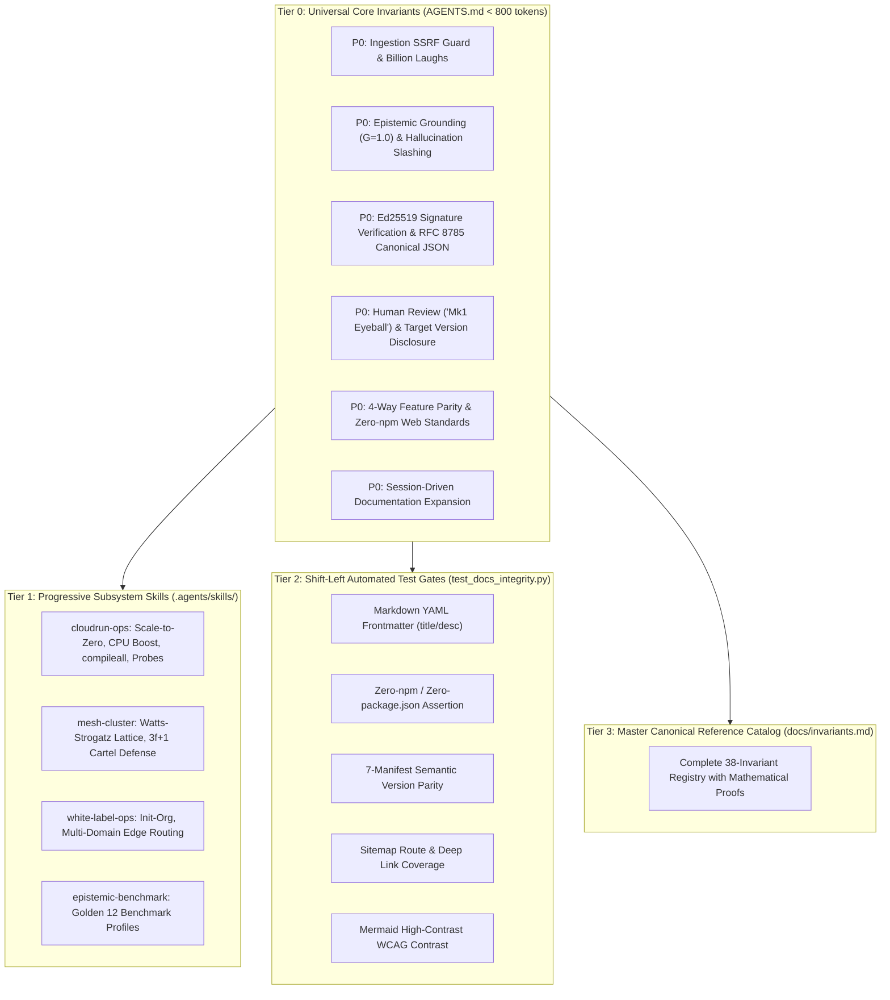

# Technical Blueprint: Invariant Scalability & Knowledge Governance

This blueprint details the architectural framework, governance hierarchy, and shift-left automation used by Credence to scale from 10 to over 38 system invariants across 15 versions without suffering from context window bloat, rule dilution, or cognitive degradation in autonomous AI coding agents.

---

## 1. The Scaling Problem in Autonomous Agent Governance

As complex software ecosystems evolve, engineering invariants, security boundaries, and protocol contracts naturally multiply:
- **Epistemic constraints** (verbatim grounding $G=1.00$, satire safeguards, topic entropy $H < 0.30$).
- **Cryptographic integrity** (RFC 8785 canonical JSON bytes, Ed25519 custody, anti-tampering).
- **Presentation standards** (Zero-npm vanilla HTML5/ES modules, 4-way parity across CLI, FastMCP, TUI, Web).
- **Infrastructure & performance** (Scale-to-zero Cloud Run tuning, Startup CPU Boost, bytecode precompilation, build context exclusions).

When all rules are dumped into a single flat file (`AGENTS.md` / system prompt), autonomous agents suffer from three distinct cognitive failure modes:

---

## 2. The 3-Tier Invariant Scalability Framework

To maintain extreme precision while keeping universal system prompt context under **800 tokens**, Credence stratifies invariants into a 4-layer taxonomy based on **enforcement criticality, execution scope, and automation feasibility**:

---

## 3. Layer-by-Layer Specifications

### Tier 0: Universal Core Invariants (`AGENTS.md`)
- **Execution Mode**: `always_on` (injected directly into agent root prompt on every turn).
- **Context Budget**: **< 800 tokens**.
- **Inclusion Criteria**: Must satisfy at least two of the following:
  1. *Universal Scope*: Applies to all files and operational surfaces.
  2. *Catastrophic Consequence*: A single violation permanently breaks data integrity, security, or core trust.
  3. *Un-lintable Behavioral Intent*: Requires cognitive reasoning that cannot be caught by deterministic regex linters.

### Tier 1: Progressive Subsystem Skills (`.agents/skills/`)
- **Execution Mode**: `on_demand` (only metadata is visible; full body is loaded when relevant).
- **Context Budget**: Dynamic (loads only during active domain tasks).
- **Inclusion Criteria**:
  - Subsystem-specific operational playbooks (e.g. Google Cloud Run cold start tuning, P2P mesh partition recovery).
  - Multi-step procedural runbooks requiring specific CLI command permutations.

### Tier 2: Shift-Left Automated Test Gates (`test_docs_integrity.py` & `Justfile`)
- **Execution Mode**: `pre_commit` / CI/CD (executed in $<0.3\text{s}$ during `just check`).
- **Philosophy**: *If a machine can assert it deterministically, never waste LLM attention tokens prompting for it.*
- **Enforced Contracts**:
  - Valid YAML frontmatter on all `.md` files.
  - Absence of `package.json` / `node_modules` in zero-build web directories.
  - Complete 7-manifest semantic version synchronization.
  - 100% route coverage in `sitemap.md`.
  - Contrast and syntax validity in Mermaid diagrams.

### Tier 3: Master Canonical Reference Catalog (`docs/invariants.md`)
- **Execution Mode**: Reference only (queried on-demand).
- **Scope**: Contains the full registry of all 38 system invariants, complete with mathematical formulas, LaTeX proofs, edge case analyses, and historical architecture context.

---

## 4. Governance Decision Matrix

When a new requirement, discovery, or post-mortem action item arises, apply this routing matrix:

| Finding Characteristic | Correct Layer | Target Location |
| :--- | :--- | :--- |
| **Non-negotiable security or behavioral rule** | Tier 0 | `AGENTS.md` (<800 token budget) |
| **Domain-specific procedural playbook** | Tier 1 | `.agents/skills/<domain>/SKILL.md` |
| **Mechanical syntax or formatting rule** | Tier 2 | `tests/test_docs_integrity.py` |
| **Mathematical proof or formal protocol** | Tier 3 | `docs/invariants.md` & `docs/blueprints/` |

---

## 5. Architectural Benefits

1. **Token Efficiency**: Reduces base system prompt consumption by **>60%**, preserving token budgets for reasoning and thinking steps.
2. **Deterministic Reliability**: Shifts formatting and version verification from fuzzy LLM compliance to 100% deterministic unit tests.
3. **Infinite Extensibility**: Allows onboarding new complex subsystems (e.g. mobile viewers, hardware cryptographic enclaves) without inflating universal core prompt size.
