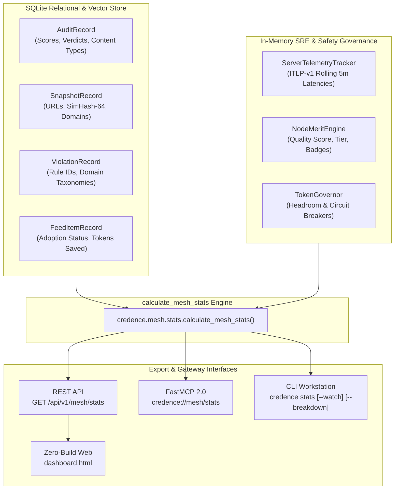

# Node & P2P Mesh Telemetry Dashboard Architecture

> **Specification Identifier**: `BLUEPRINT-019`  
> **Status**: Verified in `v1.15.0`  
> **Target Surfaces**: Zero-Build Web UI (`credence.nexus/dashboard.html`), Rich CLI (`credence stats`), Textual TUI (`[H] Health`), FastMCP 2.0 (`credence://mesh/stats`)

---

## 1. Executive Summary & Design Principles

Credence operates as a decentralized, federated network of independent validator and sifter nodes. As a node operator, visibility into **local execution**, **mesh dynamics**, and **economic efficiency** is essential for maintaining epistemic integrity and optimizing compute resources.

The **Credence Node & Mesh Telemetry Dashboard** adheres to three core architectural principles:

1. **First-Person Operator Primacy ("My Node at a Glance")**: Before diving into macro-network topology, the operator must immediately understand local state:
   - *What is my server doing right now?* (Uptime, memory RSS vs. 850 MB ceiling, cost profile, token headroom).
   - *How many articles have I evaluated?* (Lifetime & today, average suspicion score $\overline{S}$, verbatim grounding quotient $G = 1.00$).
   - *What mesh connections do I maintain?* (Active peers, bootstrap seeds, Byzantine fault tolerance margin $3f+1$).
   - *What compute savings has my node realized?* (Tokens and USD avoided through zero-token attestation adoption).
2. **Universal 4-Way Feature Parity**: Operators can access identical telemetry structures across Web, CLI, TUI, and FastMCP agent protocols.
3. **Zero-Build & Zero-npm Strict Invariant**: Web dashboards must run hermetically using vanilla HTML5, CSS Custom Properties, and native ES Modules with zero build steps and zero `npm` packages.

---

## 2. Telemetry Ingestion & Aggregation Architecture



---

## 3. Mathematical Metric Definitions

### 3.1 Verbatim Grounding Quotient (\(G\))

Every audit citation must match the raw HTML DOM character-for-character after whitespace normalization. The node's grounding quotient is defined as:

\[
G = \frac{\sum_{i=1}^{N_{\text{citations}}} \mathbb{I}(\text{dom\_match}_i)}{N_{\text{citations}}} \equiv 1.00
\]

Any non-zero deviation indicates prompt hallucination and automatically triggers a 50% reputation slash.

### 3.2 BitTorrent Work-Sharing Compute Savings

When a node discovers a syndicated feed item that has already been evaluated and signed by a trusted peer ($Q_j \ge 0.70$), it adopts the signed attestation at 0 token cost:

\[
T_{\text{saved}} = \sum_{k=1}^{M_{\text{adopted}}} T_{\text{tokens}}(k) \approx M_{\text{adopted}} \times 4{,}200 \text{ tokens}
\]

\[
\text{USD}_{\text{avoided}} = \frac{T_{\text{saved}}}{1{,}000{,}000} \times \$0.70
\]

\[
\eta_{\text{mesh}} = \frac{M_{\text{adopted}}}{N_{\text{audits}} + M_{\text{adopted}}} \times 100\%
\]

---

## 4. REST API & FastMCP Schema Specification

`GET /api/v1/mesh/stats` and `credence://mesh/stats` yield the following structured RFC 8785 canonical JSON payload:

```json
{
  "service": "credence",
  "version": "1.15.0",
  "timestamp": "2026-08-19T19:30:00Z",
  "my_node": {
    "node_id": "node_9580dc91",
    "node_pubkey": "ed25519:9580dc91...",
    "status": "healthy",
    "active_profile": "balanced",
    "uptime_seconds": 224540,
    "uptime_human": "2d 14h 22m",
    "memory_mb": 142.5,
    "memory_limit_mb": 850.0,
    "memory_percent": 16.8,
    "total_audited_lifetime": 635,
    "total_audited_today": 414,
    "avg_suspicion_score": 18.4,
    "avg_grounding_quotient": 1.00,
    "verdicts_breakdown": {
      "clean": 298,
      "low_suspicion": 266,
      "suspicious": 66,
      "high_deception": 3,
      "satire": 2
    },
    "merit": {
      "score": 85.0,
      "tier": "SPROUT"
    },
    "token_headroom": {
      "remaining_quota": 500000,
      "circuit_breaker": "NORMAL"
    }
  },
  "mesh_dynamics": {
    "connected_peers_count": 4,
    "seeds_status": {
      "canonical_domain": "seeds.credence.nexus",
      "is_reachable": true,
      "seed_nodes_count": 2
    },
    "compute_savings": {
      "total_queries_resolved": 640,
      "local_evaluations_count": 635,
      "adopted_from_mesh_count": 5,
      "work_sharing_efficiency_pct": 92.3,
      "tokens_saved_estimate": 21000,
      "usd_saved_estimate": 0.01
    },
    "byzantine_safety_margin": "3f+1 Verified (N=13, f=4)"
  }
}
```

---

## 5. CLI & TUI Interface Usage

### 5.1 CLI Command (`credence stats`)

```bash
# Standard interactive operator view
credence stats

# Detailed publisher domains and category breakdown
credence stats --breakdown

# Continuous real-time terminal watch
credence stats --watch

# Raw machine-readable JSON export
credence stats --json
```

### 5.2 Textual TUI Workstation

Launch the interactive terminal workstation:
```bash
credence tui
```
Navigate to `[🚨 Ops & Alerts]` or `[🏆 Leaderboard]` to inspect real-time rolling latencies, active alert conditions, and merit badges.
