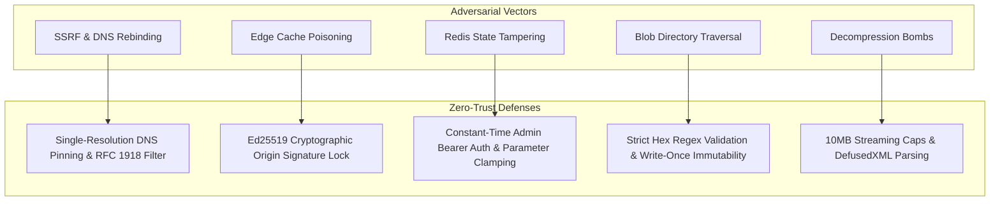

# Technical Blueprint: Security Architecture & Threat Model

This document establishes the zero-trust security controls protecting Credence nodes against network exploitation, state poisoning, and prompt injection.

---

## 1. Threat Vector & Countermeasure Matrix

---

## 2. Ingestion Defense Specifications
- **Single-Resolution DNS Pinning**: Resolves host IP once, validates non-routable ranges, and opens raw sockets directly to the pinned IP with `Host:` attached.
- **Decompression Caps**: Enforces `max_content_length = 10_485_760` (10MB) on chunked streams.
- **External Text Isolation**: Untrusted scraped prose is wrapped in `<untrusted_source_text>` XML containers before entering subagent context.
