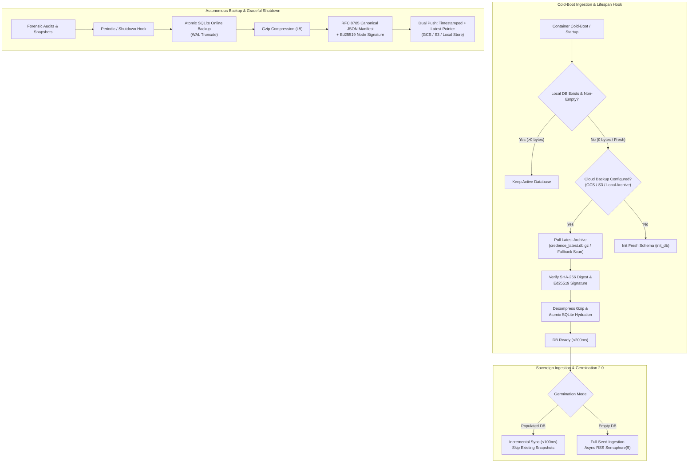
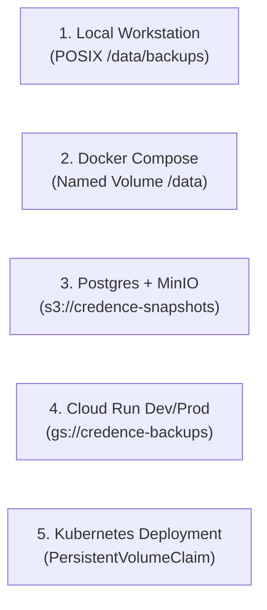

# Technical Blueprint: Sovereign Data Gravity and CAS Portability

This blueprint details how Credence enforces cryptographic content immutability, universal multi-cloud backup, and cold-boot recovery across local workstations, containerized serverless runtimes (Cloud Run), and distributed Kubernetes clusters.



---

## 1. Content-Addressable Storage (CAS) Invariant

All web snapshot artifacts, raw DOM dumps, screenshot binaries, and forensic verification receipts are stored under canonical SHA-256 addresses:

$$	ext{Address} = 	ext{"cas/sha256/"} + 	ext{SHA256}(	ext{BinaryPayload}) + 	ext{".ext"}$$

This guarantees mathematical properties across storage tiers:
1. **Idempotence & Deduplication**: Identical DOM captures produce identical SHA-256 keys, eliminating duplicate storage across audit iterations.
2. **Zero-Lock Portability**: Content addresses are completely decoupled from database primary keys. Moving from local POSIX filesystems to Cloudflare R2, AWS S3, or Google Cloud Storage requires zero alterations to stored database records.
3. **Cryptographic Proof Matching**: Web clients and external MCP agents verify in-browser WebCrypto hashes directly against signed CAS receipts.

---

## 2. Universal Sovereign Backup & Cold-Boot Recovery Engine

In serverless scale-to-zero compute topologies (such as Google Cloud Run or AWS Fargate), container instances may be decommissioned during idle periods and cold-booted on demand. Without sovereign state persistence, cold instances risk losing historical audit records, node reputation ratings, and peer gossip attestations.

Credence v2.4.0 introduces the **Universal Sovereign Backup Engine** (`credence/storage/backup.py`), operating symmetrically across all deployment modes:

| Dimension | Specification | Verification Invariant |
| :--- | :--- | :--- |
| **Backup Mechanics** | SQLite Online Backup API (`sqlite3.Connection.backup`) with WAL truncate | Zero table locking during live REST/FastMCP requests |
| **Compression** | Gzip Level-9 Stream Compression | 70–85% payload reduction (typically <150KB for 1,000 snapshots) |
| **Manifest Digest** | Canonical SHA-256 archive hash | Deterministic bitwise integrity verification |
| **Identity Custody** | RFC 8785 Canonical JSON envelope + Ed25519 signature | Sovereign node provenance and anti-tamper guarantee |
| **Cloud Transports** | Google Cloud Storage (`gs://`), S3/MinIO (`s3://`), Local POSIX | Multi-cloud abstraction with zero external binary dependencies |
| **Cold-Boot Latency** | Pre-boot restore hook in `<200ms` | Bypasses slow full table migrations on scale-to-zero wakeup |

### Manifest Cryptographic Contract

Each archive is accompanied by an RFC 8785 canonical manifest signed by the node's sovereign Ed25519 private key:

```json
{
  "file_name": "credence_backup_20260821_153000.db.gz",
  "created_at": "2026-08-21T15:30:00.000000+00:00",
  "sha256_hash": "a1b2c3d4e5f6...7890",
  "uncompressed_bytes": 1048576,
  "compressed_bytes": 184320,
  "node_pubkey": "9580dc91601992b33e3fd76718fcf94a69c76bf233b634221a9ae2ee59974cd0",
  "manifest_signature": "4f8a1c9e...5b2d"
}
```

---

## 3. Germination 2.0 & Incremental Lifespan Synchronization

Germination 2.0 upgrades the node lifecycle to support instant cold resumes and bounded parallel ingestion:

1. **Incremental Mode Auto-Detection**: When the node launches against an already populated or restored database, `germinate()` detects existing snapshots and attestation rules, completing in `<200ms` with status `incremental_ready` without repeating expensive LLM evaluations.
2. **Bounded Concurrency Semaphore**: Network RSS harvesting executes with `asyncio.Semaphore(5)`, preventing rate limits and socket exhaustion.
3. **Signed Attestation Pack Export**: Generates portable `genesis_attestations.json` containing RFC 8785 canonical bytes and Ed25519 signatures, enabling air-gapped node bootstrapping and peer gossip injection.

---

## 4. Multi-Deployment Preset Synchronization

The sovereign backup engine is natively enabled across all 5 standard deployment presets:



### Configuration Environment Variables

| Variable | Default | Purpose |
| :--- | :--- | :--- |
| `CREDENCE_BACKUP_ENABLED` | `true` | Enables automatic pre-boot cloud restore and shutdown backup flush |
| `CREDENCE_BACKUP_DIR` | `data/backups` | Local POSIX directory for storing compressed `.db.gz` archives |
| `CREDENCE_BACKUP_BUCKET` | *(unset)* | Cloud target URI (e.g. `gs://credence-backups-dev` or `s3://credence-backups`) |
| `CREDENCE_BOREDOM_ENABLED` | `true` | Enables autonomous background epistemic boredom daemon |
| `CREDENCE_SIFTER_ENABLED` | `true` | Enables syndicated RSS feed ingestion worker |

---

## 5. Administrative Operator Interfaces

### Terminal CLI Commands

```bash
# Create an atomic verified database backup
credence db backup --output /data/backups/credence_latest.db.gz

# Restore database from latest verified archive
credence db restore --input /data/backups/credence_latest.db.gz --force

# Inspect backup status and storage engine vitals
credence db status

# Export portable signed attestation pack
credence db export-pack --output genesis_attestations.json

# Import attestation pack into local state
credence db import-pack --input genesis_attestations.json
```

### FastMCP 2.0 Administrative Tools

AI agents (Claude Desktop, Cursor, Antigravity SDK) manage backups directly via FastMCP:
* `credence_admin_backup_db(upload_cloud=True)`: Creates and signs an atomic snapshot.
* `credence_admin_restore_db(backup_file=..., force=True)`: Restores state from archive.
* `credence_admin_backup_status()`: Queries storage backend, retained backups, and integrity hashes.
* `credence_admin_export_attestations()`: Returns signed genesis attestation pack.
* `credence_admin_import_attestations(attestations_json=...)`: Imports attestations into local SQLite.
* `credence_admin_trigger_boredom()`: Triggers opportunistic dual-soil curiosity cycle.
