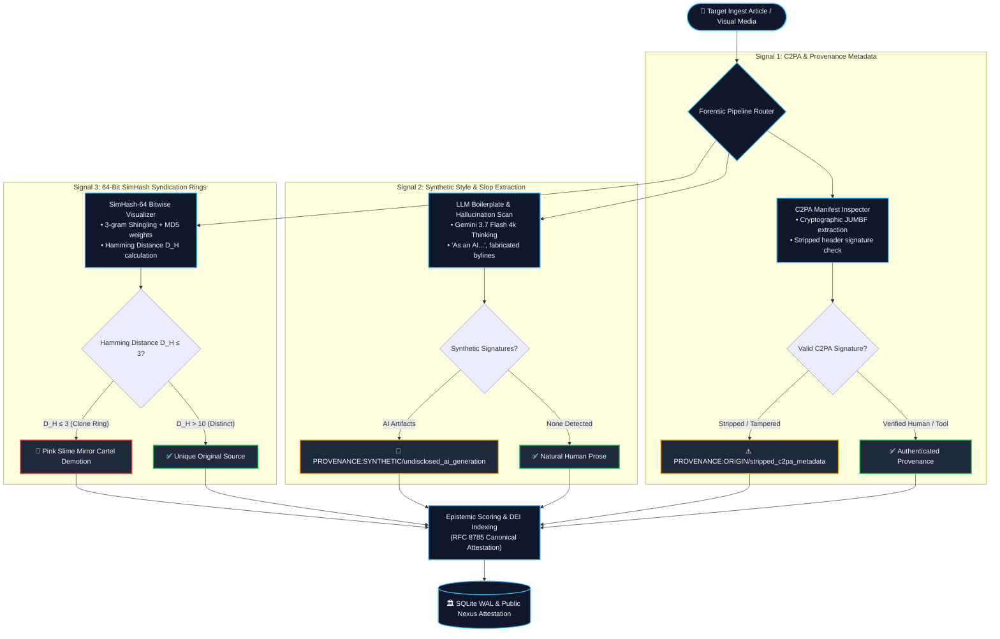

# Synthetic AI Content & Media Provenance Blueprint

The proliferation of autonomous generative AI tools has enabled the mass creation of synthetic content farms—often termed **"pink slime" journalism**. These automated networks publish thousands of rewritten, ungrounded articles daily to harvest ad revenue and manipulate public perception.

This blueprint details how Credence identifies synthetic content farms and validates digital provenance.

---

## 1. Automated Content Farm Detection Architecture

---

## 2. Detection Signals

1. **Stripped or Missing C2PA Manifests**: Ingestion inspects image and video headers for C2PA cryptographic manifests. If synthetic media has stripped provenance headers, it is flagged.
2. **Boilerplate Hallucination Signatures**: LLM generation artifacts (e.g. *"As an AI language model..."*, unrendered template tags, fabricated bylines of non-existent journalists).
3. **SimHash Syndication Rings ($D_H \le 3$)**: Content cloned across disposable FQDN networks within minutes is immediately linked to coordinated syndication cartels.

---

## 3. Provenance Taxonomy (`ai_provenance.yaml`)

- **`PROVENANCE:SYNTHETIC/undisclosed_ai_generation@1.0.0`** (Severity: 3): Publishing machine-generated text presented as human investigative journalism without disclosure.
- **`PROVENANCE:AUTHOR/fabricated_byline@1.0.0`** (Severity: 4): Attributing articles to non-existent personas with AI-generated profile pictures.
- **`PROVENANCE:ORIGIN/stripped_c2pa_metadata@1.0.0`** (Severity: 3): Publishing modified visual media with stripped provenance signatures.
