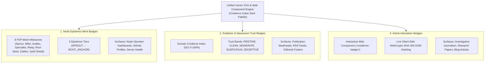
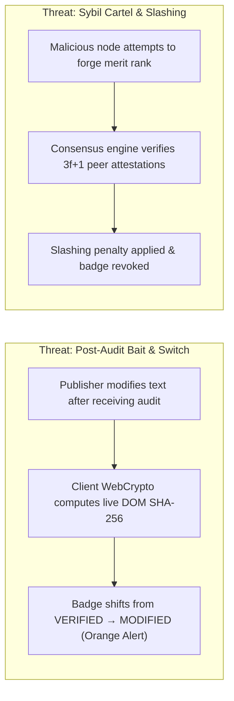

# Unified Epistemic Merit & Attestation Badge System 🛡️

The Credence network provides a unified visual and cryptographic badge framework designed to signal epistemic integrity, newsroom credibility, and P2P mesh reliability across diverse digital surfaces.

Whether displayed on static **GitHub READMEs**, dynamically rendered in **newsroom mastheads**, or embedded as an interactive **WebCrypto Web Component** inside research articles, Credence badges share a consistent design language rooted in the **Credence Cyber Dark** aesthetic.

---

## 1. The Three Badge Modalities



| Modality | Target Entity | Core Metric | Primary Embed Format | Endpoint / Interface |
| :--- | :--- | :--- | :--- | :--- |
| **Node Epistemic Merit** | P2P Validator Nodes | 8 Milestones & 5 Tiers ($Q_i, U_i, L_i$) | Dynamic Vector SVG (`.svg`) | `/api/badge/{badge_id}` / `credence badge export` |
| **Publisher Trust** | Newsrooms & Outlets | Domain Credence Index (DCI %) | Dynamic Vector SVG (`.svg`) | `/api/badge/publisher/{domain}` |
| **Article Attestation** | Individual Articles | Verbatim DOM Grounding ($G$) | Web Component (`<credence-badge>`) | `<credence-badge url="..." receipt="...">` |

---

## 2. High-DPI Vector SVG Design Specification

All vector SVG badges generated by the Credence engine adhere to the **Credence Cyber Dark** design tokens:

### Visual Design Tokens
- **Background Gradients**: Subtle vertical slate dark gradient (`#0d121f` &rarr; `#07090e`) providing contrast on both dark and light hosts.
- **Metric Sub-Pill & Accents**:
  - **Emerald Glow** (`#34d399` &rarr; `#059669`, `rgba(52, 211, 153, 0.45)`): Root Seeds, Sybil Shields, and Pristine Publications (DCI $\ge 85\%$).
  - **Cyber Cyan** (`#38bdf8` &rarr; `#0284c7`, `rgba(56, 189, 248, 0.45)`): Verified Auditors, Sifter Pioneers, and Clean Publications (DCI $\ge 70\%$).
  - **Violet Beam** (`#c084fc` &rarr; `#7c3aed`, `rgba(192, 132, 252, 0.45)`): Domain Specialists and Galileo Minority Truth Pioneers.
  - **Amber Alert** (`#fbbf24` &rarr; `#d97706`, `rgba(251, 191, 36, 0.45)`): Philanthropic Relays and Moderate Trust Bands (DCI $\ge 50\%$).
  - **Rose Slash** (`#f87171` &rarr; `#dc2626`, `rgba(248, 113, 113, 0.45)`): Flagged Deceptions and Slashing Penalties.
- **Geometry & Styles**:
  - `style="pill"`: Ultra-modern cyber glass pill with rounded endcaps (`rx="14"`), internal accent sub-pill, and 1px glowing perimeter border.
  - `style="shield"`: Crisp 2-segment badge with 6px rounded corners (`rx="6"`) and clean divider boundary.
- **Typography & Font Metrics**:
  - Stack: `-apple-system, BlinkMacSystemFont, "Segoe UI", Roboto, "Helvetica Neue", sans-serif`.
  - Dynamic character width arithmetic: $\approx 7.1\text{px}$ per title character, $\approx 7.7\text{px}$ per bold value character, with strict XML character escaping (`html.escape`).

---

## 3. Cryptographic Threat Model & Security Matrix



| Security Threat | Vector SVG (Static / GitHub) | Web Component (Interactive Article) |
| :--- | :--- | :--- |
| **Bait-and-Switch Mutation** | Detected on click-through receipt verification at `credence.report` | Detected **instantly in-browser** via live WebCrypto DOM hashing |
| **Tampered Score or Value** | Blocked via server-side generation from canonical SQLite ledger | Blocked via client-side verification against RFC 8785 Ed25519 signature |
| **Sybil Merit Inflation** | Protected by Watts-Strogatz Byzantine consensus ($3f+1$) | Protected by multi-peer gossip quorum thresholds |
| **XSS & XML Injection** | Strict `html.escape` sanitization and `ElementTree` validation | Shadow DOM boundary encapsulation (`attachShadow({ mode: 'open' })`) |

---

## 4. Integration Recipes & Embed Code

### A. Markdown (GitHub READMEs & Git Forges)
```markdown
<!-- Node Merit Badge -->
[](https://credence.nexus)

<!-- Publisher Trust Badge -->
[](https://credence.report/domain/reuters.com)
```

### B. HTML Image (Websites & Static Site Generators)
```html
<a href="https://credence.nexus" target="_blank" rel="noopener">
  
</a>
```

### C. Interactive Web Component (Blogs, Hugo, Astro, Jekyll)
```html
<!-- Embed the zero-npm custom element -->
<credence-badge 
  type="attestation" 
  score="99.4" 
  version="v2.6.4">
</credence-badge>

<!-- Load the standalone zero-npm script -->
<script type="module" src="https://credence.run/assets/credence-widget.js"></script>
```

### D. CLI Export Workflow
```bash
# Export pill merit badge to SVG file
credence badge export verified_auditor --node my-node-01 --style pill --output ./badge.svg

# Export publisher trust badge
credence badge export reuters.com --style shield --output ./reuters_badge.svg
```

---

## 5. Ecosystem Parity Matrix

| Surface | Node Merit Badges | Publisher DCI Badges | Article Attestations | Interactive Lensing |
| :--- | :---: | :---: | :---: | :---: |
| **CLI (`credence badge`)** | ✅ | ✅ | ✅ | 🔍 Terminal View |
| **Server API (`/api/badge/*`)** | ✅ | ✅ | ✅ | 🔗 Redirect Link |
| **Nexus Studio (`credence.nexus`)** | ✅ | ✅ | ✅ | 🔬 Live Dual Preview |
| **Reports Lab (`credence.report`)** | ✅ | ✅ | ✅ | 🌌 3-Tier Lensing |
| **Web Component (`<credence-badge>`)**| ✅ | ✅ | ✅ | 🌌 Full Popover Lensing |
| **FastMCP 2.0 (`mcp.credence.run`)** | ✅ | ✅ | ✅ | 📋 Resource Descriptors |

*See also: [Epistemic Merit Protocol](../protocols/epistemic-merit-and-leaderboards.md) and [Embeddable Anti-Tamper Badges](embeddable-attestation-badges-and-anti-tamper.md).*
