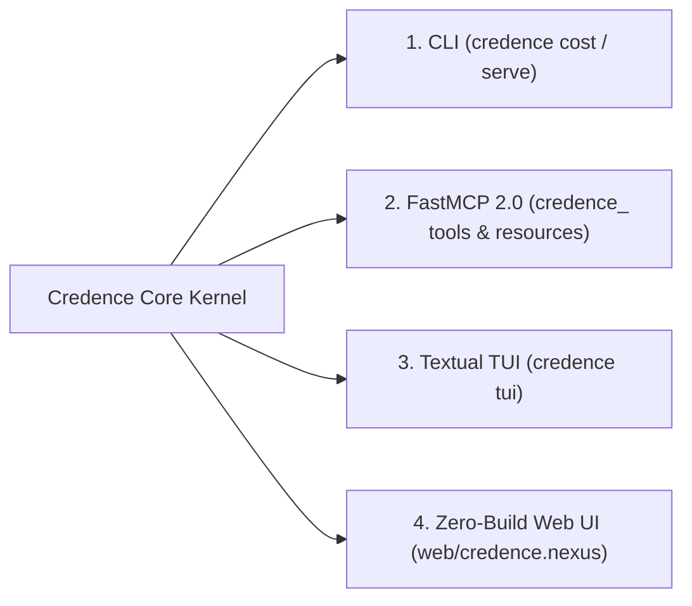

# Technical Blueprint: Universal 4-Way Parity and Environment Governance

Credence strictly maintains simultaneous 4-way feature parity across all user interfaces regardless of whether running in Dev or Production.

---

## 1. Interface Parity Matrix

Every new operational control (such as Emergency Brake, Cost Optimization, or Subdomain Routing) must expose functional bindings across all 4 interfaces simultaneously.
