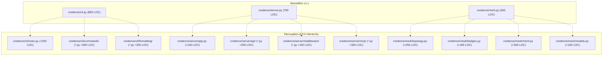

# v2 Modular Architecture & The 500 LOC Ceiling Law

This blueprint details the architectural evolution of **Credence v2.0.0**, codifying the mathematical principles, module boundaries, and shift-left governance invariants that transformed the monolithic engine into a lean, highly maintainable sovereign protocol.

---

## 1. Architectural Drivers

As the Credence protocol expanded to support decentralized peer-to-peer gossip, Bayesian consensus aggregation, live telemetry loopbacks, and multi-cloud white-label orchestration, large monolith files accumulated cross-cutting concerns.

To safeguard system maintainability, cognitive ergonomics, and test hermeticism, the **500 LOC Ceiling Law** was established as a P0 universal invariant.



---

## 2. The 500 LOC Ceiling Law

### Hard Rule
No Python file (`.py`) inside `credence/` may exceed 500 total lines of code.

### Verification Gate
The invariant is statically verified during the pre-commit integrity gate via `tests/governance/test_architecture_governance.py::test_500_loc_ceiling_invariant` in **< 0.05s**.

### Subpackage Structural Conventions
1. **CLI Layer**:
   - `credence/cli/main.py`: Lean argument parser and synchronous/asynchronous command dispatching.
   - `credence/cli/commands/`: Domain-specific command handlers (`audit.py`, `feeds.py`, `roots.py`, `org.py`, `boredom.py`, `analytics.py`, `identity.py`, `server.py`, `taxonomies.py`, `verify.py`, `quota.py`, `db.py`).
   - `credence/cli/formatting/`: Pure visual presentation modules (`badges.py`, `tables.py`, `summaries.py`).
2. **Server Layer**:
   - `credence/server/app.py`: Starlette application instantiation, CORS, and sub-router mounting.
   - `credence/server/lifespan.py`: Async database initialization, telemetry loopback startup, and graceful shutdown.
   - `credence/server/api/`: REST endpoints split by resource (`audits.py`, `feeds.py`, `domains.py`, `analytics.py`, `mesh.py`, `system.py`, `cost.py`).
   - `credence/server/middleware/`: Security, rate-limiting, and telemetry loopback collectors.
   - `credence/server/mcp/`: FastMCP 2.0 tool and resource definitions (`audit_tools.py`, `merit_tools.py`, `prompts.py`).
3. **P2P Mesh Layer**:
   - `credence/mesh/topology.py`: Dynamic Watts-Strogatz network graph clustering and live telemetry.
   - `credence/mesh/badges.py`: Epistemic milestone determination and SVG shield rendering.
   - `credence/mesh/merit.py`: Node reputation scoring and domain authority weighted medians.
   - `credence/mesh/models.py`: Immutable data models for badge definitions and telemetry schemas.

---

## 3. The `compute_*` Calculation Ontology

In v1.x, calculation functions used a mix of `calculate_*`, `calc_*`, and `compute_*` naming schemes. v2.0.0 unifies all mathematical transformations under the unambiguous `compute_*` prefix:

| Legacy Function Name | v2.0.0 Canonical Name | Subsystem |
| :--- | :--- | :--- |
| `calculate_topic_entropy` | `compute_topic_entropy` | `subjects/weather.py` |
| `calculate_subject_expertise` | `compute_subject_expertise` | `subjects/expertise.py` |
| `calculate_half_life_uptime` | `compute_half_life_uptime` | `mesh/badges.py` |
| `calculate_longevity_days` | `compute_longevity_days` | `mesh/badges.py` |
| `calculate_consensus` | `compute_consensus` | `mesh/consensus.py` |
| `calculate_effective_weight` | `compute_effective_weight` | `subjects/expertise.py` |
| `calculate_mesh_stats` | `compute_mesh_stats` | `mesh/stats.py` |

---

## 4. Directed Acyclic Graph (DAG) Import Architecture

All subpackages strictly decouple data definitions into local `models.py` modules. Inter-module dependencies strictly flow downward without bidirectional circular imports:

```
[credence.models] (Root DB & Protocol Models)
        │
        ├──► [credence.mesh.models] ──► [credence.mesh.badges] ──► [credence.mesh.merit]
        │
        └──► [credence.subjects.models] ──► [credence.subjects.weather] ──► [credence.subjects.analytics]
```

This clean DAG hierarchy guarantees that Python modules initialize cleanly in <10ms without delayed import traps or fragile workaround imports.
