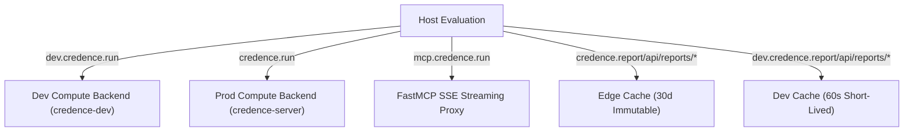

# Technical Blueprint: Zero-Build Edge Routing and Subdomain Dispatch

This blueprint details the edge routing algorithms and cache tiering implemented in `web/_worker.js`.

---

## 1. Request Resolution Pipeline

---

## 2. Zero-Build Web Assets Invariant

All HTML, CSS, and ES Modules are served directly from Cloudflare Pages / KV without any build step, bundler, or npm dependencies.
