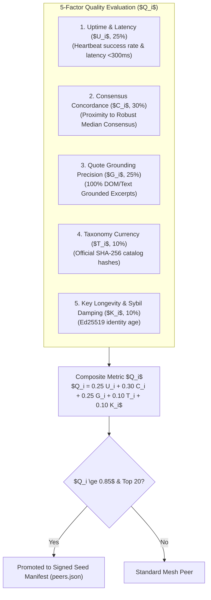

# Bootstrap Seed Governance & Node Quality

Credence employs a decentralized, cryptographically verifiable **Bootstrap Seed Protocol** to allow new and recovering nodes to discover healthy peers without relying on centralized coordination servers.

---

## 1. 5-Factor Epistemic Node Quality Metric ($Q_i$)

Candidate seed nodes are ranked by a composite quality metric ($Q_i \in [0.0, 1.0]$):

$$Q_i = 0.25 U_i + 0.30 C_i + 0.25 G_i + 0.10 T_i + 0.10 K_i$$

---

## 2. 4-Tier Discovery Fallback Sequence

1. **Tier 1: Signed Genesis Seed Manifest (`seeds.credence.nexus/peers.json`)**: Fetches signed JSON via HTTPS/R2, verifying signature against hardcoded root public key.
2. **Tier 2: Dynamic DNS SRV Records (`_mesh._tcp.credence.nexus`)**: Queries DNS SRV records for live relay endpoints.
3. **Tier 3: Local SQLite Peer Cache (`data/peers.db`)**: Reconnects to historically reputable peers ($Q_i \ge 0.70$) seen in the last 7 days.
4. **Tier 4: Localhost Default (`ws://127.0.0.1:8765`)**: Fallback for isolated developer nodes and local chaos testbeds.
