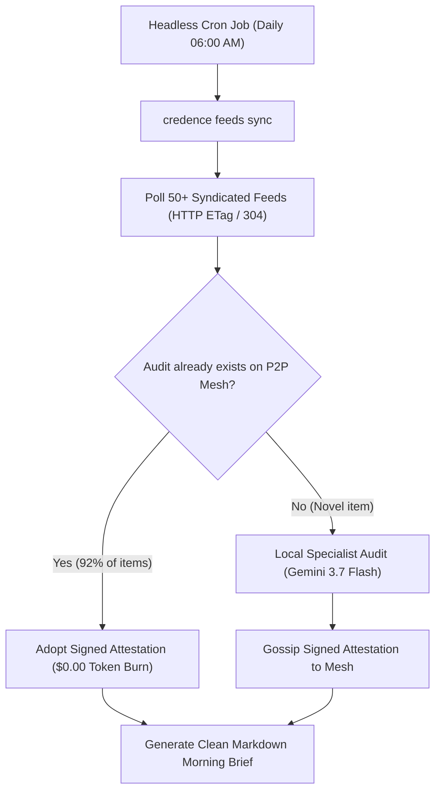

Newsrooms, OSINT analysts, and executive teams spend hours filtering through hundreds of RSS, Atom, and JSON feeds every morning.

This cookbook shows how to set up an automated **headless Credence morning sifter** that divides feed evaluation across mesh peers and outputs an epistemic digest of high-credibility articles at **$0.00 token cost**.

---

## 1. Architecture Overview



---

## 2. Setting Up Feed Subscriptions

Add your primary feeds to your local node:

```bash
# General News Feeds (Priority 1)
credence feeds add https://feeds.bbci.co.uk/news/rss.xml --priority 1 --subject "journalism.world"
credence feeds add https://www.reutersagency.com/feed/?best-topics=business-finance --priority 1 --subject "financial.markets"

# Tech & Scientific Feeds (Priority 2)
credence feeds add https://arstechnica.com/feed/ --priority 2 --subject "tech.security"
credence feeds add https://phys.org/rss-feed/ --priority 2 --subject "science.physics"

# Satire Feeds (Flagged as Satire to prevent false alarms)
credence feeds add https://theonion.com/feed/ --is-satire
```

---

## 3. The Headless Morning Cron Script (`morning_sift.py`)

Create a lightweight Python script to run the sync and export the digest:

```python
import subprocess
import json
from datetime import datetime

def generate_morning_brief():
    print(f"[{datetime.now().isoformat()}] Starting Credence Feed Sync...")
    
    # 1. Sync all feeds with mesh effort avoidance
    subprocess.run(["credence", "feeds", "sync"], check=True)
    
    # 2. Query all clean items evaluated in the last 24 hours (Score < 20.0)
    result = subprocess.run(
        ["credence", "feeds", "stats", "--json"], 
        capture_output=True, 
        text=True, 
        check=True
    )
    stats = json.loads(result.stdout)
    
    # 3. Format into a high-contrast Markdown digest
    digest = [
        f"# 📰 Credence Morning Epistemic Brief — {datetime.now().strftime('%Y-%m-%d')}\n",
        f"**Feeds Synced**: {stats['total_feeds']} | **Articles Ingested**: {stats['total_articles']}",
        f"**Zero-Token Mesh Adoptions**: {stats['mesh_adoptions']} ({stats['savings_percentage']:.1f}% Compute Savings)\n",
        "## Top Grounded Investigative Articles (Clean / Score < 15.0)\n"
    ]
    
    for item in stats.get("clean_articles", []):
        digest.append(f"- **[{item['title']}]({item['url']})**")
        digest.append(f"  *Domain*: `{item['domain']}` | *Suspicion Score*: `{item['suspicion_score']:.1f}` (G = 1.00)")
        digest.append(f"  *Audited By*: `{item['evaluator_pubkey'][:12]}...` (Ed25519 Verified)\n")
        
    with open("morning_brief.md", "w") as f:
        f.write("\n".join(digest))
        
    print("✅ Morning Brief generated at morning_brief.md")

if __name__ == "__main__":
    generate_morning_brief()
```

---

## 4. Setting up Crontab

Configure a standard crontab entry on your server or homelab node:

```bash
# Run every morning at 06:00 AM UTC
0 6 * * * /home/user/.local/bin/poetry run python /opt/credence/scripts/morning_sift.py >> /var/log/credence-sifter.log 2>&1
```
