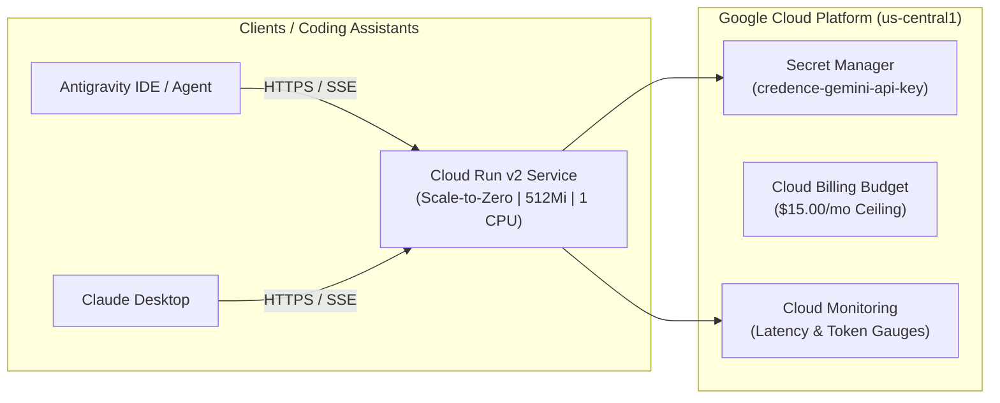

# GCP Cloud Run Deployment

This guide covers deploying the **Credence FastMCP Server** to **Google Cloud Platform (Cloud Run v2)** with strict cost controls ($15/month budget ceiling, scale-to-zero) and automated **Cloud Build CI/CD**.

---

## 1. Architecture Overview



---

## 2. Terraform Deployment Steps

### Step 1: Configure Terraform Variables
Create `terraform/terraform.tfvars`:
```hcl
project_id                  = "YOUR_PROJECT_ID"
region                      = "us-central1"
service_name                = "credence-server"
credence_profile            = "balanced"
monthly_budget_limit_usd    = 15.00
billing_account_id          = "YOUR_BILLING_ACCOUNT_ID"
alert_email_addresses       = ["admin@yourdomain.com"]
```

### Step 2: Provision Infrastructure
```bash
cd terraform
terraform init
terraform plan
terraform apply
```

### Step 3: Verify Live SSE Service
```bash
curl -i https://mcp.credence.run/sse
```
