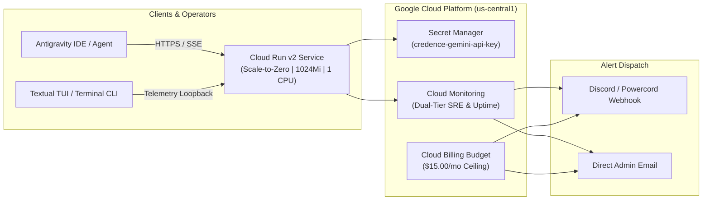

# GCP Cloud Run Deployment & Dual-Tier Monitoring

This guide covers deploying the **Credence FastMCP Server** to **Google Cloud Platform (Cloud Run v2)** with strict cost controls ($15/month budget ceiling, scale-to-zero compute), automated **Cloud Build CI/CD**, and **Dual-Tier SRE Observability** with **Discord & Powercord Alerting**.

---

## 1. Architecture Overview



---

## 2. Dual-Tier Monitoring Architecture

Credence provisions observability according to two operational modes controlled by `monitoring_tier`:

| Feature | "Guy in His Basement" Easy Mode (`monitoring_tier = "simple"`) | Advanced Production Tier (`monitoring_tier = "advanced"`) |
| :--- | :--- | :--- |
| **Default** | Yes (Default) | Optional |
| **Notification Channels**| Discord / Powercord Webhook (`discord_webhook_url`), Direct Email | Discord Webhook, Direct Email, Multi-Channel |
| **Budget Alerts** | 50%, 80%, 100% cap alerts sent to Discord & Email | 50%, 80%, 100% cap alerts sent to Discord & Email |
| **Core Failure Alerts** | 1. 🛑 Global Uptime Probe Failure (`/health`)<br/>2. 🔥 5xx Server Error Spike ($>5$ in 5m)<br/>3. ⚠️ Memory Near-OOM ($>85\%$) | 1. 🛑 Global Uptime Probe Failure<br/>2. 🔥 5xx Server Error Spike<br/>3. ⚠️ Memory Near-OOM |
| **Extended Alerts** | *Disabled (Zero false alarms)* | 4. ⏱️ P95 Latency Degradation ($>5000\text{ms}$)<br/>5. ⚙️ CPU Saturation ($>90\%$)<br/>6. 📅 Seed Publisher Cron Failure<br/>7. 📜 Log metric for `ERROR`/`CRITICAL` logs |
| **Dashboard** | 4-Quadrant SRE Visual Console | Multi-widget console with error log streams |

---

## 3. Terraform Deployment Steps

### Step 1: Configure Terraform Variables
Create `terraform/terraform.tfvars`:
```hcl
project_id                  = "YOUR_PROJECT_ID"
region                      = "us-central1"
service_name                = "credence-server"
credence_profile            = "balanced"
monthly_budget_limit_usd    = 15.00
billing_account_id          = "YOUR_BILLING_ACCOUNT_ID"
alert_email_addresses       = ["admin@yourdomain.com"]

# Easy Mode Monitoring & Discord Integration
monitoring_tier             = "simple" # or "advanced"
discord_webhook_url         = "https://discord.com/api/webhooks/YOUR_WEBHOOK_ID/YOUR_WEBHOOK_TOKEN"
enable_uptime_check         = true
```

### Step 2: Provision Infrastructure
```bash
cd terraform
terraform init
terraform plan
terraform apply
```

### Step 3: Verify Live SSE Service & Interface Telemetry
```bash
# Verify FastMCP stream
curl -i https://mcp.credence.run/sse

# Inspect live telemetry loopback via CLI
credence health
```

---

## 4. Operational Cross-References & External Documentation

### 📚 Official Cloud & Provider Specifications
* **Google Cloud Run v2**: [Cloud Run Service Configuration & Autoscaling](https://cloud.google.com/run/docs/configuring/services) &bull; [Scale-to-Zero Architecture](https://cloud.google.com/run/docs/about-instance-autoscaling)
* **Google Secret Manager**: [Secret Manager IAM & Auto-Resolution](https://cloud.google.com/secret-manager/docs/access-secret-version)
* **Google Cloud Billing**: [Billing Alert Thresholds & Webhook Integrations](https://cloud.google.com/billing/docs/how-to/budgets)
* **Google Cloud Monitoring**: [Uptime Checks & Notification Channels](https://cloud.google.com/monitoring/alerts)
* **Terraform Provider**: [HashiCorp Google Provider on Terraform Registry](https://registry.terraform.io/providers/hashicorp/google/latest/docs/resources/cloud_run_v2_service)
* **Discord Developer Portal**: [Discord Webhooks Protocol Guide](https://discord.com/developers/docs/resources/webhook)
* **GitHub Actions CI/CD**: [Configuring Keyless Workload Identity Federation (WIF)](https://cloud.google.com/iam/docs/workload-identity-federation-with-deployment-pipelines)

### 🔗 Related In-Depth Guides in Credence
* 🛠️ [Tutorial 13: Discord Alerting & Basement Monitoring](tutorials/13-discord-alerting-and-basement-monitoring.md)
* ☁️ [Multi-Cloud Deployments (AWS, Azure, Hetzner, K8s)](portability/multi-cloud-deployment.md)
* ⚡ [FastMCP 2.0 Protocol & SSE Specifications](protocols/fastmcp.md)
* 💰 [Cost Profiles & $15/mo Budget Caps](protocols/token-governor.md)
* 🏛️ [System Invariants: 3-Plane Governance & Cloudflare Workers](invariants.md)

