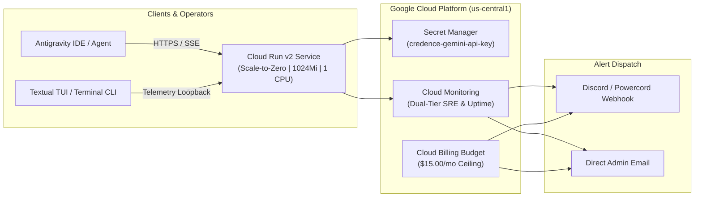

# Cloud Run Deployment & Dual-Tier Monitoring Guide

This guide covers deploying the **Credence FastMCP Server** to **Google Cloud Platform (Cloud Run v2)** with strict cost controls ($15/month budget ceiling, scale-to-zero compute), automated **Cloud Build CI/CD**, and **Dual-Tier SRE Observability** with **Discord & Powercord Alerting**.

---

## 1. Architecture Overview



---

## 2. Dual-Tier Monitoring Architecture

Credence provisions observability according to two operational modes controlled by `monitoring_tier`:

| Feature | "Guy in His Basement" Easy Mode (`monitoring_tier = "simple"`) | Advanced Production Tier (`monitoring_tier = "advanced"`) |
| :--- | :--- | :--- |
| **Default** | Yes (Default) | Optional |
| **Notification Channels**| Discord / Powercord Webhook (`discord_webhook_url`), Direct Email | Discord Webhook, Direct Email, Multi-Channel |
| **Budget Alerts** | 50%, 80%, 100% cap alerts sent to Discord & Email | 50%, 80%, 100% cap alerts sent to Discord & Email |
| **Core Failure Alerts** | 1. 🛑 Global Uptime Probe Failure (`/health`)<br/>2. 🔥 5xx Server Error Spike ($>5$ in 5m)<br/>3. ⚠️ Memory Near-OOM ($>85\%$) | 1. 🛑 Global Uptime Probe Failure<br/>2. 🔥 5xx Server Error Spike<br/>3. ⚠️ Memory Near-OOM |
| **Extended Alerts** | *Disabled (Zero false alarms)* | 4. ⏱️ P95 Latency Degradation ($>5000\text{ms}$)<br/>5. ⚙️ CPU Saturation ($>90\%$)<br/>6. 📅 Seed Publisher Cron Failure<br/>7. 📜 Log metric for `ERROR`/`CRITICAL` logs |
| **Dashboard** | 4-Quadrant SRE Visual Console | Multi-widget console with error log streams |

---

## 3. Terraform Deployment Steps

### Step 1: Initialize gcloud & Enable APIs
```bash
gcloud config set project YOUR_PROJECT_ID

gcloud services enable \
    run.googleapis.com \
    secretmanager.googleapis.com \
    artifactregistry.googleapis.com \
    cloudbuild.googleapis.com \
    billingbudgets.googleapis.com \
    monitoring.googleapis.com
```

### Step 2: Configure Terraform Variables
Create `terraform/terraform.tfvars`:
```hcl
project_id                  = "YOUR_PROJECT_ID"
region                      = "us-central1"
service_name                = "credence-server"
credence_profile            = "balanced" # or 'free', 'ultra'
monthly_budget_limit_usd    = 15.00
billing_account_id          = "YOUR_BILLING_ACCOUNT_ID"
alert_email_addresses       = ["admin@yourdomain.com"]

# Dual-Tier Monitoring & Discord Webhook
monitoring_tier             = "simple" # or "advanced"
discord_webhook_url         = "https://discord.com/api/webhooks/YOUR_WEBHOOK_ID/YOUR_WEBHOOK_TOKEN"
enable_uptime_check         = true
```

### Step 3: Initialize and Apply Terraform
```bash
cd terraform
terraform init
terraform plan
terraform apply
```

### Step 4: Add Gemini API Key to Secret Manager
```bash
echo -n "YOUR_GEMINI_API_KEY" | gcloud secrets versions add credence-gemini-api-key --data-file=-
```

---

## 4. Connecting Antigravity & Claude Desktop to Cloud Run

Once deployed, retrieve your Cloud Run SSE endpoint from Terraform outputs:
```bash
terraform output sse_endpoint
# Output: https://credence-server-xxxxx-uc.a.run.app/sse
```

Add the remote endpoint to your `mcp_config.json`:
```json
{
  "mcpServers": {
    "credence_remote": {
      "url": "https://credence-server-xxxxx-uc.a.run.app/sse"
    }
  }
}
```

---

## 5. Parameterized Operator Workflows (`Justfile`)

The repository provides a single canonical parameterized operator command family (`just gcp [action] [arg]`) with automated preflight validation:

| Command | Action | Description |
| :--- | :--- | :--- |
| `just preflight gcloud` | Preflight Gate | Verifies `gcloud` binary installation and active authenticated account. |
| `just gcp status` | Inspection | Displays active Cloud Run revision, image tag, CPU/memory, and traffic split. |
| `just gcp logs [limit]` | Forensics | Queries structured Cloud Run logs via `gcloud logging read` (default: 30 lines). |
| `just gcp tail` | Live Stream | Streams real-time container logs via `gcloud beta run services logs tail`. |
| `just gcp revisions` | History | Lists all historical revisions with author, deploy timestamp, and traffic split. |
| `just gcp describe` | Deep Inspect | Dumps full JSON/YAML service specification. |
| `just gcp probe` | Multi-Probe | Probes `/health`, `/api/health`, `/sse`, `/api/reports`, and `/api/sifter/status`. |
| `just gcp germinate [burst]` | Remote Sifting | Invokes remote `/api/germinate` endpoint to trigger Miracle-Gro ignition. |
| `just gcp rollback <revision>` | Safe Revert | Rolls back 100% traffic allocation to a previous healthy revision. |
| `just deploy backend` | Safe Deploy | Submits container build via Cloud Build, deploys to Cloud Run, and executes health probe. |

---

## 6. Scale-to-Zero Cold Start Optimization & SRE Tuning

When operating under `min_instance_count = 0` ($0.00 idle compute ceiling), Credence implements a 5-pillar serverless cold start optimization framework:

1. **Startup CPU Boost (`startup_cpu_boost = true`)**: Dynamically allocates 2–4 vCPUs during container boot to accelerate CPU-bound Python AST parsing and import graph loading.
2. **Direct Virtualenv Binary Execution**: Bypasses Poetry's CLI wrapper by executing `/app/.venv/bin/credence serve` directly with `PATH="/app/.venv/bin:$PATH"`, saving ~950ms.
3. **Build-Time Bytecode Precompilation (`compileall`)**: Docker images precompile `.pyc` files during build, eliminating AST compilation on cold boots.
4. **Lazy Dependency Deferral**: Heavy modules (`trafilatura`, `dateparser`, `playwright`) are lazy-loaded inside tool handlers, dropping module import latency by >48%.
5. **Aggressive HTTP Readiness Probing**: Startup probes check `http_get` on `/health` with a 2s period and 1s initial delay, cutting probe detection lag from up to 10s down to ~1.5–2.0s.

*For complete benchmarks and mathematical breakdown, see the [Cloud Run Cold Start Blueprint](blueprints/cloudrun-scale-to-zero-cold-start-optimization.md) and [Engineering Blog Essay](../blog/taming-the-10-second-cold-start-scale-to-zero.md).*
