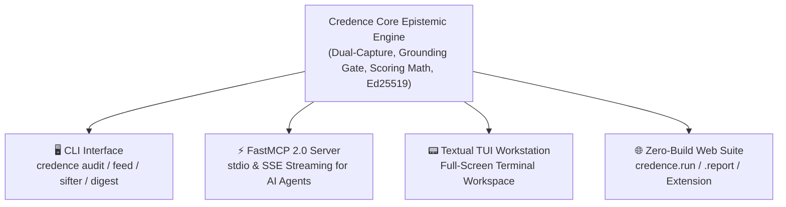

# Universal Feature Parity Matrix

In accordance with **Invariant 24 (Universal Presentation Layer Feature Parity Invariant)**, Credence maintains synchronous feature parity across all four official interfaces:

1. **🖥️ CLI**: Rich terminal command-line interface (`credence <cmd>`).
2. **⚡ FastMCP 2.0 Server**: Model Context Protocol tools, dynamic resources, and prompt templates (`credence serve`).
3. **📟 Textual TUI Workstation**: Interactive live terminal dashboard (`credence tui`).
4. **🌐 Zero-Build Web UI**: Client-side Web Cryptography portals (`credence.run`, `credence.report`, `credence.foundation`, `credence.nexus`).

---

## 🏛️ Interface Architecture

---

## 1. Interface Capability Matrix

| Feature Area | 🖥️ CLI Command | ⚡ FastMCP 2.0 Endpoint | 📟 Textual TUI View | 🌐 Zero-Build Web Portal | Status |
| :--- | :--- | :--- | :--- | :--- | :--- |
| **Audit Webpage (Live DOM)** | `credence audit <url>` | Tool: `credence_check_url` | `/` Shortcut Dialog | `credence.run` Form | **Full Parity** |
| **Direct Text Evaluation** | `credence audit` | Tool: `credence_evaluate_text` | Live Inspector View | `credence.report` Form | **Full Parity** |
| **Attestation Lookup** | `credence lookup <hash>` | Tool: `credence_get_audit` | Recent Table | `credence.report/viewer.html` | **Full Parity** |
| **Dynamic Feed Discovery** | `credence feed discover <url>` | Tool: `credence_discover_feeds` | Feed Autodiscovery Bar | Feed Discovery Widget | **Full Parity** |
| **Pre-Flight Feed Inspection** | `credence feed inspect <url>` | Tool: `credence_inspect_feed_health` | 1-Click Inspect Modal | Interactive Pre-Flight Modal | **Full Parity** |
| **Dynamic Quality Scoring ($F_j$)**| `credence feed health` | Resource: `credence://feeds/status` | Tab 4: `📡 Feeds & Dedup` | Feed Status Dashboard | **Full Parity** |
| **Real-Time Sifter Daemon** | `credence sifter` | FastMCP Sifter Task | Sifter Status Indicator | Web Status Indicator | **Full Parity** |
| **Morning Epistemic Digest** | `credence digest` | Resource: `credence://digest/morning` | Tab 7: `🌅 Morning Digest` | Morning Briefing Card | **Full Parity** |
| **Token Headroom Governor** | `credence quota` | Tool: `credence_get_quota_status` | Tab 5: `⚡ Quota` | Status Badge at `credence.run` | **Full Parity** |
| **Cost Profiles** | `credence profile list` | Resource: `credence://profiles` | Profile Badge `[FREE/BALANCED]` | Cost Tier Grid | **Full Parity** |
| **Taxonomy Governance** | `credence taxonomy list` | Resource: `credence://taxonomies` | Tab 2: `📚 Taxonomies` | `taxonomies.credence.foundation` | **Full Parity** |
| **Cryptographic Identity** | `credence identity show` | Resource: `credence://node/identity` | Tab 6: `🔑 Node Identity` | `keys.credence.foundation` | **Full Parity** |
| **Attestation Verification** | `credence verify-file` | Tool: `credence_verify_attestation` | Row Selection Auto-Verify | W3C WebCrypto API | **Full Parity** |
| **Consensus Aggregation** | Consensus Engine | Tool: `credence_get_consensus` | Consolidated Verdict Panel | Consensus Badge | **Full Parity** |
| **P2P Mesh Seeds & Ranking** | `credence seeds`, `rank` | Resource: `credence://mesh/seeds` | Peer Status Indicators | `seeds.credence.nexus/peers.json` | **Full Parity** |
| **Hierarchical Subjects** | `credence subjects list` | Resource: `credence://subjects/registry`| Tab 3: `🧠 Domain Subjects` | Subject Explorer | **Full Parity** |
| **White-Label Org Generator** | `credence init-org` | *Intentionally CLI-Only* | *Intentionally CLI-Only* | *Intentionally CLI-Only* | OS Scaffolding |
| **P2P Relay Daemon** | `credence mesh` | *Intentionally CLI-Only* | *Intentionally CLI-Only* | *Intentionally CLI-Only* | OS Daemon |
