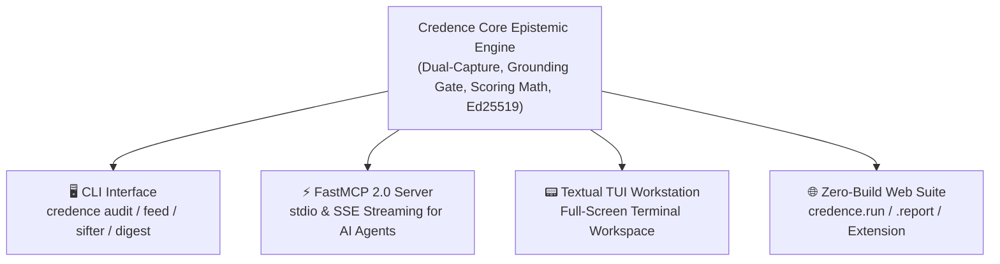

# Universal Feature Parity Matrix

In accordance with **[Invariant 24](invariants.md#invariant-24) (Universal Presentation Layer Feature Parity Invariant)**, Credence maintains synchronous feature parity across all four official interfaces:

1. **🖥️ CLI**: Rich terminal command-line interface (`credence <cmd>`).
2. **⚡ FastMCP 2.0 Server**: Model Context Protocol tools, dynamic resources, and prompt templates (`credence serve`).
3. **📟 Textual TUI Workstation**: Interactive live terminal dashboard (`credence tui`).
4. **🌐 Zero-Build Web UI**: Client-side Web Cryptography portals (`credence.run`, `credence.report`, `credence.foundation`, `credence.nexus`).

---

## 🏛️ Interface Architecture



---

## 1. Interface Capability Matrix

### A. Epistemic Ingestion & Attestation Auditing

| Feature Area | 🖥️ CLI & ⚡ FastMCP 2.0 | 📟 Textual TUI & 🌐 Web UI | Status |
| :--- | :--- | :--- | :--- |
| **Audit Webpage (Live DOM)** | `credence audit <url>`<br/>Tool: `credence_check_url` | `/` Shortcut Dialog<br/>`credence.run` Form | **Full Parity** |
| **Direct Text Evaluation** | `credence audit`<br/>Tool: `credence_evaluate_text` | Live Inspector View<br/>`credence.report` Form | **Full Parity** |
| **Attestation Lookup** | `credence lookup <hash>`<br/>Tool: `credence_get_audit` | Recent Attestations Table<br/>`credence.report/viewer.html` | **Full Parity** |
| **Human Report Viewer** | `credence report view --open`<br/>Resource: `credence://reports/{id}/human` | Tab 1: 🛡️ Inspector Dual-Pane<br/>`credence.report` Multi-Mode Viewer | **Full Parity** |
| **Attestation Verification** | `credence verify-file`<br/>Tool: `credence_verify_attestation` | Row Selection Auto-Verify<br/>W3C WebCrypto API (`window.crypto`) | **Full Parity** |
| **Consensus Aggregation** | Embedded Consensus Engine<br/>Tool: `credence_get_consensus` | Consolidated Verdict Panel<br/>Consensus Badge Display | **Full Parity** |

### B. Syndication, Feeds & Epistemic Digest

| Feature Area | 🖥️ CLI & ⚡ FastMCP 2.0 | 📟 Textual TUI & 🌐 Web UI | Status |
| :--- | :--- | :--- | :--- |
| **Dynamic Feed Discovery** | `credence feed discover <url>`<br/>Tool: `credence_discover_feeds` | Feed Autodiscovery Bar<br/>Feed Discovery Widget | **Full Parity** |
| **Pre-Flight Feed Inspection** | `credence feed inspect <url>`<br/>Tool: `credence_inspect_feed_health` | 1-Click Pre-Flight Modal<br/>Interactive Pre-Flight Modal | **Full Parity** |
| **Dynamic Quality Scoring ($F_j$)** | `credence feed health`<br/>Resource: `credence://feeds/status` | Tab 4: `📡 Feeds & Dedup`<br/>Feed Status Dashboard | **Full Parity** |
| **Real-Time Sifter Daemon** | `credence sifter`<br/>FastMCP Sifter Task | Sifter Status Indicator<br/>Web Status Indicator | **Full Parity** |
| **Morning Epistemic Digest** | `credence digest`<br/>Resource: `credence://digest/morning` | Tab 7: `🌅 Morning Digest`<br/>Morning Briefing Card | **Full Parity** |

### C. Mesh Topology, Governance & Identity

| Feature Area | 🖥️ CLI & ⚡ FastMCP 2.0 | 📟 Textual TUI & 🌐 Web UI | Status |
| :--- | :--- | :--- | :--- |
| **Token Headroom Governor** | `credence quota`<br/>Tool: `credence_get_quota_status` | Tab 5: `⚡ Quota`<br/>Status Badge at `credence.run` | **Full Parity** |
| **Cost Profiles** | `credence profile list`<br/>Resource: `credence://profiles` | Profile Badge `[FREE/BALANCED]`<br/>Cost Tier Grid | **Full Parity** |
| **Taxonomy Governance** | `credence taxonomy list`<br/>Resource: `credence://taxonomies` | Tab 2: `📚 Taxonomies`<br/>`taxonomies.credence.foundation` | **Full Parity** |
| **Cryptographic Identity** | `credence identity show`<br/>Resource: `credence://node/identity` | Tab 6: `🔑 Node Identity`<br/>`keys.credence.foundation` | **Full Parity** |
| **P2P Mesh Seeds & Ranking** | `credence seeds`, `rank`<br/>Resource: `credence://mesh/seeds` | Peer Status Indicators<br/>`seeds.credence.nexus/peers.json` | **Full Parity** |
| **Hierarchical Subjects** | `credence subjects list`<br/>Resource: `credence://subjects/registry` | Tab 3: `🧠 Domain Subjects`<br/>Subject Explorer | **Full Parity** |
| **White-Label Org Generator** | `credence init-org`<br/>*Intentionally CLI-Only* | *Intentionally CLI-Only*<br/>*Intentionally CLI-Only* | OS Scaffolding |
| **P2P Relay Daemon** | `credence mesh`<br/>*Intentionally CLI-Only* | *Intentionally CLI-Only*<br/>*Intentionally CLI-Only* | OS Daemon |

### D. Epistemic Analytics, DEI & Leaderboards

| Feature Area | 🖥️ CLI & ⚡ FastMCP 2.0 | 📟 Textual TUI & 🌐 Web UI | Status |
| :--- | :--- | :--- | :--- |
| **Epistemic Leaderboards** | `credence leaderboard`<br/>Tool: `credence_get_leaderboard` | Tab 8: `🏆 Leaderboard`<br/>`credence.nexus` Leaderboards | **Full Parity** |
| **Sovereign Node Merit** | `credence merit`<br/>Tool: `credence_get_node_merit` | Tab 8: Split Merit Card<br/>`credence.nexus` Merit Card | **Full Parity** |
| **Live Vector SVG Badges** | `credence badge export`<br/>Resource: `credence://merit/badges` | Badge Showcase Panel<br/>`credence.nexus` Badge Embedder | **Full Parity** |
| **Domain Epistemic Index (DEI)** | `credence rankings`<br/>Tool: `credence_get_domain_rankings` | DEI Honor Roll Table<br/>`credence.report` Honor Roll / Shame | **Full Parity** |
| **Top Violated Rules** | `credence rankings --type rules`<br/>Tool: `credence_get_taxonomy_analytics` | Rules Breakdown View<br/>`credence.report` Rules Aggregator | **Full Parity** |
| **Epistemic Weather Barometer** | `credence rankings --type weather`<br/>Tool: `credence_get_epistemic_weather` | Global Climate Widget<br/>`credence.report` Weather Barometer | **Full Parity** |
| **Community Bounties** | `credence bounties`<br/>Tool: `credence_get_bounties` | Open Quests List<br/>`credence.nexus` Bounties Board | **Full Parity** |

---

## 2. 4-Way Presentation Layer Showcase

See how the same epistemic audit report is presented across all four surfaces:

:::tabs
=== 📟 Textual TUI Workstation

*Full-screen terminal workstation with split-pane finding navigation, live filtering (`f`), and in-context evidence.*

=== 🌐 Zero-Build Web UI
Navigate to **`credence.report`** for a zero-build client-side cryptographic viewer featuring responsive dark mode, trust dimension breakdowns, and W3C WebCrypto Ed25519 signature validation.

=== 🖥️ Rich CLI
```bash
$ credence audit https://arstechnica.com/science/2026/08/fusion-breakthrough
🛡️ Credence Audit Report
├─ Verdict: FACTUAL_REPORTING (Score: 8.5 / 100.0)
├─ Density: 0.0 violations / 1k words  |  Confidence: 98%
├─ Content SHA-256: 1a2b3c4d5e6f7a8b...
└─ Attestation: ✓ Signed (Ed25519: 7a4c9f...)
```

=== ⚡ FastMCP 2.0 JSON-LD
```json
{
  "url": "https://arstechnica.com/science/2026/08/fusion-breakthrough",
  "content_sha256": "1a2b3c4d5e6f7a8b9c0d1e2f3a4b5c6d7e8f9a0b1c2d3e4f5a6b7c8d9e0f1a2b",
  "suspicion_score": 8.5,
  "suspicion_density": 0.0,
  "confidence_score": 0.98,
  "classification": "FACTUAL_REPORTING",
  "is_satire": false,
  "node_signature": "ed25519:sig:clean123456789",
  "violations": []
}
```
:::
