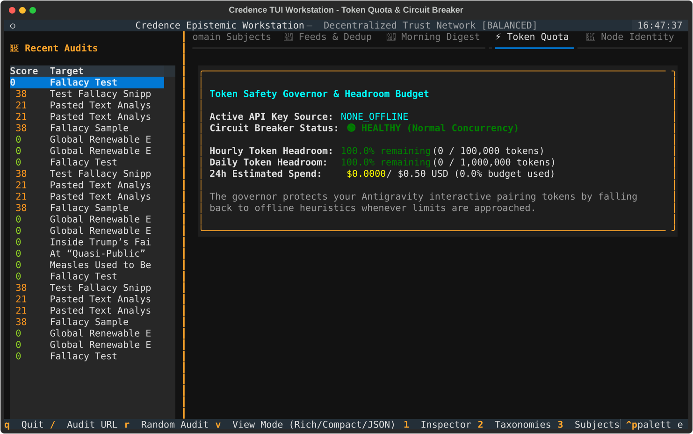
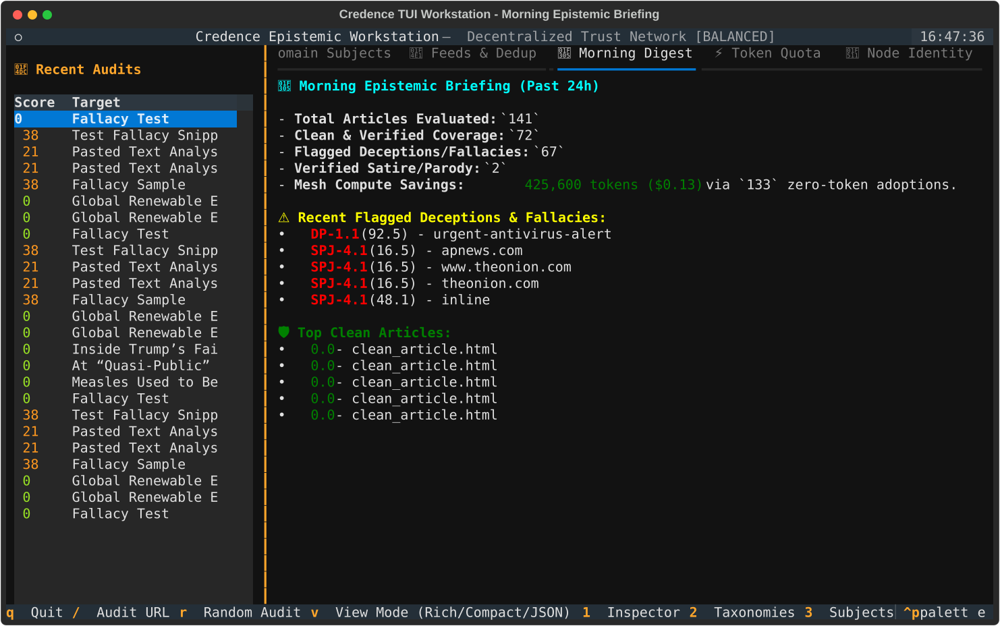
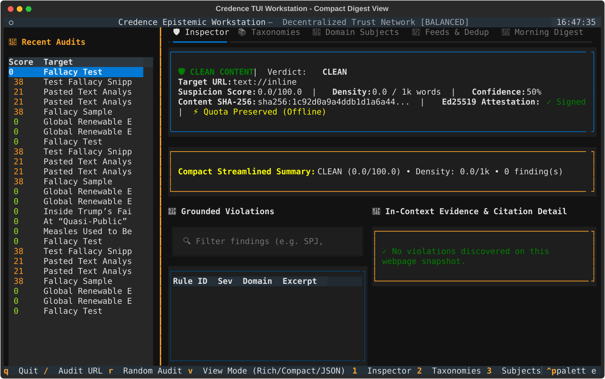
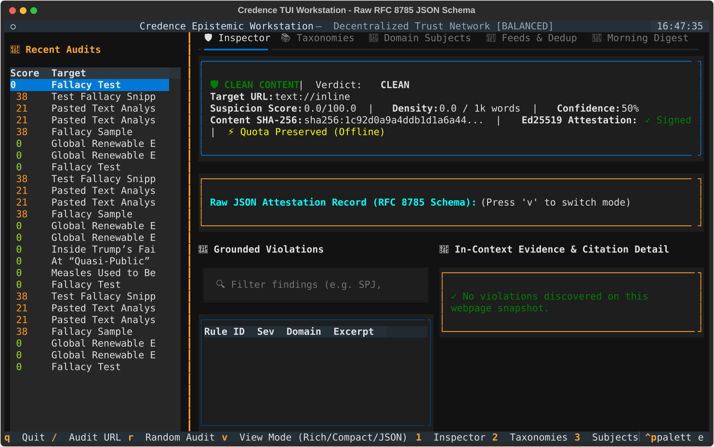
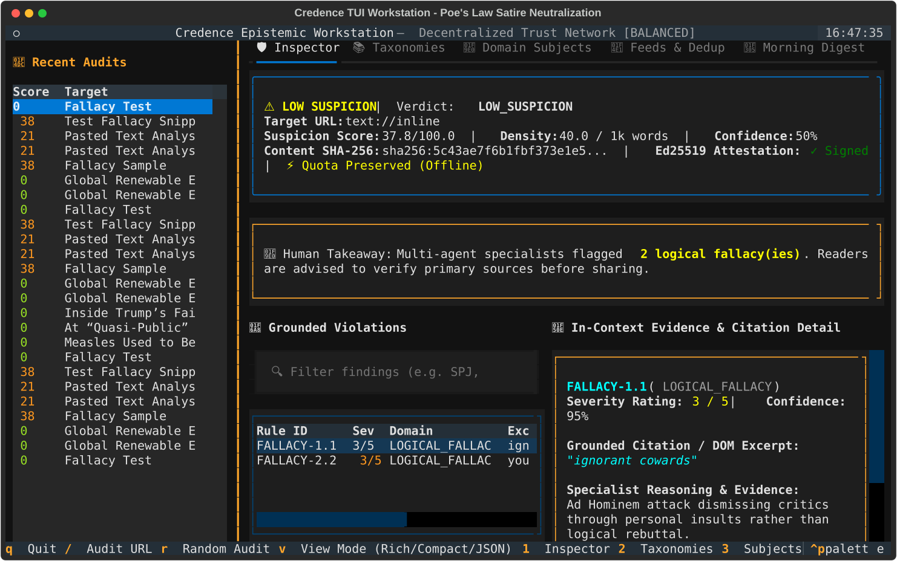
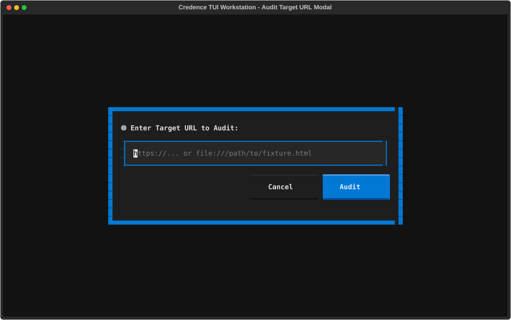

> **Note**: Textual TUI Terminal Workstation Deep Dive

Credence includes an interactive terminal workstation powered by **Textual** (`credence tui`).

It provides real-time audit monitoring, grounded citation inspection across 3-tier epistemic lenses, publisher dossiers, token headroom governance, live SRE telemetry, and decentralized P2P mesh consensus directly inside your terminal emulator.

```bash
credence tui
```


---

## 1. Global Keyboard Navigation Reference

The workstation is entirely keyboard-driven with single-key shortcuts:

| Keybinding | Action | Description |
|:---|:---|:---|
| `/` | **Audit URL** | Open modal dialog to submit a live URL for multi-agent evaluation. |
| `1` | **🛡️ Inspector** | Switch to the active epistemic audit & 3-tier violation inspector. |
| `2` | **📚 Taxonomies** | Switch to the registered taxonomy catalog hierarchy tree (36 canonical rules). |
| `3` | **🧠 Subjects** | Switch to the hierarchical subject classification registry. |
| `4` | **📡 Feeds** | Switch to syndicated feeds table with dynamic quality scores ($F_j$). |
| `5` | **🏛️ Dossiers** | Switch to domain leaderboards and longitudinal publisher dossiers. |
| `6` | **⚡ Quota** | Switch to real-time token governor & 30% headroom circuit breaker monitor. |
| `7` | **🔑 Identity** | Switch to local cryptographic Ed25519 node identity & public keys. |
| `8` | **🛠️ Ops** | Switch to SRE telemetry, scale-to-zero vitals, and container health. |
| `9` | **🕸️ Mesh** | Switch to decentralized P2P mesh cluster reality & Byzantine quorum ($3f+1$). |
| `l` | **Cycle Lens** | Cycle through 3-tier epistemic lenses: **1. Surface (Glance)** $\to$ **2. Focus (Evidence)** $\to$ **3. Deep Forensic**. |
| `f` | **Filter Findings** | Focus the real-time search bar to filter violations (e.g. `SPJ`, `IEP`, `fallacy`). |
| `r` | **Surprise Me** | Select and inspect a random audit from local history. |
| `i` | **Info Modal** | Open the Invariant Bible & Epistemic Lexicon modal dialog. |
| `q` | **Quit** | Exit the workstation cleanly. |

---

## 2. Workstation Layout Anatomy

### Textual TUI Terminal Workstation Architecture

----------------
| 1. HEADER: Live UTC Clock • Model Profile Badge [ECONOMY / BALANCED / ULTRA] • Version     |
----------------
| 2. STATUS PILL: Headroom Headroom % • Grounding Active ($G=1.00$) • Scale-to-Zero State    |
----------------
| 3. 9-TAB NAVIGATION SUITE:                                                                 |
|    [1] Inspector  [2] Taxonomies  [3] Subjects  [4] Feeds  [5] Dossiers                    |
|    [6] Quota      [7] Identity    [8] Ops       [9] Mesh                                   |
------------------------------------------------+
| 4. DUAL-PANE CONTEXT VIEW                                 | 5. EPISTEMIC LENSING PANE      |
| • Active Audit Feed / Publisher Dossier Tree              | • Surface (Score Gauge)        |
| • Real-Time SQLite WAL Log Stream                         | • Focus (Grounded Evidence)    |
| • Fail-Closed Dynamic Mesh Telemetry                      | • Deep Forensic (Ed25519 Sig)  |
------------------------------------------------+
| 6. FOOTER: Interactive Keybinding Action Bar (`/` Audit, `l` Lens, `f` Filter, `q` Quit)   |
----------------

---

## 3. The 9 Core Workstation Panes

### Tab 1 (`1`): 🛡️ Epistemic Inspector & 3-Tier Lensing
The primary analytical surface for inspecting multi-specialist findings. Select any audit from the sidebar to inspect the calibrated suspicion score, density per 1,000 words, and itemized violations.
* **Surface Lens (1)**: High-level score gauge, trust band, and executive takeaway.
* **Focus Lens (2)**: Grounded violation table and verbatim quote inspections.
* **Deep Forensic Lens (3)**: Ed25519 envelope signature, canonical SHA-256 digest, and timestamp.

---

### Tab 2 (`2`): 📚 Registered Taxonomy Catalogs
Browse all loaded taxonomy rulebooks (SPJ Journalistic Ethics, Informal Logical Fallacies, Deceptive UI Patterns).
* Collapsible tree hierarchy showing catalogs, thematic clusters, rule IDs, and baseline severity ratings.
* Pinned by SHA-256 catalog hashes in accordance with **[The Invariant Bible](../invariants.md#invariant-5)** (Namespaced Fixed Taxonomies).

---

### Tab 3 (`3`): 🧠 Hierarchical Domain Subject Registry
Explore the subject taxonomy used for domain-weighted consensus and specialist routing.
* Multi-tier hierarchy spanning journalism, computing, science, biology, and satire.
* Used to calculate empirical node expertise ($E_i$) and enforce the **[Anti-Diploma Invariant](../invariants.md#invariant-17)**.

---

### Tab 4 (`4`): 📡 Syndicated Feeds Stream
Monitor RSS, Atom, and JSON syndicated feeds partitioned across the swarm via Highest Random Weight (HRW) Rendezvous Hashing.

---

### Tab 5 (`5`): 🏛️ Dossiers & Domain Leaderboards
Inspect longitudinal reputation records, Bayesian DCI scores, and trust band transitions for news publishers.

---

### Tab 6 (`6`): ⚡ Quota & Headroom Governor
Real-time token spend gauges, cost ceiling alerts, and 30% headroom circuit breakers across configured LLM adapters.

---

### Tab 7 (`7`): 🔑 Cryptographic Node Identity
Inspect local Ed25519 public key pinning, RFC 8785 envelope signing status, and root key provenance.

---

### Tab 8 (`8`): 🛠️ SRE Ops Telemetry
Real-time node performance, scale-to-zero idle optimization ($0.00 cost), and container health.

---

### Tab 9 (`9`): 🕸️ P2P Mesh Consensus & Byzantine Quorum
Live network topology reporting active node count ($N \ge 1$), Byzantine fault tolerance ($f = \lfloor (N-1)/3 \rfloor$), and peer gossip health. In standalone mode, explicitly reports `STANDALONE` in adherence with the **[Production Telemetry Boundary Invariant](../invariants.md#invariant-25)**.
* Real-time composite quality metric ($F_j = 0.35 S + 0.25 G + 0.20 H + 0.20 T$).
* Press `s` to execute instant background feed synchronization and check mesh effort avoidance.

---

### Tab 5 (`5`): ⚡ Token Safety Governor & Quota
Real-time monitoring of LLM token consumption and automatic circuit breakers.



* **Hourly & Daily Headroom**: Percentage remaining and exact token counts.
* **Spend Budget**: Estimated 24-hour spend in USD against daily ceilings.
* **Circuit Breaker Status**: Reports `🟢 HEALTHY`, `⚠️ THROTTLED`, or `🚨 TRIPPED (QUOTA_PRESERVED)`. Automatically falls back to offline heuristics when limits are approached.

---

### Tab 6 (`6`): 🔑 Cryptographic Node Identity (Ed25519)
Inspect your node's cryptographic keypair used to sign and verify attestations across the P2P mesh.


* Displays public key hex, private keyfile location, and verification readiness.
* Guarantees 100% tamper-evident envelopes in compliance with RFC 8785.

---

### Tab 7: 🌅 Morning Epistemic Briefing & Mesh Savings
Review the automated 24-hour executive summary compiling articles sifted across all syndicated feeds.



* Breakdown of total articles evaluated, clean verified coverage, flagged deceptions, and verified satire.
* **Mesh Compute Savings**: Displays exact tokens and USD saved through zero-token peer attestation adoptions.

---

## 4. Multi-Display View Modes

In accordance with **[The Invariant Bible](../invariants.md#invariant-25)**, the TUI supports 3 distinct presentation modes toggled via `v`:

| Mode | Key | Primary Use Case | Output Format |
|:---|:---|:---|:---|
| **Rich Takeaway** | `v` | Human-first executive briefing | Plain-English summary + split-screen evidence |
| **Compact Digest** | `v` | Rapid single-screen triage | Single-line summary + metric badges |
| **Raw JSON** | `v` | Machine ingestion & debugging | Canonical RFC 8785 JSON schema |

:::tabs
=== Rich Executive View


=== Compact Digest View


=== Raw RFC 8785 Schema


=== Satire Neutralization

:::

---

## 5. Interactive Modals & Real-Time Finding Search

### URL Audit Modal (`/`)
Pressing `/` opens an interactive modal to submit any public URL or local fixture for instant multi-agent evaluation without leaving the terminal:



### Real-Time Finding Filter (`f`)
Pressing `f` focuses the filter input bar above the violations table. As you type, the table immediately filters findings across rule IDs, taxonomy domains, reasoning, and quoted excerpts:

```text
🔍 Filter: MED
-> Filters table to show only MEDICAL_HEALTH (e.g. MED-1.2 Unsubstantiated Cure)
```
