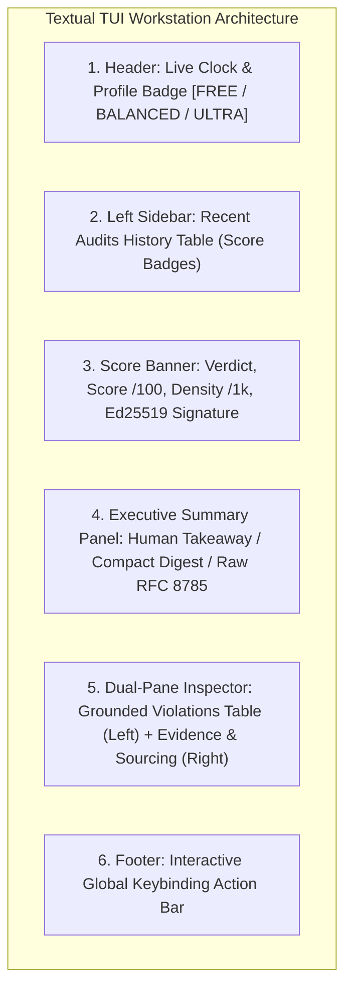

# Textual TUI Terminal Workstation Deep Dive

Credence includes an interactive terminal workstation powered by **Textual** (`credence tui`).

It provides real-time audit monitoring, grounded citation inspection, syndicated feed quality analysis, token headroom governance, and cryptographic identity verification directly inside your terminal emulator.

```bash
credence tui
```


---

## 1. Global Keyboard Navigation Reference

The workstation is entirely keyboard-driven with single-key shortcuts:

| Keybinding | Action | Description |
|:---|:---|:---|
| `/` | **Audit URL** | Open modal dialog to submit a live URL for multi-agent evaluation. |
| `1` | **🛡️ Inspector** | Switch to the active epistemic audit & violation inspector. |
| `2` | **📚 Taxonomies** | Switch to the registered taxonomy catalog hierarchy tree. |
| `3` | **🧠 Subjects** | Switch to the hierarchical subject classification registry. |
| `4` | **📡 Feeds & Dedup** | Switch to syndicated feeds table with dynamic quality scores ($F_j$). |
| `5` | **⚡ Quota** | Switch to the real-time token governor & circuit breaker monitor. |
| `6` | **🔑 Identity** | Switch to local cryptographic Ed25519 node identity & keys. |
| `v` | **Cycle View Mode** | Toggle between **Rich Takeaway**, **Compact Digest**, and **Raw JSON**. |
| `f` | **Filter Findings** | Focus the real-time search bar to filter violations (e.g. `SPJ`, `MED`, `fallacy`). |
| `s` | **Sync Feeds** | Trigger background syndicated feed polling & check mesh effort avoidance. |
| `r` | **Random Audit** | Select and inspect a random audit from local history. |
| `o` | **Open in Web** | Open active audit in the zero-build web report viewer (`credence.report`). |
| `e` | **Export Report** | Export current audit report to formatted Markdown (`credence_audit_export.md`). |
| `q` | **Quit** | Exit the workstation cleanly. |

---

## 2. Workstation Layout Anatomy



---

## 3. The 7 Core Workstation Panes

### Tab 1 (`1`): 🛡️ Epistemic Inspector & Grounded Evidence
The primary analytical surface for inspecting multi-specialist findings. Select any audit from the sidebar to inspect the calibrated suspicion score, density per 1,000 words, and itemized violations.


* **Left Panel**: Filterable DataTable listing Rule IDs, severity badges (`1/5` to `5/5`), taxonomy domains, and verbatim text excerpts.
* **Right Panel**: Detailed evidence view displaying the exact grounded quote, specialist reasoning, and canonical rule URI.

---

### Tab 2 (`2`): 📚 Registered Taxonomy Catalogs
Browse all loaded taxonomy rulebooks (SPJ Journalistic Ethics, Informal Logical Fallacies, Deceptive UI Patterns, Medical/Health Sourcing).


* Collapsible tree hierarchy showing catalogs, thematic clusters, rule IDs, and baseline severity ratings.
* Pinned by SHA-256 catalog hashes in accordance with **[Invariant 5](../invariants.md#invariant-5)** (Namespaced Fixed Taxonomies).

---

### Tab 3 (`3`): 🧠 Hierarchical Domain Subject Registry
Explore the subject taxonomy used for domain-weighted consensus and specialist routing.


* Multi-tier hierarchy spanning journalism, computing, science, biology, and satire.
* Used to calculate empirical node expertise ($E_i$) and enforce the **[Anti-Diploma Invariant](../invariants.md#invariant-17)**.

---

### Tab 4 (`4`): 📡 Syndicated Feeds & Dedup Stream
Monitor RSS, Atom, and JSON syndicated feeds partitioned across the swarm via Highest Random Weight (HRW) Rendezvous Hashing.


* Displays priority tiers (`T1` Breaking to `T4` Satire), title, feed URL, classified subject tag, and active status.
* Real-time composite quality metric ($F_j = 0.35 S + 0.25 G + 0.20 H + 0.20 T$).
* Press `s` to execute instant background feed synchronization and check mesh effort avoidance.

---

### Tab 5 (`5`): ⚡ Token Safety Governor & Quota
Real-time monitoring of LLM token consumption and automatic circuit breakers.


* **Hourly & Daily Headroom**: Percentage remaining and exact token counts.
* **Spend Budget**: Estimated 24-hour spend in USD against daily ceilings.
* **Circuit Breaker Status**: Reports `🟢 HEALTHY`, `⚠️ THROTTLED`, or `🚨 TRIPPED (QUOTA_PRESERVED)`. Automatically falls back to offline heuristics when limits are approached.

---

### Tab 6 (`6`): 🔑 Cryptographic Node Identity (Ed25519)
Inspect your node's cryptographic keypair used to sign and verify attestations across the P2P mesh.


* Displays public key hex, private keyfile location, and verification readiness.
* Guarantees 100% tamper-evident envelopes in compliance with RFC 8785.

---

### Tab 7: 🌅 Morning Epistemic Briefing & Mesh Savings
Review the automated 24-hour executive summary compiling articles sifted across all syndicated feeds.


* Breakdown of total articles evaluated, clean verified coverage, flagged deceptions, and verified satire.
* **Mesh Compute Savings**: Displays exact tokens and USD saved through zero-token peer attestation adoptions.

---

## 4. Multi-Display View Modes

In accordance with **[Invariant 25](../invariants.md#invariant-25)**, the TUI supports 3 distinct presentation modes toggled via `v`:

| Mode | Key | Primary Use Case | Output Format |
|:---|:---|:---|:---|
| **Rich Takeaway** | `v` | Human-first executive briefing | Plain-English summary + split-screen evidence |
| **Compact Digest** | `v` | Rapid single-screen triage | Single-line summary + metric badges |
| **Raw JSON** | `v` | Machine ingestion & debugging | Canonical RFC 8785 JSON schema |

:::tabs
=== Rich Executive View


=== Compact Digest View


=== Raw RFC 8785 Schema


=== Satire Neutralization

:::

---

## 5. Interactive Modals & Real-Time Finding Search

### URL Audit Modal (`/`)
Pressing `/` opens an interactive modal to submit any public URL or local fixture for instant multi-agent evaluation without leaving the terminal:


### Real-Time Finding Filter (`f`)
Pressing `f` focuses the filter input bar above the violations table. As you type, the table immediately filters findings across rule IDs, taxonomy domains, reasoning, and quoted excerpts:

```text
🔍 Filter: MED
-> Filters table to show only MEDICAL_HEALTH (e.g. MED-1.2 Unsubstantiated Cure)
```

