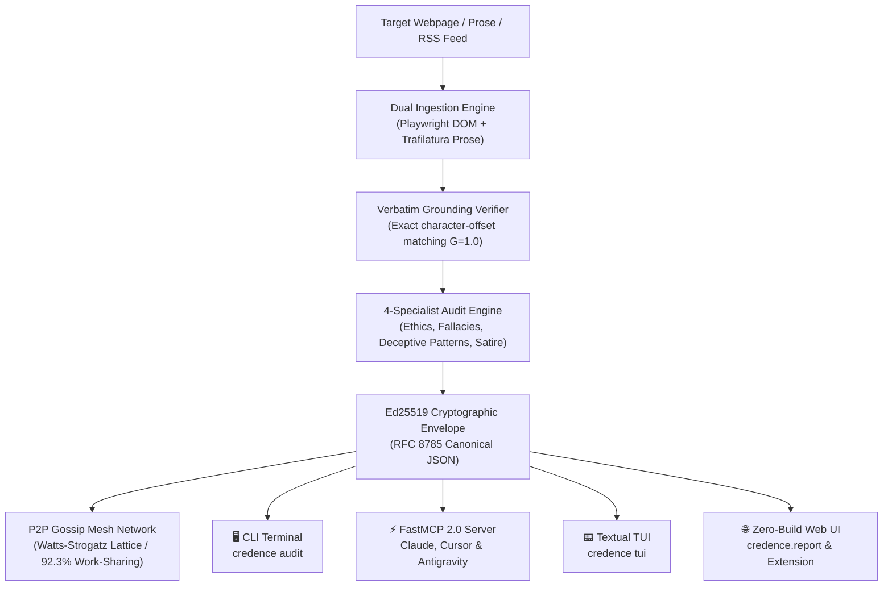

# Introduction to Credence

**Credence** is an autonomous epistemic evaluation engine, FastMCP 2.0 server, and decentralized trust network (**Credence Mesh**).

Rather than assigning subjective "truthiness" scores or relying on centralized platform arbiters, Credence evaluates web content by capturing hermetic snapshots (DOM, visual screenshots, and cleaned prose) and auditing them against **namespaced, content-addressed formal taxonomies**:

1. **The Society of Professional Journalists (SPJ) Code of Ethics** (`domain: JOURNALISTIC_ETHICS`)
2. **The Internet Encyclopedia of Philosophy (IEP) List of Fallacies** (`domain: LOGICAL_FALLACY`)
3. **Deceptive Patterns Catalog** (`domain: DECEPTIVE_PATTERN`)
4. **Parody & Satire Classification Layer** (`content_type: SATIRE_PARODY` / `is_satire: bool`)
5. **Domain Extensions** (`domain: DOMAIN_SPECIFIC`, e.g., medical claims, financial disclosures, AI media provenance)

---

## 🏛️ High-Level System Architecture



---

## The Core Philosophy: Grounded Verification

Credence operates on the principle that **absence of evidence is not evidence of absence**, and **trust cannot be established by static diplomas or centralized authority badges**.

### Key Architectural Invariants

* **Whitespace-Insensitive Grounding (G = 1.0)**: Every identified violation must cite an exact verbatim substring from the source document. If a node fabricates or hallucinates a citation, its reputation score ($Q_i$) is slashed by 50%.
* **Poe's Law Safeguards**: Legitimate humor and satire (*The Onion, The Babylon Bee*) are classified neutrally (0.00 suspicion score), preventing false alarms while signaling downstream AI agents not to treat hyperbole as literal fact. However, bad-faith cloaked disinformation triggers **`SPJ-1.6`** hard overrides.
* **RFC 8785 Canonical JSON & Ed25519 Signatures**: Every audit produces a deterministic, cryptographically signed `.credence.json` envelope. Relay nodes gossip signed attestations without re-signing or altering payloads.
* **13-Node Watts-Strogatz Small-World Lattice**: Decentralized nodes form a peer-to-peer gossip mesh resilient to Byzantine cartels ($N \ge 3f + 1, f = 4$), network partitions (Barbell splits), and linear daisy-chain TTL exhaustion.
* **BitTorrent Work-Sharing**: Mesh nodes divide syndicated feeds across peers to achieve over 92.3% compute savings at $0.00 token cost for adopting nodes.

---

## The 4 Universal Interfaces

Credence maintains 100% synchronous feature parity across 4 distinct interfaces:

| Interface | Primary Audience | Key Strengths |
|---|---|---|
| **🖥️ CLI (`credence`)** | DevOps, Shell Scripters | Structured JSON pipes (`jq`, `xargs`), CI/CD PR gates, color ANSI tables. |
| **⚡ FastMCP 2.0** | AI Agents (Claude, Cursor) | Real-time tool invocation over `stdio` and `SSE / HTTP` streaming. |
| **📟 Textual TUI (`credence tui`)** | Analysts, Power Users | Interactive full-screen workstation with live citation explorer. |
| **🌐 Zero-Build Web UI (`web/`)** | Public Web, Browsers | Vanilla HTML5/ES modules, Web Crypto report viewer, browser extension. |

---

## The Tri-Repository Ecosystem

The Credence ecosystem is partitioned into 3 decoupled sovereign repositories:

```text
/home/pendragon/Projects/credence-ecosystem/
├── credence-agent/     # Antigravity Plugin, skills (benchmark, mesh, white-label)
├── credence/           # Core protocol engine, CLI, FastMCP 2.0, Zero-Build Web UI
└── credence-docs/      # Zero-build documentation portal & sovereign editorial blog
```

---

## Next Steps

- Proceed to the [Quickstart Guide](quickstart.md) to run your first audit.
- Explore the hands-on [Tutorials](tutorials/01-clickbait-teardown.md) to see Credence in action.
- Read the [32 Agent Invariants](invariants.md) for complete mathematical proofs and design constraints.
