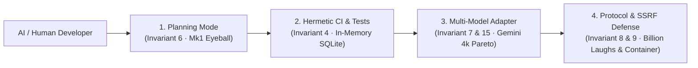
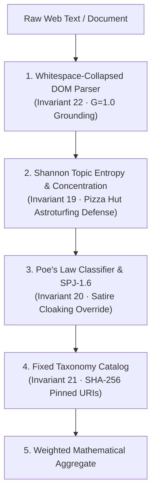
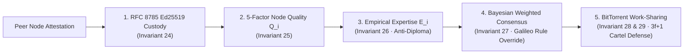
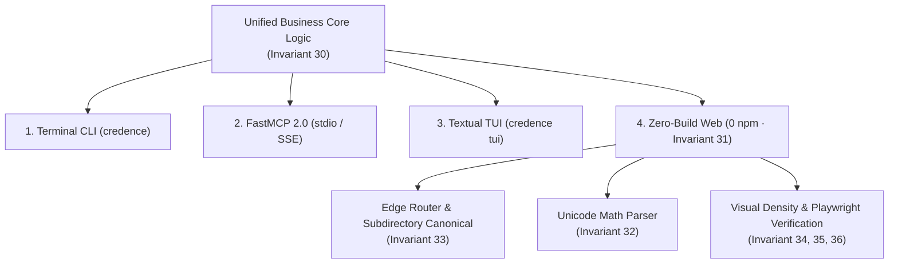

# The Invariant Bible: Living Canon of System-Wide Invariants & Protocols

Mandatory invariants, mathematical formulas, and runtime guardrails governing human contributors, AI pair programmers, and autonomous agents across the Credence network.

| Pillar Domain | Scope & Focus | Primary Verification Gate | Core Engineering Guarantees |
| :--- | :--- | :--- | :--- |
| **1. Core Engineering & Runtime Safety** | Workspaces, async DB, token budgets, SSRF | `just test` (Hermetic in-memory SQLite) | Python 3.12 async, SSRF defense, 4k Pareto token budget |
| **2. Epistemic Ingestion & Scoring** | Information theory, Grounding, Satire | `pytest tests/test_scoring.py` | Topic entropy astroturfing defense, $G=1.0$ grounding, satire cloaking overrides |
| **3. Cryptographic Mesh & Authority** | P2P gossip, Ed25519 envelopes, Consensus | `pytest tests/test_mesh.py` | RFC 8785 Ed25519 envelopes, 5-factor quality $Q_i$, Galileo Rule protection |
| **4. Universal Presentation & Zero-Build** | Zero-npm, 4-way parity, accessible layouts | `pytest tests/test_docs_rendering.py` | Zero npm / zero build, synchronous 4-way parity, framed accessible UX |

> [!IMPORTANT]
> **Continuous Verification Invariant**: Every code change must pass automated static verification (`pytest tests/test_docs_integrity.py`), Playwright live rendering suites (`tests/test_docs_rendering.py`), and version parity checks before presenting for human review (**"Mk1 Eyeball"**). Invariants are a living, expanding canon of verifiable constraints.

---

## Pillar 1: Core Engineering & Runtime Safety

<h3><a href="#docs/invariants#invariant-1">Invariant 1: Project & Workspace Isolation</a></h3>

Credence is completely decoupled from any external or sibling repositories. All tools, databases, configurations, and test runners must execute hermetically within the workspace boundary without depending on external host environment states.

<h3><a href="#docs/invariants#invariant-2">Invariant 2: Python & SQLModel Async Architecture</a></h3>

The codebase requires Python <code>>=3.12,<3.13</code>. All database operations strictly use <code>sqlmodel.ext.asyncio.session.AsyncSession</code> and <code>async_sessionmaker</code>. To prevent SQLModel type metadata stripping, never import <code>from __future__ import annotations</code> in <code>models.py</code>.

<h3><a href="#docs/invariants#invariant-3">Invariant 3: Continuous Changelog & Semantic Version Governance</a></h3>

Diligently maintain <code>docs/changelog.md</code> and manage Semantic Version bumps across the ecosystem whenever notable features, architectural blueprints, or bug fixes are completed. All 7 ecosystem manifests (<code>pyproject.toml</code>, <code>__init__.py</code>, <code>index.html</code>, <code>app.js</code>, <code>plugin.json</code>, and <code>credence.run</code>) must maintain 100% version parity.

<h3><a href="#docs/invariants#invariant-4">Invariant 4: Hermetic Testing & Docs Integrity</a></h3>

The default unit test suite (<code>tests/</code>) must be 100% network-free using <code>sqlite+aiosqlite:///:memory:</code>, offline HTML DOM fixtures, and automated validation of documentation frontmatter, widget DOM contracts, and tutorial YAML blocks (<code>test_docs_integrity.py</code>).

<h3><a href="#docs/invariants#invariant-5">Invariant 5: Scoped Verification for Docs-Only Changes</a></h3>

When modifying purely Markdown documentation, tutorials, blog essays, or static zero-build assets (<code>docs/</code>, <code>blog/</code>, <code>credence-docs</code>), bypass the full Python regression test suite (<code>just test</code>). Verify using local static inspection or web preview (<code>just serve-web</code>). Reserve full test runs for changes to Python source code (<code>credence/</code>), test suites (<code>tests/</code>), or data models.

<h3><a href="#docs/invariants#invariant-6">Invariant 6: Human Review Before Commits ("Mk1 Eyeball")</a></h3>

Never execute <code>git commit</code> automatically. Always present changes and live verification results for human approval first.

<h3><a href="#docs/invariants#invariant-7">Invariant 7: Multi-Model Sovereignty & Token Budget</a></h3>

While Google Gemini 3.7 Flash is the default reference engine for cost efficiency ($0.075/1M) and 16k thinking token density, the pipeline strictly abstracts inference via decoupled adapters supporting Anthropic (Claude 3.7 Sonnet), OpenAI (GPT-4o), DeepSeek (R1), and 100% offline local models (Ollama/vLLM with Llama 3.3 70B) with automatic offline circuit breakers (<code>QUOTA_PRESERVED</code>) at 30% headroom.

<h3><a href="#docs/invariants#invariant-8">Invariant 8: Network Ingestion SSRF Guard</a></h3>

Reject cloud metadata (<code>169.254.169.254</code>, <code>metadata.google.internal</code>), loopback (<code>127.0.0.1</code>, <code>localhost</code>), and RFC 1918 private subnets unless running hermetic local fixtures (<code>allow_local=True</code>).

<h3><a href="#docs/invariants#invariant-9">Invariant 9: Red Team Ingestion & Protocol Defense</a></h3>

XML parsers must reject <code><!DOCTYPE></code> / <code><!ENTITY></code> declarations (Billion Laughs protection). External LLM inputs must be enclosed in <code><untrusted_source_text></code> containers with prompt injection guard directives. FastMCP and P2P relay endpoints must enforce token-bucket rate limiters.

<h3><a href="#docs/invariants#invariant-10">Invariant 10: XML ElementTree Traversal Safety</a></h3>

Never use boolean <code>or</code> expressions on ElementTree elements (e.g. <code>find(a) or find(b)</code>); always check <code>elem is not None</code> or use <code>_find_first_elem()</code> to prevent dropping leaf text elements.

<h3><a href="#docs/invariants#invariant-11">Invariant 11: Model Default Truth & Verification Guardrail</a></h3>

Never assume or hallucinate model version defaults or pricing tiers. Always treat <code>credence/config.py</code> as canonical ground truth (<code>gemini-3.7-flash</code> default reference engine).

<h3><a href="#docs/invariants#invariant-12">Invariant 12: FastMCP 2.0 Reverse Proxy Transport Security</a></h3>

FastMCP servers running over SSE must configure <code>TransportSecuritySettings(enable_dns_rebinding_protection=False, allowed_hosts=["*"], allowed_origins=["*"])</code> to allow seamless proxying via Cloudflare and custom domain host headers without <code>Invalid Host</code> rejections.

<h3><a href="#docs/invariants#invariant-13">Invariant 13: Cloudflare Workers Zero-Build Static Assets Invariant</a></h3>

All Cloudflare Worker deployments utilizing custom <code>_worker.js</code> routing with static assets must define <code>binding = "ASSETS"</code> in <code>wrangler.toml</code> and maintain a <code>.assetsignore</code> file excluding <code>_worker.js</code> and <code>wrangler.toml</code> to prevent asset leakage and build failures.

<h3><a href="#docs/invariants#invariant-14">Invariant 14: Edge Routing Origin Header Translation</a></h3>

Cloudflare Worker edge routers must rewrite <code>Host</code> headers to native Cloud Run target URLs (<code><service>.run.app</code>) to bypass Google Search Console domain verification requirements while preserving live Server-Sent Events (SSE) streaming and global CORS headers.

<h3><a href="#docs/invariants#invariant-15">Invariant 15: Empirical Thinking Budget Sweet Spot (4k Invariant)</a></h3>

In accordance with Golden 12 cross-model benchmarks, <code>gemini-3.7-flash</code> with a 4,096 thinking token budget represents the optimal Pareto frontier ($0.34–$0.68/1k audits, 2.4s–5.1s latency) achieving 100% verbatim grounding and Poe's Law satire neutralization without the 30x cost overhead and over-analysis penalties of flagship Pro models.

<h3><a href="#docs/invariants#invariant-16">Invariant 16: FastMCP Nested Datetime Serialization</a></h3>

All data models and digest payloads exposed via FastMCP tools or resources must serialize nested <code>datetime</code> instances to ISO-8601 strings (<code>.isoformat()</code>) within <code>.to_dict()</code> prior to JSON encoding.

<h3><a href="#docs/invariants#invariant-17">Invariant 17: Content Decoupling & Hermetic CI</a></h3>

Keep application repos lean by separating marketing HTML from core code. Maintain technical tutorials in <code>docs/tutorials/</code> in clean Markdown. CI workflows (<code>ci.yml</code>) must run 100% hermetically without cloud secrets.

<h3><a href="#docs/invariants#invariant-18">Invariant 18: Context Governance & Progressive Disclosure</a></h3>

Keep <code>AGENTS.md</code> lean (<1,000 tokens) in thematic categories. Place multi-step runbooks in <code>.agents/skills/</code> and complete specifications in <code>docs/</code>.

---

## Pillar 2: Epistemic Ingestion & Scoring Engine

<h3><a href="#docs/invariants#invariant-19">Invariant 19: Topic Entropy Astroturfing Defense (The Pizza Hut Problem)</a></h3>

Topic diversity calculators must incorporate Top-Token Concentration penalties ($C_{\text{top3}}$) alongside Shannon entropy ($H$) to ensure single-topic promotional pivots trigger autonomous quarantine ($H < 0.30$).

$$H_{\text{penalized}} = H \times (1.0 - C_{\text{top3}})$$

<h3><a href="#docs/invariants#invariant-20">Invariant 20: Poe's Law & Satire Safeguards</a></h3>

Treat structural Schema.org and masthead badges as candidate cues. Neutralize legitimate satire ($0.00$), but invoke <code>SPJ-1.6</code> cloaking overrides (disabling satire protection) on factual defamatory/health allegations.

<h3><a href="#docs/invariants#invariant-21">Invariant 21: Namespaced Fixed Taxonomies</a></h3>

Never hardcode rule names in scoring math; use namespaced URIs (<code>domain:cluster/rule_id@version</code>) pinned by catalog SHA-256 hashes.

<h3><a href="#docs/invariants#invariant-22">Invariant 22: Whitespace-Insensitive Grounding</a></h3>

Quote validators must collapse whitespace sequences (<code>\s+</code> &rarr; <code> </code>) in both citations and source DOM text before substring matching ($G=1.0$).

<h3><a href="#docs/invariants#invariant-23">Invariant 23: Transparent Heuristic Disclosure</a></h3>

When the offline governor activates, explicitly populate <code>evaluation_method: "offline_structural_heuristic"</code> with confidence capped at $\le 0.50$.

---

## Pillar 3: Cryptographic Mesh & Empirical Authority

<h3><a href="#docs/invariants#invariant-24">Invariant 24: RFC 8785 Canonical JSON & Ed25519 Custody</a></h3>

Signatures must use RFC 8785 canonical bytes with UTC timestamps. Intermediate relay nodes must never re-sign valid envelopes.

<h3><a href="#docs/invariants#invariant-25">Invariant 25: 5-Factor Node Quality ($Q_i$)</a></h3>

Reputation evaluates 5 composite factors: $Q_i = 0.25 U_i + 0.30 C_i + 0.25 G_i + 0.10 T_i + 0.10 K_i$. Bootstrap seeds (<code>peers.json</code>) require root Ed25519 signature verification.

<h3><a href="#docs/invariants#invariant-26">Invariant 26: Empirical Expertise ($E_i$) & Anti-Diploma Invariant</a></h3>

Authority is earned via performance ($E_i = 0.40 C + 0.35 G + 0.15 V + 0.10 L$) and combined with node quality ($W_i = 0.20 Q_i + 0.80 E_i$). Requires domain entropy across $\ge 5$ distinct FQDNs. Hallucinated findings incur a 50% score slash.

<h3><a href="#docs/invariants#invariant-27">Invariant 27: The Galileo Rule (Asymmetric Grounded Evidence)</a></h3>

Absence of evidence is not evidence of absence. Verified domain authorities submitting 100% grounded citations cannot be outlier-dismissed (<code>is_outlier = False</code>) by swarms reporting zero violations. Consensus uses Domain Authority Weighted Medians.

<h3><a href="#docs/invariants#invariant-28">Invariant 28: BitTorrent Work-Sharing & Generous Defaults</a></h3>

Nodes seed attestations freely and divide syndicated feeds across peers to achieve 92.3% compute savings at $0.00 token cost.

<h3><a href="#docs/invariants#invariant-29">Invariant 29: Byzantine Cartel Resistance ($3f+1$)</a></h3>

The mesh requires $\ge 3f + 1$ nodes to tolerate up to $f$ adversarial Sybil cartel nodes without state compromise, reinforced by mandatory domain entropy requirements.

---

## Pillar 4: Universal Presentation Layer & Zero-Build Web

<h3><a href="#docs/invariants#invariant-30">Invariant 30: Universal Feature Parity</a></h3>

Maintain synchronous feature parity across all 4 interfaces: <b>CLI</b> (<code>credence</code>), <b>FastMCP 2.0</b> (<code>credence_</code> tools & <code>credence://</code> resources), <b>Textual TUI</b> (<code>credence tui</code>), and <b>Zero-Build Web UI</b> (<code>web/</code>).

<h3><a href="#docs/invariants#invariant-31">Invariant 31: Universal Zero-Build Standards (Zero-npm Invariant)</a></h3>

All public web surfaces, documentation portals (<code>credence-docs</code>), and sovereign blogs strictly use vanilla HTML5, CSS Custom Properties (<code>credence-ui.css</code>), and native ES Modules with <b>zero npm dependencies, zero package.json, and zero build toolchains</b>. Never introduce Node.js frameworks (Astro, Next.js, Vite) for any web property.

<h3><a href="#docs/invariants#invariant-32">Invariant 32: Zero-Build Math & Currency Invariant</a></h3>

All zero-build Markdown parsers must render mathematical expressions using native Unicode entities and styled containers (<code>.math-block</code>, <code>.math-inline</code>) while preserving currency strings (<code>$0.00</code>, <code>$15.00</code>) without escaping artifacts.

<h3><a href="#docs/invariants#invariant-33">Invariant 33: Edge Subdirectory Canonicalization</a></h3>

Multi-domain edge routers (<code>_worker.js</code>) must intercept internal <code>env.ASSETS</code> folder redirects and enforce 301 canonical redirects to prevent folder names (e.g. <code>/credence.run/</code>) from appearing in public browser address bars.

<h3><a href="#docs/invariants#invariant-34">Invariant 34: Universal Mermaid & Visual Syntax Guardrail</a></h3>

All Mermaid diagrams across markdown documentation and planning artifacts must strictly use standard flow/graph/sequence syntax (<code>graph TD</code>, <code>flowchart TD</code>, <code>sequenceDiagram</code>) with all special characters (<code>>=</code>, <code><=</code>, <code>()</code>, <code>/</code>, <code>&</code>) enclosed in double quotes (e.g. <code>id["Label (Details)"]</code>), avoiding unquoted <code>< ></code> brackets or unsupported diagram types to prevent rendering failures across IDE viewers and static engines.

<h3><a href="#docs/invariants#invariant-35">Invariant 35: Visual Density & Anti-Wall-of-Text Invariant</a></h3>

All documentation guides, tutorials, and editorial blog posts must maintain a visual density of $\ge 2.0$ visual elements per 500 words (using Mermaid architecture diagrams, comparison matrices, and styled alert callout boxes) to eliminate unformatted prose fatigue.

<h3><a href="#docs/invariants#invariant-36">Invariant 36: Automated Live Rendering Regression Verification</a></h3>

All UI and documentation rendering updates must be verified via automated Playwright live rendering test suites (<code>tests/test_docs_rendering.py</code>) ensuring non-zero SVG diagram dimensions, zero raw HTML tag leaks in rendered prose, and interactive widget state contracts.

<h3><a href="#docs/invariants#invariant-37">Invariant 37: Zero-Build Inline HTML Tag & Nested Math Integrity</a></h3>

Zero-build Markdown parsers must mask and preserve safe author-supplied inline HTML tags (<code>&lt;a&gt;</code>, <code>&lt;code&gt;</code>, <code>&lt;span&gt;</code>) before entity escaping and use balanced-brace recursive parsing for nested LaTeX mathematical structures (e.g. <code>\frac{...}{...}</code>) to guarantee zero raw tag string leaks or unparsed backslashes across all surfaces.

<h3><a href="#docs/invariants#invariant-38">Invariant 38: Anti-Scrollbox & Natural Flow Presentation</a></h3>

Document reading surfaces and forensic inspectors must never constrain content with fixed nested vertical scrollbars; article previews must expand naturally (<code>height: auto; overflow: visible;</code>) and dense technical payloads must be encapsulated in native <code>&lt;details&gt;</code> accordions with auto-height <code>&lt;pre&gt;</code> blocks.

<h3><a href="#docs/invariants#invariant-39">Invariant 39: Opportunistic Boredom Ingestion & Epistemic Root Expansion</a></h3>

When nodes detect idle compute with rolling daily token headroom $\ge 30\%$ and clear circuit breakers, they must autonomously execute prioritized FIFO queue digestion, extract cited outbound domains from verified clean articles ($G=1.00, \text{Score} \le 25.0$), probe and auto-subscribe to candidate RSS/Atom feeds, and gossip signed Ed25519 attestations across the P2P mesh to enable zero-token peer adoption.

---

## Invariant Reference Index Matrix

| Invariant ID | Pillar | Key Property | Formula / Enforcement |
| :--- | :--- | :--- | :--- |
| **[Invariant 1](#invariant-1)** | Safety | Workspace Isolation | Decoupled execution |
| **[Invariant 2](#invariant-2)** | Safety | Python & SQLModel Async | Python 3.12 async sessions |
| **[Invariant 3](#invariant-3)** | Safety | Version Parity | Universal manifest sync |
| **[Invariant 4](#invariant-4)** | Safety | Hermetic Testing | In-memory SQLite & offline fixtures |
| **[Invariant 6](#invariant-6)** | Safety | Human Approval | Mk1 Eyeball before commits |
| **[Invariant 7](#invariant-7)** | Safety | Multi-Model Sovereignty | 30% quota circuit breakers |
| **[Invariant 15](#invariant-15)** | Safety | 4k Thinking Sweet Spot | Gemini 3.7 Flash Pareto optimal |
| **[Invariant 19](#invariant-19)** | Ingestion | Pizza Hut Astroturfing | $H_{\text{penalized}} = H \times (1 - C_{\text{top3}})$ |
| **[Invariant 20](#invariant-20)** | Ingestion | Poe's Law & Satire | Structural cues & SPJ-1.6 override |
| **[Invariant 22](#invariant-22)** | Ingestion | Verbatim Grounding | $G=1.00$ whitespace-collapsed |
| **[Invariant 24](#invariant-24)** | Mesh | Canonical Signatures | RFC 8785 Ed25519 custody |
| **[Invariant 25](#invariant-25)** | Mesh | 5-Factor Node Quality | $Q_i = 0.25U + 0.30C + 0.25G + 0.10T + 0.10K$ |
| **[Invariant 26](#invariant-26)** | Mesh | Anti-Diploma Authority | $E_i = 0.40C + 0.35G + 0.15V + 0.10L$ |
| **[Invariant 27](#invariant-27)** | Mesh | The Galileo Rule | Asymmetric grounded evidence preservation |
| **[Invariant 28](#invariant-28)** | Mesh | BitTorrent Work-Sharing | HRW hashing & 92.3% token savings |
| **[Invariant 30](#invariant-30)** | Presentation | 4-Way Parity | Synchronous CLI, FastMCP, TUI, Web |
| **[Invariant 31](#invariant-31)** | Presentation | Zero-npm / Zero-Build | Vanilla ES Modules & 0 node_modules |
| **[Invariant 34](#invariant-34)** | Presentation | Mermaid Syntax Safety | Standard quoted graph syntax |
| **[Invariant 35](#invariant-35)** | Presentation | Visual Density | $\ge 2.0$ visuals per 500 words |
| **[Invariant 36](#invariant-36)** | Presentation | Live Playwright Tests | SVG geometry & 0 HTML leaks |
| **[Invariant 37](#invariant-37)** | Presentation | Inline HTML & Math | Balanced-brace LaTeX & safe tag masking |
| **[Invariant 38](#invariant-38)** | Presentation | Anti-Scrollbox Flow | Natural auto-height & details accordion |
| **[Invariant 39](#invariant-39)** | Mesh / Ingestion | Boredom & Root Expansion | Autonomous opportunistic digestion & feed discovery |
