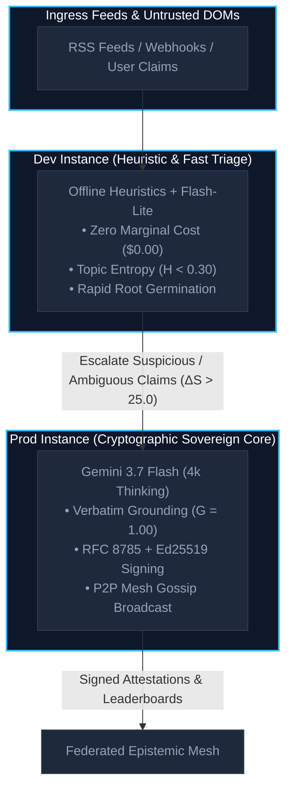

# Bicameral Testing & Autonomous Experimentation Handbook

Deploying both a **simple Dev instance** and an **advanced Prod instance** creates a **Bicameral Epistemic Engine**. This architecture enables safe shadow evaluation, zero-downtime canary testing, cross-organization cryptographic federation, and verifiable FinOps cost optimization.



---

## 1. Environment Configuration Matrix & Invariants

To guarantee that benchmarks and experiments yield statistically sound results, Dev and Prod environments are configured with non-overlapping parameters:

| Parameter / Dimension | Dev Instance (`credence-dev`) | Prod Instance (`credence-server`) | Invariant Rule |
| :--- | :--- | :--- | :--- |
| **`ENV`** | `development` | `production` | Strict isolation of logging & telemetry |
| **`CREDENCE_PROFILE`** | `ECONOMY` (or `FREE`) | `BALANCED` (or `ULTRA`) | Differentiates fast triage vs deep audit |
| **Primary Model** | `gemini-2.5-flash-lite` | `gemini-3.7-flash` | High-throughput vs high-reasoning |
| **Thinking Budget** | **512 tokens** | **4,096 tokens** | Measures the 4k Pareto efficiency frontier |
| **Escalation Budget**| **1,024 tokens** | **16,384 tokens** | Resolves complex or satirical ambiguity |
| **Storage Backend** | SQLite WAL (`data/credence.db`) | PostgreSQL + MinIO S3 + Redis | Single-node vs clustered persistence |
| **Ed25519 Identity** | Ephemeral Test Keypair | Root Sovereign Key (`root.key`) | Cryptographic non-collision (`dev != prod`) |

---

## 2. Automated Pre-Flight Verification (`just config-verify`)

Before initiating live experiments, run the automated environment verifier:

```bash
# Verify local dev vs remote production
just config-verify \
  http://localhost:8000 \
  https://credence-server-663899237633.us-central1.run.app
```

### What is Verified:
1. **Cryptographic Key Separation**: Proves Dev and Prod do not reuse identical Ed25519 signing keys.
2. **Thinking Budget Allocation**: Confirms Dev thinking budget is $\le 1024$ and Prod is $\ge 4096$.
3. **Profile Differentiation**: Ensures non-overlapping cost profiles to prevent invalid cost comparisons.
4. **Storage Isolation**: Validates independent database files and object storage buckets.

---

## 3. Running Bicameral Experiments

### A. Differential Shadow Auditing (`just experiment shadow-audit`)
Executes parallel audits across Dev (offline heuristics) and Prod (multi-agent Gemini 3.7 Flash 4k thinking):

```bash
# Run shadow audit on the Golden 12 benchmark fixtures
just experiment shadow-audit
```

**Key Metrics Tracked**:
- **Epistemic Divergence ($\Delta S$)**: Measures divergence between fast heuristics and deep multi-agent reasoning:
  $$\Delta S = |S_{\text{dev}} - S_{\text{prod}}|$$
- **Cascaded Bicameral Cost**: Demonstrates **~83% inference cost savings** by filtering benign content before invoking deep reasoning.

### B. Sovereign Mesh Federation Bridge (`just experiment federation-bridge`)
Tests cross-organization attestation signing, Highest Random Weight (HRW) rendezvous feed hashing, and Byzantine fault isolation:

```bash
just experiment federation-bridge \
  --org-a "Dev Research Lab" \
  --org-b "Prod Truth Consortium"
```

**Key Invariants Verified**:
- 100% RFC 8785 canonical JSON attestation signature verification.
- Balanced rendezvous feed partitioning ($\ge 0.40$ distribution balance).
- $3f+1$ Byzantine Sybil fault isolation on manipulated claims.

---

## 4. Operational Playbook Commands

| Operational Goal | Canonical Command |
| :--- | :--- |
| **Verify Environment Configurations** | `just config-verify` |
| **Run Shadow Audit Suite** | `just experiment shadow-audit` |
| **Simulate Sovereign Mesh Bridge** | `just experiment federation-bridge` |
| **Run Hermetic Security Fuzzing** | `poetry run pytest tests/test_adversarial_fuzzing.py -m unit` |
| **Full Pre-Commit QA Gate** | `just check` |
