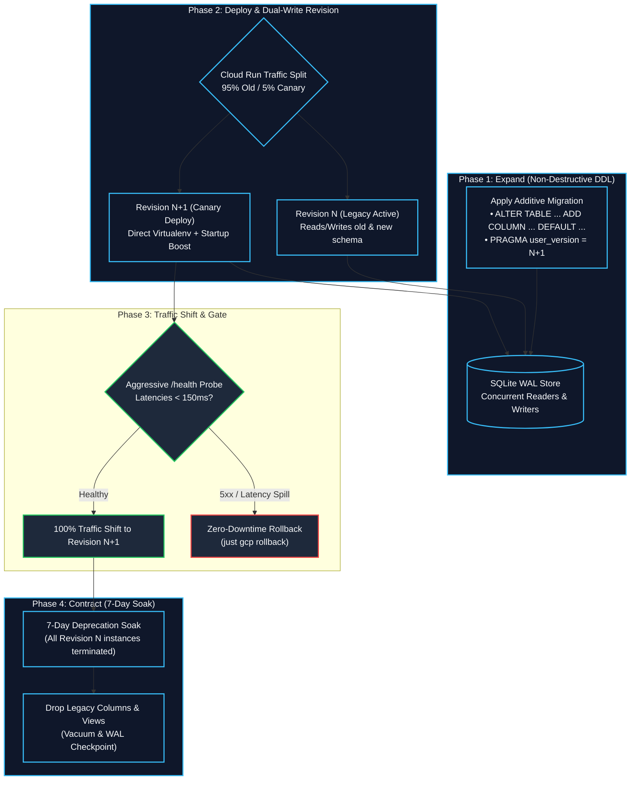

# Operational Guide: Zero-Downtime Database Migrations

Running zero-downtime schema migrations across auto-scaling Cloud Run containers requires strict adherence to backward-compatible schema evolutions.

---

## 1. The 4-Phase Zero-Downtime Migration Architecture

1. **Phase 1: Expand**: Apply additive non-destructive DDL (`ALTER TABLE ... ADD COLUMN ... DEFAULT ...`).
2. **Phase 2: Migrate**: Deploy new application container revisions running `credence serve`.
3. **Phase 3: Contract**: Drop legacy columns only after all older container revisions have rolled off traffic.
