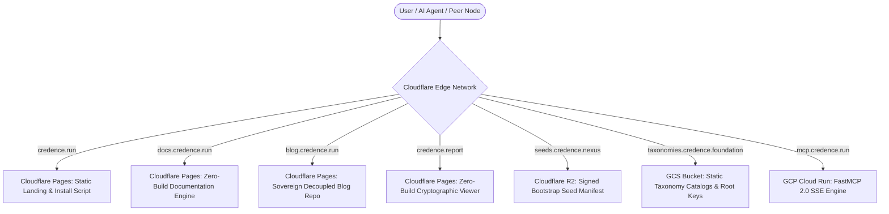

# Bootstrap Operator Guide & Runbook

A comprehensive, unabridged operations runbook for deploying, configuring, securing, and maintaining **Credence** nodes, multi-cloud production infrastructure, P2P mesh clusters, sovereign federations, and decoupled editorial platforms.

---

## Table of Contents
1. [Multi-Cloud Architecture & DNS Delegation Topology](#1-multi-cloud-architecture--dns-delegation-topology)
2. [Terraform Remote State Persistence (GCS Backend)](#2-terraform-remote-state-persistence-gcs-backend)
3. [Air-Gapped Root Ed25519 Key Ceremony & Seed Signing](#3-air-gapped-root-ed25519-key-ceremony--seed-signing)
4. [13-Node Watts-Strogatz Local & Distributed Mesh Operations](#4-13-node-watts-strogatz-local--distributed-mesh-operations)
5. [Zero-Build Web Deployments (Cloudflare Pages CDN)](#5-zero-build-web-deployments-cloudflare-pages-cdn)
6. [GCP Cloud Run Production Deployment](#6-gcp-cloud-run-production-deployment)
7. [Threat Model & Adversarial Defense Matrix (Invariants 1–32)](#7-threat-model--adversarial-defense-matrix-invariants-132)
8. [Operational Runbooks & Diagnostics](#8-operational-runbooks--diagnostics)
9. [GitHub Repository Configuration & Publishing Operations](#9-github-repository-configuration--publishing-operations)
10. [Sovereign Decoupled Blog Architecture & Design System](#10-sovereign-decoupled-blog-architecture--design-system)

---

## 1. Multi-Cloud Architecture & DNS Delegation Topology

Credence is engineered to run as a multi-domain, hybrid-cloud federation spanning **Google Cloud Platform (GCP)** (for serverless compute, Secret Manager, and token governor monitoring) and **Cloudflare** (for global edge CDN, DDoS protection, zero-egress R2 distribution, and DNS delegation).



> [!NOTE]
> **Zero-Build Invariant**: All web properties (`credence.run`, `docs.credence.run`, `blog.credence.run`, and `credence.report`) run purely on vanilla HTML5, native CSS Custom Properties, and ES modules with **0 npm dependencies and 0 build steps**.

### Canonical Domain Routing Matrix

| Domain | Infrastructure Provider | Purpose | Canonical Endpoint |
| :--- | :--- | :--- | :--- |
| **`credence.run`** | Cloudflare Pages / GCS | Landing Page & POSIX Install Script CDN | `https://credence.run/install.sh` |
| **`docs.credence.run`** | Cloudflare Pages | Git-Driven Documentation Engine | `https://docs.credence.run` |
| **`blog.credence.run`** | Cloudflare Pages | Sovereign Decoupled Blog Repository | `https://blog.credence.run` |
| **`mcp.credence.run`** | GCP Cloud Run | FastMCP 2.0 Server (SSE Transport) | `https://mcp.credence.run/sse` |
| **`seeds.credence.nexus`** | Cloudflare R2 / GCS | Signed P2P Bootstrap Peer Directory | `https://seeds.credence.nexus/peers.json` |
| **`taxonomies.credence.foundation`** | Google Cloud Storage | Taxonomy Governance & Root Signing Keys | `https://taxonomies.credence.foundation/keys/root.pub` |
| **`credence.report`** | Cloudflare Pages / GCS | Zero-Build Cryptographic Audit Viewer | `https://credence.report/viewer.html` |

---

## 2. Terraform Remote State Persistence (GCS Backend)

Credence uses a private, versioned Google Cloud Storage (GCS) bucket for state persistence with native precondition state locking.

```bash
export PROJECT_ID="your-gcp-project-id"
export REGION="us-central1"

gcloud storage buckets create gs://${PROJECT_ID}-tfstate \
  --project=${PROJECT_ID} \
  --location=${REGION} \
  --uniform-bucket-level-access

gcloud storage buckets update gs://${PROJECT_ID}-tfstate --versioning

cp terraform/backend.tf.example terraform/backend.tf
terraform -chdir=terraform init \
  -backend-config="bucket=${PROJECT_ID}-tfstate" \
  -backend-config="prefix=credence/state"
```

---

## 3. Air-Gapped Root Ed25519 Key Ceremony & Seed Signing

In accordance with **[Invariant 16](docs/invariants.md#invariant-16)** (*Cryptographic Identity & RFC 8785 Canonical JSON Invariant*), bootstrap seed manifests (`peers.json`) must be cryptographically signed by an air-gapped root Ed25519 keypair.

```bash
# Step 1: On an air-gapped, offline secure workstation, generate root keypair
poetry run python -c "
from credence.identity import generate_node_keypair
from cryptography.hazmat.primitives import serialization
from pathlib import Path

priv = generate_node_keypair()
pub = priv.public_key()

Path('root_private.pem').write_bytes(
    priv.private_bytes(
        encoding=serialization.Encoding.PEM,
        format=serialization.PrivateFormat.PKCS8,
        encryption_algorithm=serialization.NoEncryption()
    )
)
Path('root.pub').write_text(pub.public_bytes(
    encoding=serialization.Encoding.Raw,
    format=serialization.PublicFormat.Raw
).hex())
print('Air-gapped root key ceremony complete. Public Key Hex:', Path('root.pub').read_text())
"

# Step 2: Generate and sign canonical peers.json manifest (valid for 72 hours)
poetry run credence seeds sign \
  --key-path root_private.pem \
  --output peers.json \
  --valid-hours 72

# Step 3: Publish public key and signed peers.json to origins
gsutil cp root.pub gs://${PROJECT_ID}-taxonomies-foundation/keys/root.pub
gsutil cp peers.json gs://${PROJECT_ID}-seeds-nexus/peers.json
```

---

## 4. 13-Node Watts-Strogatz Local & Distributed Mesh Operations

Credence utilizes a 13-node Watts-Strogatz small-world lattice ($N=13, K=4, \beta=0.15$) with Byzantine cartel tolerance ($N \ge 3f + 1, f = 4$).

```bash
# Run hardware pre-flight check and spin up local cluster
just mesh-cluster-up

# Inspect running cluster topology (Ports 8765–8777)
docker compose -f docker-compose.mesh.yml ps

# View live epidemic gossip propagation in the Textual TUI
poetry run credence tui
```

---

## 5. Zero-Build Web Deployments (Cloudflare Pages CDN)

```bash
# Deploy landing page & install script CDN
npx wrangler pages deploy web/credence.run --project-name=credence-run --branch=main

# Deploy zero-build cryptographic report viewer
npx wrangler pages deploy web/credence.report --project-name=credence-report --branch=main
```

---

## 6. GCP Cloud Run Production Deployment

```bash
# Build and push container to Google Container Registry
gcloud builds submit --config cloudbuild.yaml .

# Deploy to Cloud Run with Secret Manager environment variables
gcloud run deploy credence-server \
  --image gcr.io/${PROJECT_ID}/credence:latest \
  --platform managed \
  --region ${REGION} \
  --allow-unauthenticated \
  --min-instances 0 \
  --max-instances 10 \
  --memory 2Gi \
  --cpu 2 \
  --set-secrets CREDENCE_GEMINI_API_KEY=CREDENCE_GEMINI_API_KEY:latest
```
