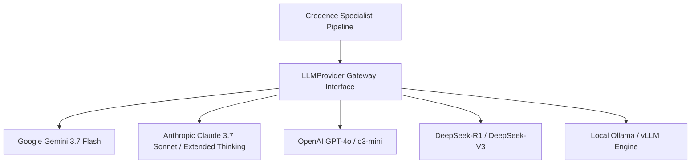

# Multi-Model Provider Architecture

While Credence uses **Google Gemini 3.7 Flash** as its default reference engine, the core epistemic evaluation pipeline is completely **model-agnostic**.

Credence abstracts model inference behind a decoupled `LLMProvider` protocol interface, allowing newsrooms, enterprises, and independent researchers to plug in any frontier API or self-hosted open-weights model.

---

## 1. The Decoupled Provider Protocol



---

## 2. Supported Provider Configurations

Switch providers effortlessly via environment variables or CLI flags:

### A. Anthropic Claude 3.7 Sonnet (Extended Thinking)
Ideal for deep investigative analysis with custom reasoning budgets:

```bash
export CREDENCE_LLM_PROVIDER=anthropic
export ANTHROPIC_API_KEY=sk-ant-...
export CREDENCE_MODEL=claude-3-7-sonnet-20250219
export CREDENCE_THINKING_BUDGET=8192

credence audit https://example.com/article
```

### B. OpenAI GPT-4o & o3-mini (Structured Outputs)
Leverages OpenAI's native JSON Schema validation:

```bash
export CREDENCE_LLM_PROVIDER=openai
export OPENAI_API_KEY=sk-proj-...
export CREDENCE_MODEL=gpt-4o  # or o3-mini

credence audit https://example.com/article
```

### C. DeepSeek-R1 & DeepSeek-V3 (Open-Weights Reasoning)
High-rigor syllogistic reasoning at open-weights API pricing:

```bash
export CREDENCE_LLM_PROVIDER=deepseek
export DEEPSEEK_API_KEY=sk-...
export CREDENCE_MODEL=deepseek-reasoner

credence audit https://example.com/article
```

### D. Local Ollama & vLLM (100% Offline & Private)
Run confidential audits with zero cloud egress:

```bash
export CREDENCE_LLM_PROVIDER=ollama
export OLLAMA_HOST=http://localhost:11434
export CREDENCE_MODEL=llama3.3:70b-instruct-q4_K_M

credence audit https://example.com/article
```

---

## 3. Implementing a Custom LLM Adapter

To add a proprietary in-house model or specialized inference gateway, implement the `LLMProvider` abstract base class in Python:

```python
from typing import Dict, Any, List
from credence.pipeline.provider import LLMProvider, AuditResult

class CustomEnterpriseLLMProvider(LLMProvider):
    def __init__(self, endpoint_url: str, api_token: str):
        self.endpoint_url = endpoint_url
        self.api_token = api_token

    async def evaluate_claims(
        self, 
        normalized_prose: str, 
        taxonomy_rules: List[Dict[str, Any]],
        thinking_budget: int = 1024
    ) -> AuditResult:
        # 1. Format containerized prompt with <untrusted_source_text>
        # 2. Invoke enterprise inference endpoint
        # 3. Parse JSON violations and return structured AuditResult
        pass
```
