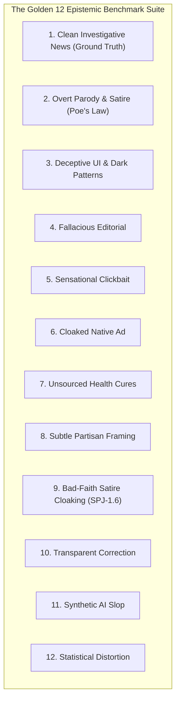

# Golden 12 Benchmark Suite Specification

The **Golden 12 Epistemic Benchmark Suite** is Credence's standard verification testbed. It evaluates news articles, editorials, web pages, and synthetic content across all registered taxonomy domains under `FREE`, `BALANCED`, and `ULTRA` operational cost profiles.

---

## 1. Benchmark Fixtures Architecture



---

## 2. Benchmark Fixture Specifications & Rule Matrix

| # | Fixture Filename | Scenario Description | Core Rules Evaluated | Expected Classification |
|---|---|---|---|---|
| 1 | `clean_article.html` | Rigorous peer-reviewed journalism with metadata, datasets, and corrections policy. | Ground truth baseline. | `CLEAN` ($S = 0.0$) |
| 2 | `satire_article.html` | Overt parody news reporting on lunar provolone cheese mining with Schema.org tags. | Poe's Law Safeguard (`is_satire=True`). | `SATIRE_PARODY` ($S = 0.0$) |
| 3 | `deceptive_page.html` | Fake system update UI with resetting countdown, confirmshaming modal, and pre-selected checkboxes. | `DP-1.1`, `DP-2.1`, `DP-2.2`, `DP-3.1`. | `DECEPTIVE` ($S = 71.7$) |
| 4 | `fallacious_op_ed.html` | Partisan opinion attacking solar initiatives with personal insults and false dilemmas. | `FALLACY-1.1`, `FALLACY-2.2`, `FALLACY-3.1`. | `SUSPICIOUS` ($S = 61.3$) |
| 5 | `sensational_clickbait.html` | Apocalyptic city evacuation headline contrasted against routine 2-hour water valve maintenance. | `SPJ-1.2` (Headline/Body Delta). | `LOW_SUSPICION` ($S = 32.4$) |
| 6 | `cloaked_native_ad.html` | Cardiovascular report that secretly pitches proprietary VitaMax supplements for $89.99/bottle. | `SPJ-3.2` (Disguised Native Ad). | `LOW_SUSPICION` ($S = 38.7$) |
| 7 | `unsupported_medical_claim.html` | Natural health bulletin claiming boiled barbasco bark permanently cures every pathogen in 3 hours. | `SPJ-1.1` (Unsourced Medical Claim). | `LOW_SUSPICION` ($S = 25.5$) |
| 8 | `subtle_propaganda_framing.html` | Polarizing political editorial claiming opposition lawmakers are treasonous collaborators. | `FALLACY-2.2` (False Dilemma). | `LOW_SUSPICION` ($S = 21.1$) |
| 9 | `cloaked_satire_defense.html` | Defamatory headline accusing mayor of felony wiretapping, hiding behind 5px hidden disclaimer. | `SPJ-1.6` (Bad-Faith Satire Defense). | `LOW_SUSPICION` ($S = 32.7$, Override) |
| 10 | `transparent_correction.html` | Clean energy article featuring a prominent, high-contrast, timestamped editorial correction box. | `SPJ-4.3` (Transparent Correction). | `CLEAN` ($S = 0.0$) |
| 11 | `synthetic_ai_slop.html` | Generic AI-generated cloud guide exhibiting formulaic circular semantic loops and unverified citations. | `SPJ-1.1` (Synthetic AI Slop Repetition). | `LOW_SUSPICION` ($S = 24.1$) |
| 12 | `statistical_distortion.html` | Warning that coffee triples cardiac death based on an observational cohort shift from 0.001% to 0.003%. | `FALLACY-3.2` (Relative/Absolute Risk). | `LOW_SUSPICION` ($S = 21.1$) |

---

## 3. Running the Benchmark

```bash
just benchmark
```
