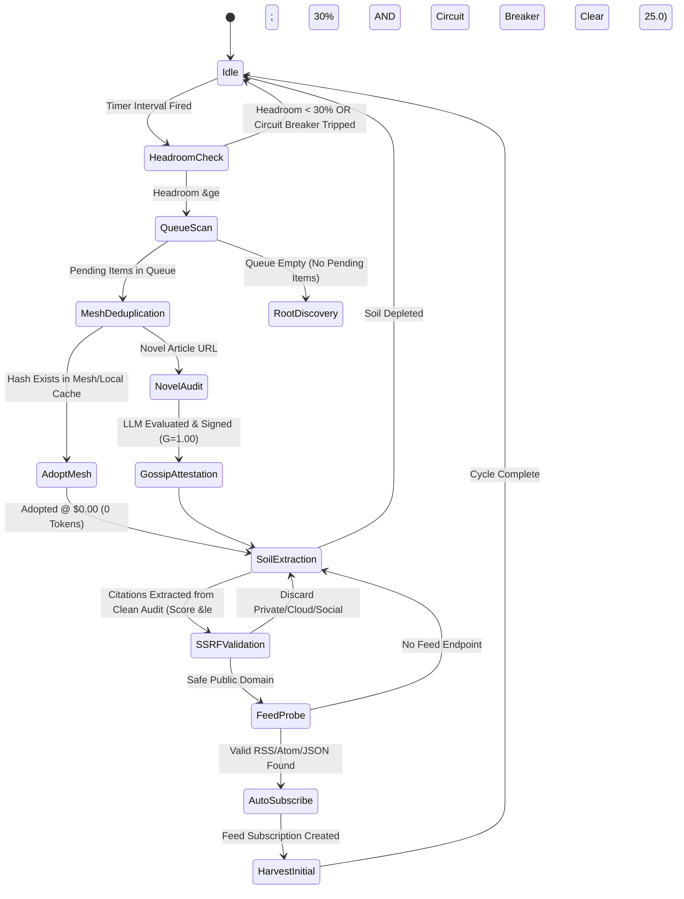

# Epistemic Protocol Specification: Boredom Engine & Root Expansion (EPEP-16)

## 1. Abstract

This specification defines the protocol, mathematical invariants, and operational state machine for **Opportunistic Boredom Ingestion & Epistemic Root Expansion** in the Credence decentralized trust network.

Autonomous nodes operate under a dual-mode evaluation loop:
1. **Interactive Mode**: Real-time evaluation triggered by user CLI, FastMCP 2.0 tool calls, or inbound webhook events.
2. **Opportunistic Boredom Mode**: Autonomous background ingestion that activates during computational and token idle periods to drain pending syndicated queues, discover external primary sources cited by verified clean articles, register new root subscriptions, and broadcast signed Ed25519 attestations across the P2P mesh.

---

## 2. Mathematical Formalization & State Machine



### 2.1 Activation Criteria

Let $\mathcal{H}_{\text{daily}} \in [0.0, 1.0]$ denote the rolling 24-hour remaining token budget ratio, and let $\mathcal{C}_{\text{trip}} \in \{0, 1\}$ denote the binary state of the Token Safety Governor circuit breaker:

$$\text{BoredomEligible}(t) = \left( \mathcal{H}_{\text{daily}} \ge 0.30 \right) \land \left( \mathcal{C}_{\text{trip}} == 0 \right) \land \left( \text{ActiveWorkers}(t) == 0 \right)$$

If $\text{BoredomEligible}(t) == \text{False}$, the node must immediately yield execution and sleep until the next scheduled interval without firing LLM requests.

### 2.2 Prioritized FIFO Queue Processing

Pending items are ordered by feed priority tier $P_f \in \{1, 2, 3, 4\}$ (where $1$ is highest priority) followed by discovery timestamp $t_{\text{disc}}$:

$$\text{PriorityRank}(i) = \left( P_f(i), t_{\text{disc}}(i) \right)$$

### 2.3 Citation Soil Filtering Invariants

For each outbound domain $d \in \text{OutboundLinks}(\mathcal{A})$ extracted from a clean audit $\mathcal{A}$ where $\text{SuspicionScore}(\mathcal{A}) \le 25.0$:

1. **SSRF Guard**: $d \notin \text{RFC1918} \land d \ne \text{127.0.0.1} \land d \ne \text{169.254.169.254} \land d \ne \text{metadata.google.internal}$
2. **Noise Rejection**: $d \notin \mathcal{S}_{\text{social}} \cup \mathcal{S}_{\text{cdn}} \cup \mathcal{S}_{\text{shorteners}}$
3. **Novelty Constraint**: $d \notin \text{SubscribedDomains}(\mathcal{D}_{\text{local}})$

---

## 3. Data Structures & Database Schema

### 3.1 `RootCandidate` Model
```python
@dataclass
class RootCandidate:
    domain: str
    citation_count: int
    avg_parent_trust: float
    parent_articles: list[str]
    sample_cited_urls: list[str]
    primary_subject: str
```

### 3.2 `BoredomCycleSummary` Model
```python
@dataclass
class BoredomCycleSummary:
    timestamp: datetime
    headroom_daily_pct: float
    headroom_hourly_pct: float
    circuit_breaker_tripped: bool
    pending_items_scanned: int
    pending_items_audited: int
    mesh_attestations_adopted: int
    items_deferred_budget: int
    tokens_saved_mesh: int
    new_roots_subscribed: int
    initial_items_harvested: int
    details: list[dict[str, Any]]
```

---

## 4. REST API & FastMCP 2.0 Endpoints

### 4.1 REST API Routes
- `POST /api/boredom/cycle` — Immediate opportunistic cycle trigger (accepts `{"burst": int, "expand_roots": bool}`).
- `GET /api/boredom/status` — Live boredom engine & token headroom telemetry.
- `POST /api/roots/expand` — Execute autonomous root expansion pass.
- `GET /api/roots/tree` — Complete hierarchical JSON tree of active roots & pending soil.
- `GET /api/roots/candidates` — Top ranked citation candidate domains.

### 4.2 FastMCP 2.0 Tools & Resources
- `credence_trigger_boredom_cycle(burst: int, expand_roots: bool)`
- `credence_expand_roots(max_sources: int, dry_run: bool)`
- `credence_get_root_candidates(limit: int)`
- `credence://roots/tree` (Resource)
- `credence://roots/candidates` (Resource)
- `credence://boredom/status` (Resource)

---

## 5. Security & Safety Invariants

1. **Strict SSRF Containment**: All domain discovery and feed probing MUST pass through `is_safe_url` to prevent local IP traversal, loopback access, or cloud credential exfiltration.
2. **Billion Laughs & XML Entity Defense**: Syndicated feed XML parsing MUST disable DTD processing and external entity resolution.
3. **P2P Gossip Bandwidth Preservation**: Attestation gossips MUST be deduplicated using Bloom filters / LRU sets (`MeshMessageDeduplicator`) to prevent network broadcast storms.
